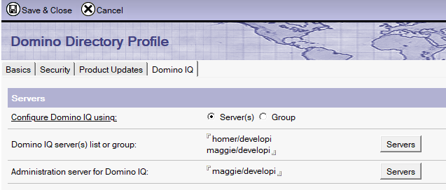
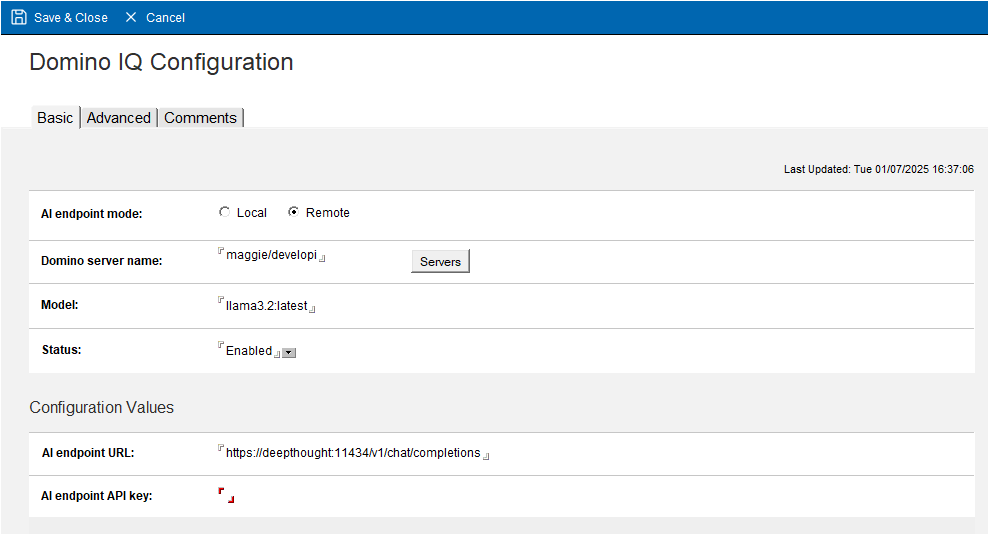
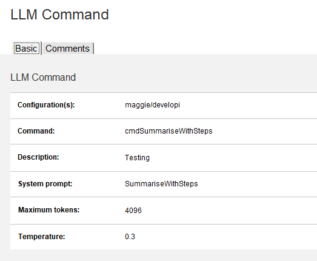
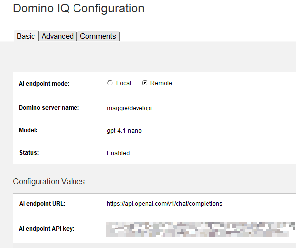
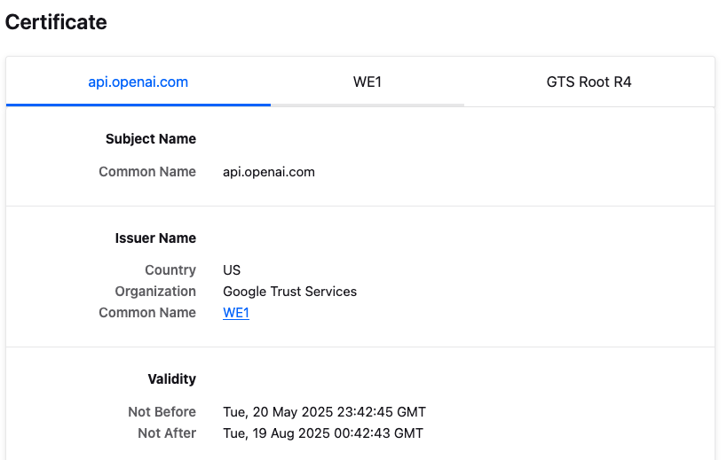
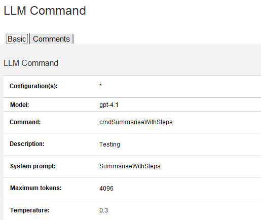

Domino IQ is a new feature in Domino 14.5. It connects Domino applications with Large Language Models (LLMs). The feature came with the Early Access Program (EAP) for Domino 14.5 last autumn. Now, it's available in the latest Domino 14.5 release.

I’ve come across a few questions about connecting Domino IQ with external engines like Ollama and OpenAI. Here’s how I got it working from scratch—hopefully it’ll help you too.
<!-- more -->

At its core, [Domino IQ](https://help.hcl-software.com/domino/14.5.0/admin/domino_iq_server.html) adds support for Large Language Models. With Domino IQ set up, Domino applications can use chat completion API for supported LLM providers. This is possible thanks to new classes added to LotusScript and Java. HCL has also added two actions to the Mail database in 14.5 that utilise LLM functionality (*Summarise* and *Reply with AI*) for end users.

## Enabling Domino IQ

We'll start with enabling Domino IQ, if you haven't done so already. Go to your Domino Directory database and click **Actions** --> **Edit Directory Profile**. If you upgraded your Domino Directory database to the 14.5 template, you should see a new tab here.



To enable Domino IQ, you’ll need a central configuration database (`DominoIQ.nsf`). The directory profile is used to select the servers for this function and identify the main server. The “*Administration server for Domino IQ*” will maintain the DominoIQ.nsf database, while the others will keep a replica. Thanks to this directory profile, all other servers and clients will know how to access these services.

Configure the directory profile on your Domino Administration server. Then replicate it to all other servers and restart all participating servers, starting with the Domino IQ Administration server. Confirm that each participating server has its own replica of the Domino IQ configuration. You’ll also see the following warning on your servers — you can ignore it for now:

```console
DominoIQTask : Server Configuration not found in config database: Cache entry not found
```

## Local and Remote Mode

Domino IQ has two sides. The first is an inference engine running on the [llama.cpp](https://en.wikipedia.org/wiki/Llama.cpp) library. This is a separate installation on top of Domino and runs model files in *GGUF* format using Nvidia GPUs on a local server. This side falls outside the scope of this post, but I want to clarify the terminology.

!!! warning "GPU is Required for the Local Mode!"
    Early versions of the Domino IQ beta program allowed us to run Domino IQ using only the CPU. **As of EA3 and GA, Domino IQ requires a compatible Nvidia GPU.**

Above, you’ll see I’ve defined two servers in my Domino environment: Homer and Maggie. Let’s say Homer has an Nvidia GPU and can run the Domino IQ inference engine. We can run Homer’s Domino IQ in **Local Mode**. We install the inference engine add-on, configure all settings, pick a model, and download it. Maggie will run in **Remote Mode**. Whenever it receives an LLM request, it will pass it to a remote endpoint — acting as a proxy for clients and the LLM engine. This engine could be Homer or another server with similar capabilities.

That brings us to the second side: Domino IQ also has a server thread that’s activated when added to the Directory Profile. Whether in local or remote mode, this thread handles LLM requests, forwarding them to the local or remote inference engine. When you use the new LotusScript or Java classes, this thread is what you connect through.

## Connecting to Ollama

I don’t have a GPU-enabled server, so I’ll go with an external alternative. Since I do have a Mac with a decent GPU, I can run Ollama on my local machine. This is the simplest architecture to test a few tricks. My 4-year-old MacBook Pro M1 Pro can handle a small model such as Llama 3.1:8B or Llama 3.2, which are both good enough to test a few tricks. The newer ones will work with larger models.

First, let’s install and configure [Ollama](https://ollama.com/). Download and install Ollama. Pick a [model](https://ollama.com/search) and download it.

This step might resolve the first common issue: by default, Ollama listens only on the local interface (127.0.0.1). So if you run `curl http://127.0.0.1:11434` in a terminal, you’ll get a valid response. But if you try using the machine’s external IP, it will fail. To fix this, we'll use the following command:

```bash
launchctl setenv OLLAMA_HOST "0.0.0.0:11434"
```

After restarting your Ollama instance, it will listen on all interfaces. Alternatively, open a terminal and use:

```bash
export OLLAMA_HOST=0.0.0.0:11434 && ollama serve
```

This works too but it will be transient — the setting won’t persist after reboot.

The second step is to configure Domino IQ to connect to Ollama in remote mode. Before that, another problem: Ollama doesn’t support TLS, while Domino requires TLS by default. Set the following in `notes.ini` to disable TLS:

```ini
DOMIQ_DISABLE_EXTERNAL_TLS=1
```

Alternatively, you can build a Nginx reverse proxy to handle TLS and forward requests to Ollama. This involves installing nginx, configuring TLS, forwarding requests to Ollama on port 11434, and adding TLS certificate to the Certificate Store. This is a more secure option for production, but for testing purposes, we’ll just disable TLS in Domino IQ.

Now go to your server and open DominoIQ.nsf. Open the **Configurations** view and click **Add Configuration**. Select `Remote` for the endpoint mode. Choose the Domino server that will connect to Ollama and fill in the fields as shown:



It will automatically change the endpoint address to `https`. Since we disabled external TLS, it will use the endpoint as `http`. I also recommend using the `set config` console command to set the following parameters to enable debugging:

```ini
DEBUG_DOMINOIQ_LLMPAYLOAD=1
DEBUG_DOMINOIQ_LLMREQUEST=1
```

These settings will create a log file for each request in `domiqllmthr-{number}_{server_name}_{date@time}` format, which will help you debug any issues.

!!! info
    In 14.5 GA, Domino IQ automatically paraphrases all chat completion prompts. This is a security measure to reduce prompt injection and model hijacking risks. I prefer to turn it off so I can control prompt behaviour. Prompt engineering should be the developer’s responsibility. [You can disable it](https://blog.nashcom.de/nashcomblog.nsf/dx/domino-iq-paraphrasing-explained.htm), by adding the following parameter to notes.ini:

    ```ini
    DOMIQ_DISABLE_PROMPT_PARAPHRASE=1
    ```

## Show time!

You can now test this setup using [my Domino IQ demo database](https://github.com/sbasegmez/LLM-Demos/tree/main/nsf/nsf.engage25-dominoiq-demo), or try it yourself using the prompts and code below.

First, go to your DominoIQ.nsf configuration database. Create a new System Prompt and name it **SummariseWithSteps**. The prompt should look like this:

```output
You are going to receive a detailed description for an open source project.

- First; provide a short summary of the given text in plain British English.
- Then add a line with "*****" string and list installation steps in a simple form.

Do not include anything else. Stick to the project text.

Here is an example for the format between two "----" lines.

----
<summary in five sentences>

*****
- Step 1 description
- Step 2 description
....
----
```

Go to Commands and create a command like this:



Here’s an example LotusScript code for calling this command:

```vbscript
' This function generates a summary of the input text using the specified LLM command.
Function GenerateSummaryOfText(serverName As String, commandName As String, inputText As String) As String
    Dim session As New NotesSession
    Dim llmreq As NotesLLMRequest
    Dim llmresp As NotesLLMResponse

    Set llmreq = session.Createllmrequest()

    Set llmresp = llmreq.Completion(serverName, commandName, inputText)

    GenerateSummaryOfText = llmresp.Content
End Function
```

Use an agent to call this function. You can grab any project definition from [OpenNTF](https://www.openntf.org/).

## Connect to the OpenAI API.

If the Ollama setup is working, let’s now configure Domino IQ to connect to the OpenAI API. This is mostly straightforward, with a few caveats.

[Sign up](https://platform.openai.com/signup) for the OpenAI API and generate an API key. Then go back to your DominoIQ.nsf configuration database. Disable the Ollama configuration document and create a new one for OpenAI. Note that each server can only have one active configuration document.

Decide which model you want to use and configure the OpenAI endpoint and the API Key.



If you’ve followed the steps above, your code shouldn’t need any changes. Try testing again — this time it will fail. That’s because we previously disabled TLS, and OpenAI doesn’t support HTTP connections. Clear the `DOMIQ_DISABLE_EXTERNAL_TLS` parameter from your configuration and try again. You’ll fail again with a new error message:

```console
InvokeLLM> PerformRequest() returned (500): NotesError : , Error = SSL certificate problem: unable to get local issuer certificate, ErrorOperation = CurlRequest

TEXT: TLSv1.3 (OUT), TLS alert, unknown CA (560):

TEXT: SSL certificate problem: unable to get local issuer certificate
```

This means your server doesn’t recognise the certificate authority used by OpenAI. Domino 14.5 doesn’t yet include this by default. We’ll use `certstore.nsf` to add the relevant CA. Make sure you have [the Certificate Manager task running](https://opensource.hcltechsw.com/domino-cert-manager/quickstart/) on your server.

Open `https://api.openai.com/v1/chat/completions` in Firefox. You’ll get an error — that’s fine.

Click the padlock icon in the address bar, click **Connection Secure** → **More information**. This opens the certificate chain. At the time of writing, it was: `api.openai.com` → `WE1` → `GTS Root R4`



- Go to the WE1 tab and download the PEM (Cert) from the Miscellaneous section.
- Open the file in a text editor and copy its contents.
- Go to your Domino Administration server and open `certstore.nsf`.
- Navigate to **Configurations** → **Trusted Roots** and click **Add Trusted Root**.
- Click **Paste Certificate**, then **Submit Request**.

The Certificate Manager will do the rest. After a few seconds, press F9 to refresh. You should see the trusted root with yellow status sign.


Replicate certstore.nsf to other servers and test again. You can also do the same for "GTS Root R4" to complete the chain, but it’s not strictly necessary for OpenAI to work.

## Using Different Models for Different Tasks

One last tip: what if you want to use different models for different applications/tasks? Each server configuration allows only one model, which might be a limitation if you’re using cloud-based LLMs like OpenAI. These services offer different models optimised for various tasks and price points.

Ollama supports multiple models too, but it’s not ideal in production; model files are large, and sharing computing resources may not be ideal. Still, it’s good to know it’s possible.

Let’s say you want to use the pricier **gpt-4.1** model for a specific task. Go to your command definition in DominoIQ.nsf and change the model field accordingly:



The model defined in the server configuration acts as the default (e.g. `gpt-4.1-nano`), but this command will use `gpt-4.1` explicitly. You can define several commands for the same prompt, each with a different model, and switch based on your logic.

!!! warning
    You can only configure one endpoint per server. So you can’t use a model from Ollama and another from OpenAI on the same server.

This would have helped with reasoning models, but as of 14.5 GA, Domino IQ cannot use OpenAI’s o-models, since those no longer support the max_tokens parameter required by Domino IQ.

## Conclusion & Summary

To summarise, here are the steps to connect Domino IQ to external LLM providers like Ollama or OpenAI:

- Enable Domino IQ in your Domino Directory profile.
- For Ollama:
    - Install and configure Ollama
    - Set it to listen on all interfaces.
    - Download models you want to use.
    - Create a Remote configuration in DominoIQ.nsf with the Ollama endpoint (http://ollama-server:11434/v1/chat/completions).
    - Disable TLS in `notes.ini` or build a reverse proxy with Nginx.
- For OpenAI:
    - Sign up for OpenAI API and generate an API key.
    - Create a Remote configuration in DominoIQ.nsf with the OpenAI endpoint (https://api.openai.com/v1/chat/completions) and API key.
    - Make sure TLS is not disabled in `notes.ini`
    - Add the OpenAI CA certificate to `certstore.nsf` to avoid SSL errors.
- Create system prompts and commands in DominoIQ.nsf to use the LLM functionality.
- You can use different models for different tasks by specifying the model in the command definition.

I hope these steps help you get Domino IQ running with Ollama or OpenAI. [Join the discussion](https://discord.com/channels/953760981241200721/1308779126231924736) in the [OpenNTF Discord channel](https://www.openntf.org/discord) and let me know how it’s going — or share your tips and questions with the community!
