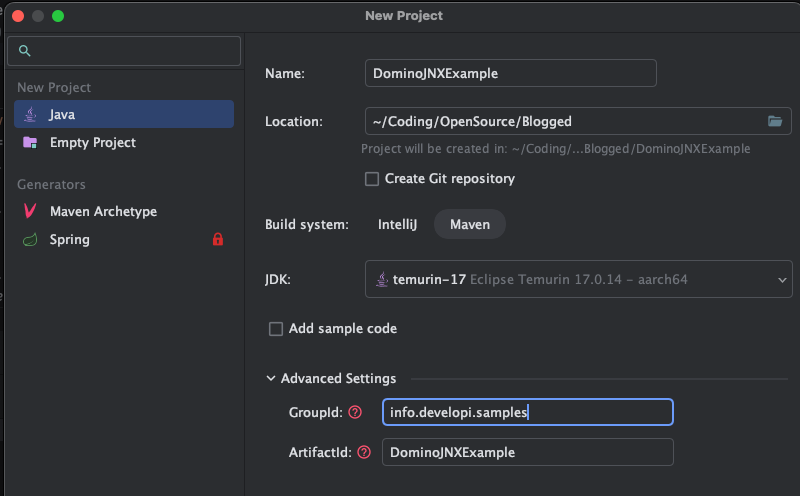

I’ve always been obsessed about finding the right balance between user experience and functionality. This can be a real challenge for us, Domino developers, as we spend much of our working day with Domino Designer. Falling in love with macOS almost a decade ago hasn’t made things easier either, as I had to deal with the added complexity of running a VM. And to top it off, Apple’s move to the highly efficient ARM architecture hasn’t received enough love and respect from HCL.

So, while I can’t avoid Domino Designer completely, I do try to minimise the time I spend using it.
<!-- more -->
Fortunately, I’d been using Eclipse IDE for a variety of tasks—plugin development, DOTS tasklets and even simple agents for day‑to‑day needs. Over time, I began experimenting with IntelliJ IDEA. In terms of user experience and productivity, it far outpaces any other IDE I’ve tried. However, Eclipse—with its [XPages SDK](https://openntf.org/main.nsf/project.xsp?r=project/XPages%20SDK%20for%20Eclipse%20RCP)—still makes plugin development more straightforward, and IntelliJ isn’t always the best fit for that.

I also decided to drop my decade‑long resistance to Maven. Working with OSGi, Maven can get quite complex. For more insight, check out Jesse’s posts on the [rocky roads of Maven, Tycho, and Domino](https://frostillic.us/blog/posts/2015/3/14/F952B6D5F7BAE6C685257E0800632220). I tried at first but struggled to grasp the basics of Tycho. After a while, though, I found my footing in the Maven world—thanks again to Jesse’s excellent [blog posts](https://frostillic.us/blog/posts/2024/4/10/simplifying-the-maven-build-of-the-nsf-file-server-project). Using a Tycho-alternative approach in Maven resolved most compatibility issues between IntelliJ IDEA and OSGi.

Long story short, I switched entirely to IntelliJ IDEA for my plugin projects last year. I mavenized my active projects and integrated AI assistants into my daily workflow. I still use Domino Designer for some development and VSCode for non‑Java work, but IntelliJ has significantly modernised my Java development. Here are a few tips and tricks if you’re considering the same switch.

## A few remarks: What’s different?

IntelliJ IDEA takes a different approach from Eclipse in several areas. [The IntelliJ help documentation has a concise summary](https://www.jetbrains.com/help/idea/migrating-from-eclipse-to-intellij-idea.html) of what you need to be aware of. (VSCode follows a different approach for Java development, so I won't compare it here.) For me, there have been only a few key points that really matter.

One of them is that the workspace concept no longer exists on IntelliJ Idea. I’ve always had a weird relationship with Eclipse workspaces. Over the years, I never quite figured out the best way to organise them: by customer, by project type (plugins vs standalone apps), or something else. Switching between an XSP plugin and a DOTS plugin often changes my target platform, which can lead to a bloated, messy workspace. Using multiple workspaces helps, but then I have to synchronise settings —code styles, themes, key bindings, etc— across each one.

When I switched to IntelliJ, I appreciated its project-centric model without workspaces, but I soon realized what I was missing: workspaces allow Eclipse users to manage multiple related projects within a single environment. IntelliJ’s project-per-window approach is clean and straightforward, but it lacks support for inter-project dependencies and makes working with multiple loosely coupled projects less practical.

You need to rethink the concept of a project as a logical group of multiple modules, and shift dependency management entirely from the IDE to Maven (while Maven is not the only option, it has a few more perks).

Here is a comparison of terminology between Eclipse and IntelliJ IDEA ([source](https://www.jetbrains.com/help/idea/migrating-from-eclipse-to-intellij-idea.html#user_interface)):

| Eclipse | IntelliJ IDEA |
| ---- | ---- |
| Workspace | Project |
| Project | Module |
| Facet | Facet |
| Library | Library |
| JRE | SDK |
| Classpath variable | Path variable |

A few other things to note:

- IntelliJ IDEA has a more powerful inspection engine than Eclipse, which can be both a blessing and a curse. It helps you catch potential issues early but can also overwhelm you with warnings and suggestions. You can configure the inspection settings to suit your needs.
- The search functionality works differently in IntelliJ IDEA. It’s not worse—just different—and may take some time to master. This can affect complex refactoring tasks where you need to find usages of a class or method across multiple modules.
- IntelliJ IDEA follows a freemium model. The Community Edition is free but lacks some advanced features. The Ultimate Edition is paid but worth the investment for serious Java development. I’ve been happy with the Community Edition, though I’m planning to upgrade to the Ultimate Edition soon.

## Setting up IntelliJ IDEA for Domino development

Let's build a simple standalone Java application that uses the Domino JNX. I specifically chose JNX because it's the simplest way to get started. The classical Domino Java API (notes.jar) needs additional work especially if you use Mac OS ARM, and the Domino JNX is a good alternative. It’s also a good way to get started with Maven.

My environment is Mac OS Sequoia 15.5, running on an Apple Macbook M1 Pro. I’m using IntelliJ IDEA Community Edition 2025.1.2, but the steps should be similar for other versions and operating systems. ARM architecture adds a few extra steps, but I’ll cover those on the way.

### Prerequisites

- Notes Client (see below for versions)
- [IntelliJ IDEA](https://www.jetbrains.com/idea/download/) (Community or Ultimate Edition)
- Java Development Kit (JDK) 17 or later (see below for versions)

#### Notes Client and JDK versions

I tend to use the latest Notes Client version available on Mac as it's the most compatible with the Mac Silicon environment. As of this blog post, the latest version is 14.5 but I am on 14.0FP4. The Notes client version is important for the compiler. Here are the JVMs for different Notes versions:

- Notes 14.5: Java 21 / IBM Semeru Open Edition
- Notes 14: Java 17 / IBM Semeru Open Edition
- Notes 11-12: Java 8 / AdoptOpenJDK, later IBM Semeru (Adoptium)
- Notes 9.0.1FP10: Java 8 / IBM J9

I tested a few stuff on Notes 12, however, I'm generally comfortable with Java 17 and Notes Client 14 on my Mac M1 Pro.

JDK selection is strongly dependent on the Notes Client version you use. If you use Notes 14, you can use Java 17. If you use Notes 12, you can use Java 8. For Notes 12, you should also consider the bitness of the JDK (e.g. 32-bit client needs 32-bit JDK). See the [HCL documentation](https://opensource.hcltechsw.com/domino-jnx/notes_environment.html) for more details.

On my platform, I use two JDKs at the same time:

- **IBM Semeru Open Edition 17 x86_64**: This is the JDK compatible with my Notes Client 14.0FP4. I use it to run the code.
- **IBM Semeru Open Edition 17 aarch64** or **Temurin 17 aarch64**: This is just to compile the code. Some large projects take time to build and since the x86_64 compiler is emulated on my M1 Pro, it runs significantly slower than the ARM compiler.

You can download the JDKs from [Adoptium](https://adoptium.net/) or [IBM Semeru](https://developer.ibm.com/languages/java/semeru-runtimes/). There are tools to manage multiple JDKs on your system. I tried some of them, but I end up downloading the JDKs manually and setting them up in IntelliJ IDEA.

#### Environment variables

Domino JNX needs to find the Notes Client installation path to be able to load native libraries. It handles this in different ways depending on the platform. On Windows, it uses the system properties 'java.library.path' and 'jna.library.path'. On Mac OS and Linux, it uses the 'DYLD_LIBRARY_PATH' environment variable to locate the native libraries. I tested this combinations on Mac OS 15.5 with the Notes Client 14.0 and Windows 11 with the Notes Client 14.0. Different platforms may require different environment variables, so check the [HCL documentation](https://opensource.hcltechsw.com/domino-jnx/notes_environment.html) for more details.

!!! warning
    Of course, nothing is ever simple, and Mac OS has its own quirks. The `DYLD_LIBRARY_PATH` environment variable is ignored when System Integrity Protection (SIP) is enabled, which is the default on modern Mac OS versions. This means you need to set the environment variables in a way that they are available to the IntelliJ IDEA process. We'll cover this in the Run Configurations below.

There are also helper variables which are referenced by our sample code. It's a good practice to set them on your system once. For Mac OS, you might use `~/.zshenv` file to set the environment variables. Windows has its standard Environment Variables section in the Advanced System Properties.

!!! info
    When you modify system-wide environment variables, you need to restart IntelliJ IDEA.

```bash
# DYLD is ignored in Mac OS, when System Integrity Protection (SIP) is enabled. We'll deal with this later.
# export DYLD_LIBRARY_PATH="/Applications/HCL Notes.app/Contents/MacOS"

# Notes Client path: This is the path to your Notes Client installation. This is referenced in the code.
export Notes_ExecDirectory="/Applications/HCL Notes.app/Contents/MacOS"

#Test user for Java use. Referenced in the code.
export Notes_IDPath="<path_to_your_id_file>"
export Notes_IDPassword=<your_password_here>
```

### Creating a new project in IntelliJ IDEA

- Open IntelliJ IDEA and select "New Project".
- Select "Java" from the left panel.
- Give a name to your project, e.g. "DominoJNXExample"
- Specify a location for the project.
- Select "Maven" as the build system. This will create a Maven project structure for you.
- Select the JDK you want to use for the project.
- In Advanced Settings, you can set the GroupId and ArtifactId for your project. Follow the [Maven conventions](https://maven.apache.org/guides/mini/guide-naming-conventions.html).
- Click "Finish" to create the project.



!!! Note
    Since this is a standalone application, I could pick the x86_64 JVM. However x86_64 is emulated on my M1 Pro, so I prefer to use the ARM JVM for compilation. We'll come to this later in the Run Configurations.

If everything goes well, you should see a new project in the IntelliJ IDEA window. The project structure will look like this:


### Adding dependencies

Go to the `pom.xml` file in the root of your project. This is where you define your Maven dependencies.

First, as a good practice, we will define the properties to specify versions of JNX and other dependencies. This way, we can easily update them later if needed. Go to properties section and make changes:

```xml
<properties>
    <!-- These are automatically set by the IntelliJ IDEA -->
    <maven.compiler.source>17</maven.compiler.source>
    <maven.compiler.target>17</maven.compiler.target>
    <project.build.sourceEncoding>UTF-8</project.build.sourceEncoding>

    <!-- Versions for packages we will use -->
    <jnx.version>1.47.0</jnx.version>
</properties>
```

Now, we can add the dependencies to the `dependencies` section. The Domino JNX is available in the Maven Central repository, so we can add it directly.

```xml
<dependencies>
    <!-- Domino JNX implementation: Also includes API and Commons-->
    <dependency>
        <groupId>com.hcl.domino</groupId>
        <artifactId>domino-jnx-jna-r14</artifactId>
        <version>${jnx.version}</version>
    </dependency>

    <!-- Needed for JNX, in case. -->
    <dependency>
        <groupId>org.eclipse.angus</groupId>
        <artifactId>angus-mail</artifactId>
        <version>2.0.3</version>
    </dependency>
</dependencies>
```

When you modify the `pom.xml` file, IntelliJ IDEA will expect you to sync the project. You can do this by clicking the small red "V" icon in the top right corner of the pom editor, or by right-clicking on the `pom.xml` file and selecting "Maven" -> "Sync Project".


### Add some code

Finally, let’s add some code. I created a [handy snippet](https://openntf.org/XSnippets.nsf/snippet.xsp?id=simple-lambda-wrapper-for-domino-jnx) to encapsulate Domino JNX functionality. To include it in your project:

1. Right-click the `src/main/java` folder and choose **New → Java Class**.
2. Name the class `com.developi.jnx.utils.DominoRunner`.
3. Paste the snippet code into this new file.

This helper class simplifies Domino JNX usage by running a lambda function within the Domino context, handling thread setup and teardown, and managing your Notes ID file and password automatically.

Next, create a main class to verify everything works:

1. Right-click the `src/main/java` folder and select **New → Java Class**.
2. Give it an appropriate name and open the editor.

Below is an example that uses `DominoRunner` to perform a basic Domino JNX operation:

```java
package info.developi.samples;

import com.developi.jnx.utils.DominoRunner;
import com.hcl.domino.DominoClient;
import com.hcl.domino.data.Database;

public class JnxExample {

    public static void main(String[] args) {
        DominoRunner.runWithDominoClient(JnxExample::runWithClient, true);
    }

    public static void runWithClient(DominoClient client) {
        // This is where you would implement your logic using the DominoClient
        System.out.println("Running JNX example...");
        System.out.println("Effective User Name: " + client.getEffectiveUserName());

        Database namesDatabase = client.openDatabase("names.nsf");

        namesDatabase.openCollection("Locations")
                     .orElseThrow()
                     .forEachDocument(0, Integer.MAX_VALUE, (doc, loop) -> {
                         System.out.println("Date Created: " + doc.getCreated().toString());
                         System.out.println("Location Name: " + doc.getAsText("Name", ' '));

                         // You can add more logic here to process each location document

                         System.out.println("-----------------------------------");
                     });
    }

}
```

### Running the code

Now comes the trickiest part: running the code. IntelliJ IDEA’s Run Configuration system lets you define exactly how your application is executed. Since we’re using Domino JNX, a few adjustments are required.

Windows users must add JVM options to specify the Notes Client path.

For macOS users, it’s more complex due to System Integrity Protection (SIP) and how macOS handles dynamic libraries. We’ll use the `DYLD_LIBRARY_PATH` environment variable to point to the Notes Client’s native libraries. However, SIP ignores this variable when set globally, so it must be configured at runtime. Additionally, although we compiled with the ARM JDK, we need to select an x86_64 JDK for running the code.

Rather than configuring each class separately, let’s set up a Run Configuration template:

1. Go to **Run → Edit Configurations…**
2. Click **Edit Configuration Templates** in the bottom left.
3. Select **Application** from the list.

**For Windows users:**

1. Click **Modify options → Add VM options**.
2. Add these lines to the VM options field:

   ```text
   -Djava.library.path="C:\HCL\Notes"
   -Djna.library.path="C:\HCL\Notes"
   ```

3. (On Windows 11 with Notes Client 14, I found that `jna.library.path` alone was sufficient.)

**For macOS users:**

1. Change the JRE to an x86_64 JDK for running the code (all Notes Client versions are x86_64).
2. Under **Environment variables**, add:

   ```text
   DYLD_LIBRARY_PATH=/Applications/HCL Notes.app/Contents/MacOS
   ```


- Click **OK** to save the template.

Any new Run Configuration you create will now use this template by default. You can still override the settings for each configuration if needed.

Click the green triangle icon next to your class to run it. IntelliJ IDEA will compile and launch the code with the chosen settings. If everything is configured correctly, you’ll see the output in the Run window.

## Where to go from here?

This example is just the beginning of what you can do with IntelliJ IDEA and Domino JNX. Try extending it by adding more functionality—creating or updating documents, experimenting with other Domino JNX features, or exploring IntelliJ IDEA’s powerful tools for code inspection, refactoring and debugging.

I plan to write more articles on using IntelliJ IDEA and Domino JNX in the future, covering topics such as building more complex applications with plugins, standalone testing apps and unit tests. In the meantime, you can explore these sample projects for inspiration:

- [Langchain4j Domino](https://github.com/sbasegmez/langchain4j-domino)
- [LLM Demos](https://github.com/sbasegmez/LLM-Demos)
- [Domino-Blog-Converter](https://github.com/sbasegmez/Domino-Blog-Converter)
- [OpenNTF-Pmt Export](https://github.com/sbasegmez/OpenNtf-PmtExport)
- [KeepExt-PlainText](https://github.com/sbasegmez/KeepExt-PlainText)

If you’d like to share feedback or discuss your experience with IntelliJ IDEA and Domino JNX, join us on the [OpenNTF Discord channel](https://openntf.org/discord). We have a dedicated topic for [Domino JNX discussions](https://discord.com/channels/953760981241200721/1229014336312311888).
