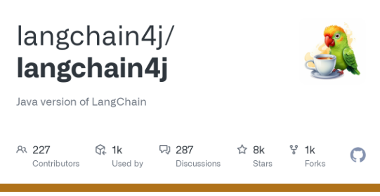

Last month, I promised a release at my [Engage 2025 talk](https://speakerdeck.com/sbasegmez/engage-2025-transforming-domino-applications-with-llms-dominoiq-and-beyond). Here we are!

I’ve just released [the first version](https://github.com/sbasegmez/langchain4j-domino/tree/develop) of the [Domino integration project](https://www.openntf.org/main.nsf/project.xsp?r=project/LangChain4j%20for%20Domino) for the [Langchain4j](https://github.com/langchain4j/langchain4j) library.
<!-- more -->
I started this project last year as an example for my [Engage 2024 session](https://speakerdeck.com/sbasegmez/engage-2024-experimenting-with-integrating-large-language-models-into-domino-apps). I waited for the main Langchain4j project to mature and settle into a regular release cycle. Early on, everything was changing weekly — from package names to class hierarchies.

/// caption
The Java implementation of LangChain is making good progress.
///

## Langchain4j

Langchain4j is a native Java implementation of the popular LangChain framework, which has gained significant traction in the LLM community for its simplicity and flexible integration with LLM workflows. Langchain4j also introduces its own ideas to provide a unified API for different model engines, vector stores, and agent-based AI features. After several alpha, beta, and release candidate cycles, the team released version 1.0.0 last month.

The way it works is refreshingly straightforward. If you want to get a feel for the basic building blocks of Langchain4j-powered LLM applications, check out [Lize Raes’s session](https://www.youtube.com/watch?v=Ewr1KYPtLa0). You might also find the [example repository](https://github.com/langchain4j/langchain4j-examples) helpful.

## Integration

Langchain4j Domino integration, on the other hand, is built around two key aims.

First, I focused on enabling data integration for the framework. Langchain4j offers broad support for end-to-end RAG (Retrieval-Augmented Generation) workflows. This includes document loaders that let you ingest textual data through LLMs and upload it to a vector database. For Domino to be part of this workflow, it needs to read Domino data and convert it into Langchain4j documents — essentially just metadata and text. The integration project includes a core library with basic document loaders.

For real-world projects, [DominoDocumentLoader](https://github.com/sbasegmez/langchain4j-domino/blob/develop/core-libs/langchain4j-domino/src/main/java/org/openntf/langchain4j/data/DominoDocumentLoader.java) can work with two types of data: fields or attachments. The loader can combine extracted text from multiple fields or use document attachments. Langchain4j provides several document parsers for extracting text from files. I’ve included parsers for PDF and Office files in the core libraries, as these are likely the most common use cases.

The second aim is the XSP plugin, which makes Langchain4j classes and core libraries available to Domino Designer and XPages developers. It generates an update site that can be installed on both the server and the Designer client.

## What next?

At the moment, I’m focusing on the ingestion part of the workflow. If you’re working with local models, ingestion can be slow and often needs to run in the background.

Java agents might seem like a solution, but the libraries used by Langchain4j are quite large. Even after stripping out most components, the library is still around 60 MB. That’s not an issue for OSGi plugins, but Java agents don’t handle large JAR attachments well. Until someone finds a creative workaround, I’m not convinced agents are reliable for this task (looking at you, Daniele… 😁).

As shown in the [LLM Demos repository](https://github.com/sbasegmez/LLM-Demos/tree/1438717d1bf153d55f2aee22bc0a9e92a1d6c4af/langchain4j-demos-cli/src/main/java/com/developi/llm/demo), the ingestion process can be built as a standalone Java application, as long as you have a locally installed Notes/Domino. This is useful in two ways: First, standalone tools give developers a playground to experiment. When developing LLM apps, a lot of trial and error is needed — such as testing different chunking strategies. Running the process as a standalone Java app makes this much easier. Second, the entire production ingestion workflow can also be run standalone, alongside the server.

DOTS is another option. While its development cycle can be tricky for many developers, it’s possible to combine standalone and tasklet modes within the same application. Developers can start by building a standalone application, then integrate the ingestion process into a DOTS tasklet for production. Creating a DOTS boilerplate could help speed up this process.

## Bottom line

The first release is fairly basic — there’s quite a lot of Maven boilerplate and not as much production-ready code yet. I’d love to hear feedback from anyone experimenting with this integration or building their own LLM workflows on Domino. Contributions, suggestions, and bug reports are all very welcome.

As Langchain4j project keeps evolving, I hope this project will make it easier for Domino developers to explore and adopt these new technologies.
