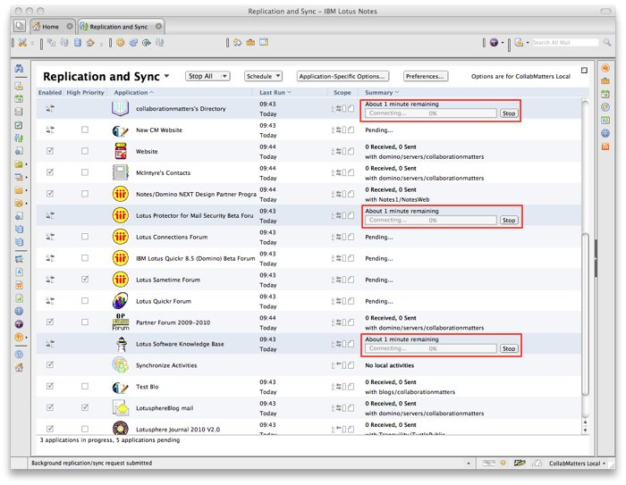
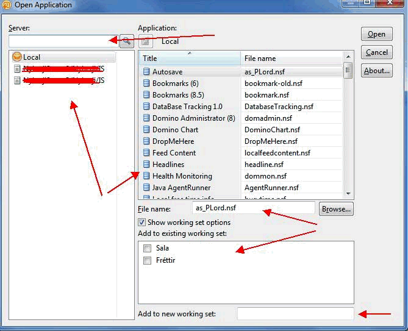
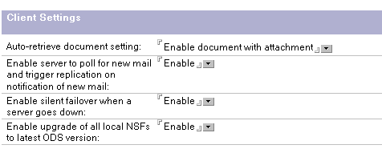

---
authors:
  - serdar

title: "Lotus Notes/Domino 8.5.2 is coming: A blogroll wrap-up..."

slug: lotus-notesdomino-8.5.2-is-coming-a-blogroll-wrap-up...

categories:
  - News

date: 2010-04-19T19:23:03+02:00

tags:
  - blogging
  - community
  - domino-admin
  - domino-dev
---

**Lotus Notes / Domino 8.5.2** was in managed-beta program since january. Last week, confidentiality has been lifted, which means beta users are now free to talk about improvements in new version.

Of course blogs are raining about new features. I wrapped-up some important features from bloggers:
<!-- more -->
**1.** Peter Presnell [blogged](http://www.bleedyellow.com/blogs/dotdomino/entry/product_review_else_8_5_2_lotusscript_8_5_23?lang=en_us) about the **new features of Eclipse-Based Lotusscript Editor** and some **Lotusscript classes** .

* Reserved words are now being corrected as **proper case**, just like in the classical one.
* **'Auto-indent'** is now automatic for pasted codes. In release 8.5.1, that was manual with Ctrl-L.
* 'Database Scripts' is now being edited with Eclipse-based Lotusscript Editor.
* **NotesDomain** , **NotesDirectory** , **NotesDirEntry** classes has been added. Now we can develop routines and functions to deal with directory operations.
* NotesDatabase class has new functions like **Archivenow()** , **Archivenowbypolicy()** , **Replicatewithclientoptions()** , **Retrievepop3mail()**.
* NotesAgent: **Runwithdocumentcontex()** method has been developed. It is a very important feature we were expecting. Now we will be able to implement 'WebQuerySave' functionality on XPages.

 

**2** . John D. Head [blogged](http://www.johndavidhead.com/jhead/johnhead.nsf/dx/8.5.2-finally-makes-database-icons-rock) about improved Application Icon editing.

* Now we can use BMP, JPG, GIF or PNG files for **application icons**.

 

**3** . Ulrich Krause [shared](http://www.eknori.de/2010-04-19/daos-enhancement-in-8-5-2/) an improvement on DAOS.

* DAOS feature can be enabled while archiving. It was two different procedure on previous version.

 

**4** . Stuart McIntryre [blogged](http://blog.collaborationmatters.com/blog/cmblog.nsf/dx/my-favourite-enhancement-in-notes-8.5.2) about my favorite improvement!

* Now **replication process is working 'multi-threaded'** on the client!!!

**5** . Erik Brooks gave details about improvements mostly about XPages on [his blog](http://www.bleedyellow.com/blogs/erik/entry/8_5_2_notes_domino11?lang=en_us).

* There are new controls like Checkbox group and radio button group in XPages.
* Dojo version is now 1.4.1.
* Server-side-javascript has new function **sessionAsSigner()** now. This XPages function provides us the opportunity to use signer and user authorization at the same time.
* Database scripts can be written with @Formula now.
* 8.5.2 Web Server has **REST API**.

 

**6** . Palmi [blogged](http://northrenlotusblog.wordpress.com/2010/04/18/8-5-2-notesdomino-funs-stuff/) the screen shot below. No further comment :)

 

 

**7** . Darren Duke, provided some details about client on his [blog](http://blog.darrenduke.net/Darren/DDBZ.nsf/dx/8.5.2-unleashed-with-some-really-nice-features.htm).

* Now we are able to fix some new settings on client workstation like **Auto-retrieve attachments** , **upgrading ODS versions of local databases**. These settings are under 'Desktop Policy' settings.

 

* **Silent fail-over**, changes replica if one server is unreachable, without bizarre pop-ups to end-user.

 

 

\* Of course, there is no need to remind that all these features are not final and certain. So IBM may alter or cancel these new improvements...
