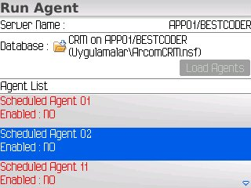
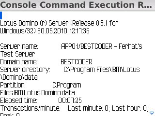
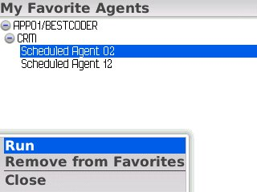

---
authors:
  - serdar

title: "Blackberry-based Mobile Domino Administration..."

slug: blackberry-based-mobile-domino-administration...

categories:
  - Misc

date: 2010-05-31T09:39:12+02:00

tags:
  - domino-admin
  - mobile
  - open-source
  - openntf
---

My friend [Ferhat](http://www.bestcoder.net/) informed me about he has published a blog entry announcing a new Domino Administration utility. The little application will be working on Blackberry phones and providing some basic administration functions like access to remote console, remote calls for scheduled agents, etc.
<!-- more -->

The application is on beta testing and he is waiting for user feedback. The blog entry is [here](http://www.bestcoder.net/?p=171)...
