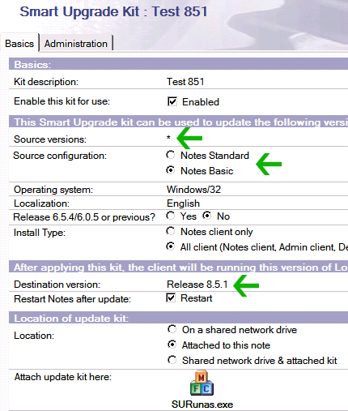
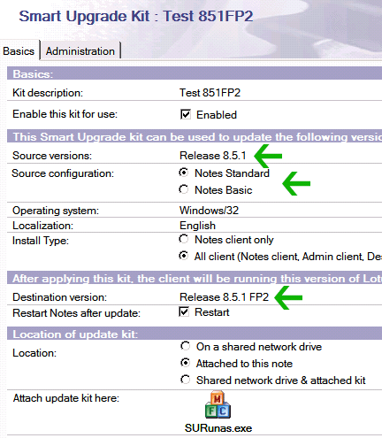
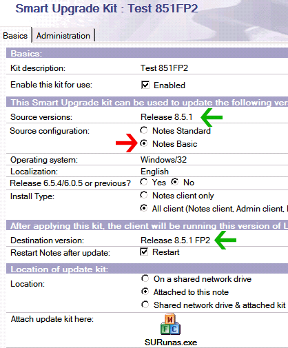

---
authors:
  - serdar

title: "Chain Smart Upgrade for Series of Upgrades"

slug: chain-smart-upgrade-for-series-of-upgrades

categories:
  - Tips & Tricks

date: 2010-05-10T18:45:46+02:00

tags:
  - domino-admin
  - troubleshooting
---

We prefer using smart upgrade during our large deployments. I would like to summarize some issues with the mechanism in this little post. I would be happy if you also share your experiences.
<!-- more -->
Some of important advantages of using Smart Upgrade are:

* You can activate upgrades with **policies** to upgrade clients part by part.
* **SUSetRunAsWizard** can be used to upgrade client environments where users don't have administrative rights on their machines.
* **InstallShield Tuner for Lotus Notes** (can be downloaded from Passport Advantage site with product code, C84T5NA) can be used to customize cery interesting features.
* Smart upgrade can also be used to upgrade **a series of different versions** at one time.

 

According to my experiences, some issues should be considered. Improper installations may create unforeseen problems. For some clients, we see that tech guys switch installation directory manually (for instance, they move 'Lotus\\Notes' folder from "Program Files" to root directory and change the short cut). Since installer gets wrong registry entries, user will see the initial setup screen when s/he opens Lotus Notes upon upgrade. Guess what; panic, phone calls and angry end-user who thinks s/he lost the address book :)

We are still dealing with some issues. Sometimes, smart upgrade dialog does not appear automatically. In one case, users have been forced to upgrade even it is not defined in their policy. We should open some PMR's and do more tests about it. I'll blog about the improvements.

The best blog I ever seen about smart upgrades is "[The New Domino Admin](http://www.thenewdominoadmin.com/)" site maintained by **Marc Champoux** ve **Patrick Darke** . They created some PDF documents from setting up smart upgrades to customizing install packages.

I have been using smart upgrade for a very long time. Lately, I discovered a terrific feature that provides serial upgrades: **Chain Smart Upgrades** .

For example, we can easily upgrade users from version 7.0.X to 8.5.1. You prepare a package with destination version of "Release 8.5.1" and it works. But what if we also want to install fix pack to these users?

We build the same one and a second package with source version of "Release 8.5.1" and destination version of "Release 8.5.1 FP2". Smart upgrade install both package at the same time!!!

Below, the first package withe source version of "\*" and destination of "Release 8.5.1":

The second package is from "Release 8.5.1" to "Release 8.5.1 FP2":

At this point we discovered an important issue: We tested the upgrade from 7.0.3 to 8.5.1 FP2. But chain upgrade was not working. After a small investigation, we found that the source configuration was the problem. Normally the second package is designed for "Standard Configuration". But Pre-8 versions are assumed to be "Basic Configuration". So Notes 7.0.3 does not see the second step of the chain. Then we have duplicated the second package as in below:

We will implement this configuration at production next weeks. We'll see our success rate :)))
