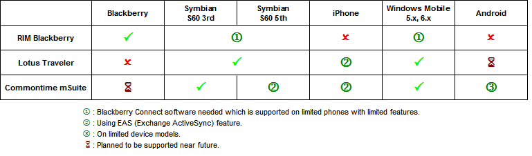

---
authors:
  - serdar

title: "New horizons for Lotus professionals: Mobile Platforms (1)"

slug: new-horizons-for-lotus-professionals-mobile-platforms-1

categories:
  - Articles

date: 2010-05-14T18:52:02+02:00

tags:
  - mobile
  - series
---

When I chat with Lotus Professionals around, I see that many are busy with their daily agendas. Most cannot concentrate on developing their expertise. I even know Lotus professionals working in large companies and dealing with non-Lotus systems, which seems abnormal to me.
<!-- more -->
IBM Lotus software products have been transformed in recent years. Demand for broader platform support, integration needs, increasing price pressures or packaged software need for collaboration environments are changing the product mixes in middleware and collaboration software platforms. In addition, competition forced IBM to create new lines for their products and they rearranged their product development strategies.

The first step of the change is **mobile applications** . We will summarize the basic issues with mobilization aspects which concerns Lotus professionals. What is going to change in our lives and what will internal customers demand near future?

I will concentrate on mobile development in another topic. Still, the way to mobile applications intersects with supporting a robust, manageable and secure mobile infrastructure.

As you know, **mobile messaging** is at the center of mobilization. But mobility of users has different dimensions. As most of companies consider, the most important issue is **security** . Mobile networks have different levels of security risks. Two important problems should be regarded.

Firstly, the communication between devices and corporate networks should be secured. As we discussed in earlier blogs, Lotus Traveler has some shortcomings. It normally relies on SSL-based communication, whereas its rivals, Blackberry and mSuite have capabilities to create secure channels using AES-like ciphering algorithms for both messaging and application layers. Certification also grants this encryption process. Lotus Traveler is able to integrate in Lotus Mobile Connect, leading security software of IBM.

A different approach is using carrier-assisted private networks. Carriers may create **private APN** 's and authenticate users to **radius servers** for companies over certain number of employees. These private networks can be used to provide VoIP services or route IP traffic of devices to corporate firewalls to protect users from internet-based threats.

Another security issue is with stolen or lost devices. The mobile software and/or devices provide some features to deal with loss. Ability to wipe out devices remotely is a common feature supported. Blackberry and mSuite also provide on-device encryption capabilities where mSuite uses the encryption feature of symbian and windows mobile operating systems.

**Manageability** is another dimension to be considered. It will be an important work-load to manage hundreds of mobile users in different operations like general setup, specifying limitations, network addressing, security configurations or version management. RIM Blackberry or Commontime mSuite provides policy-based central management functionality for administrators. For instance, with mSuite, you can deliver configuration changes or package-updates over the air. Both software provides policy packages which assures that users will not enter any configuration parameter during installation except their passwords. Manageability is more crucial when it comes to mobile applications. Because applications will need more frequent updates than basic software components.

**Device Support** is another important criteria in selection. Although many companies prefer to use a predefined device model for all employees, they may also decide to let users select their devices or use different devices for different user profiles. In case of mixed device environment, the variety of devices which your software supports become important. Nowadays, favorite phones are using Blackberry, Windows Mobile, Symbian and iPhone platforms. Android is also becoming popular and iPad is in radar. I wrapped up the following table showing the device support for three different mobile solutions.

 

 

Blackberry has limited support on different devices, whereas mSuite is more 'device-agnostic'. There are pros and cons in this approach. As in AS/400 case, Blackberry develops the device, operating system and the mobile software at one hand. It makes blackberry systems more robust in practice. However, the cost of Blackberry is higher due to higher prices of phones and operator services.

This comparison is for messaging case only. Regarding mobile applications, Lotus Traveler does not provide any rapid development solution. Blackberry's **MDS** application can be used only on Blackberry phones. mSuite has **mDesign Studio** software which supports only Windows Mobile devices for now. Commontime announced the support for Symbian (S60 5th), iPhone, iPad, Android and even Blackberry devices to be released this year.

Internal customers will be demanding **PIM (Personal Information Management) mobilization** more and more. Currently, calendar, address book and personal notes synchronization may be carried out with local sync applications (ActiveSync, Nokia PCSuite, etc.). With the changing working environments, it becomes more popular to be able to see colleagues' free time or share their calendars and address books (with managers or assistants). OTA (over the air) sync solutions also provide abilities to modify synchronized data. For instance, mSuite has secondary address book feature that allows a salesperson receive his own customer contacts directly from corporate database.

VoIP and mobile device integration is another hot topic. I will blog another post about this issue.
