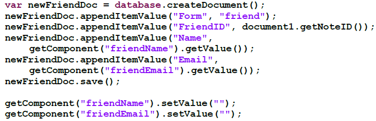

---
authors:
  - serdar

title: "New horizons for Lotus Professionals: Roadmap to the XPages (2)"

slug: new-horizons-for-lotus-professionals-roadmap-to-the-xpages-2

categories:
  - Articles

date: 2010-05-28T14:29:22+02:00

tags:
  - domino-dev
  - series
  - xpages
---

Second episode is coming for developers. It is time to be expert in XPages.

This week I have participated in XPages virtual workshop of IBM Texas Innovation Center. Due to the time zone issue, it was starting at 5.00 pm and ending at midnight; which upsets my little daughter [Defne](http://www.bebekdefne.com/) :) Anyway, I have improved some practise about XPages...
<!-- more -->
If you are a Lotus Domino developer, it is the right time to designate a roadmap for **XPages development** . Our current applications will be working for a long time, but XPages becomes an important part of our lives with its unique rapid application development abilities. In lab hours, we developed very nice and useful web 2.0 applications, created widgets and add them into (i)notes very quickly... I can say that since 1992, the time of Borland [Turbo Vision](http://en.wikipedia.org/wiki/Turbo_Vision), none of application development frameworks have been impressed me that much. I also have to admit that when IBM Lotus claimed the new Notes client as a new interface for all enterprise applications, I found this argument as a bit overstatement. But now, it seems reasonably applicable.

Anyway, let's start. We will list some new technologies to be added on top of our skill set. But first, let's have a couple of words about **what we should (!) forget** :)

Firstly, I think we may forget what we know about **Lotusscript** ... In XPages, there is no use of lotusscript. But don't worry, there are some sideways to use existing routines in new XPages. Lotusscript can be used with agents indirectly. Surely, it is important how you had used lotusscript in your applications. If our routines are cleverly parameterized with objects, we would not have much problems in migration. They would be painlessly transferred to agents. However, we will put away our Lotusscript skills in near future.

Some antique technologies like frames, iframes or CGI can be forgotten now. We have kept these burdens due to some incapabilities of current models.

Regarding **Formula** language, it is not the same formula language we are using anymore... The current formula have still a practical usage in form elements as computed fields, default values, input translations, etc. There will be a brand new formula notation integrated into javascript now. 70-80% of prior functions have been enabled for this new javascript formulas. If you pay attention to case sensitivity, using comma instead of semicolons or remember to use parantheses for every function, you would easily get used to this new notation. The new formula notation is like that:

Now, we will list some new concepts to add our skill set...

#### XML

 

If you didn't learn anything about XML yet, you should reserve your weekend for this! Whatever your profession is, you must be familiar with XML notations.

XML has a common use in XPages. Most primarily, XPage itself is an XML file with extension of XSP. Sometimes, we may use this XML file to have some modifications manually. Additionally, some features like widgets or themes are directly related with XML. To increase compatibility and prevent some HTML errors, we are developing our pages in XHTML style, which is a 'more XML type of HTML'. To interchange data with outer systems, we may have to use XML, XSL and XSLT technologies.

#### Java

 

Although it is not mandatory, using Java increases our integration and portability abilities in XPages. For over 5 years, I recommend Lotus professionals to learn Java. There is a false perception that Java is slow, heavy, hard and useless language. But if you are willing to work with IBM technologies, there is no escape!

In 2000's, Microsoft and IBM have agreed on base principles of web services technologies and presented to W3C. Then, two vendors formed two different strategies. Microsoft created '**dotNet** ' platform with '**Multiple languages, single platform** ' approach and they let developers to use many languages like Visual Basic, Cobol, C++, C# (alike Java) on one precious platform: Windows. On the other hand, IBM selected '**Single language for all platforms** ' strategy and elected **Java** (J2EE) as the single language. Developers should use Java on variety of platforms: Windows, Linux, Solaris, AIX, etc.

XPages, is based on JSF (JavaServer Faces) which is initially developed on JSP (Java Server Pages), then liberated as a different standard. All developments are being processed by Java servlets in background. Therefore Java support is native for XPages and the most optimum way of programming, in fact. By the way, structures of JSF like managed beans can also be used in XPages. These are being utilized by many enterprise systems from mobile solutions to embedded systems with huge support of different vendors and communities.

#### JavaScript

 

Javascript is the official language of XPages and being used in both server-side and client-side. Lotus has created the exact object model of Lotusscript also for Javascript. If you are familiar with JS notation, you would have no problem to adapt the new scripting. For example;

Additionally, developer has the opportunity to call server-side functions from client-side, with AJAX (no need to refresh anything).

On XPages, attributes of every single objects such as visibility, dimension, size, data source mapping, etc. can be customized by Javascript. You should start to learn Javascript if you didn't work with it.

Unlike common assumptions, Javascript is not related with Java except its similar notation. In fact, their notation are not similar to each other; they are both designed based on C language. Java is a simplified version of C++. It is **object oriented** like C++ and depends on the **class structure** . However, Javascript is a **prototype-based** **scripting language** . Java is compiled into bytecodes and run on JVM whereas (client-side) Javascript is interpretted on browser scripting engine.

The important point here is the prototype structure. Knowing the difference matters in advanced programming. Unfortunately, even some computer engineers cannot express the difference. For more information and detailed comparison to class structure, see [Wikipedia](http://en.wikipedia.org/wiki/Prototype-based) and [Sun](http://docs.sun.com/source/816-6409-10/obj2.htm) articles.

#### Dojo

 

Dojo is another framework, which is ignored by many web programmers in years. Dojo is not mandatory in XPages development. You may handle your client-side scripting with standart javascript. But Dojo is strongly advised to develop advanced Web 2.0 applications.

Dojo is a large open-source library based on Javascript. It contains every single pieces of functionalities that you might need, from menus to dialog boxes, client-side data storage to Ajax routines. You may use practical Dojo objects and forget browser dependency.

#### CSS

 

Cascaded Style Sheets have been developed in 1996 to augment the presentation layer from HTML. The main purpose was to seperate each legs of MVC (Model View Control) from each other. However, during the bloody hard times of browser wars, it had difficulties with the absence of common standards and neither fully understood nor effectively used by developers. Lately, since Microsoft loses power in browser wars, open source armies move forward and XHTML becomes more common standard, CSS can be used more actively.

It is becoming vital to learn CSS in application development. It is mostly because, fine tuning applications in IDE becomes more difficult and meaningless. (X)HTML is nothing more that serializing tags. Coloring, positioning and sizing objects are carried out mostly by CSS.

Application visualization can be completely changed by small changes in CSS. Especially ones who are developing packaged solutions or willing to have different views for different instances of applications (departmental or functional) have to use hierarchical structures of CSS.

#### Component Model and Widgets

 

XPages are compatible with the composite application structure released by Eclipse platform. In this model, multiple application parts can be run in composition and interactively.

Increasingly more applications are being used in companies whereas these applications are becoming more specific in functions. Before, HR departments were using large application to hold personnel data, job applications, candidate pools, etc. Now they are prefering a single applicant management software and use personnel data from ERP system. However, the user wants to use a single screen. Experienced developers know that it is very hard to do it with frame structure. Moreover, adding interaction, like showing 2-3 information from diferent applications with one view selection, is a nightmare.

Component model is a solid solution. Besides, you need little modifications in your current applications. You just create a couple of publisher and listener and bind these components in a composite application. Moreover, you deliver an XPage as a widget and give it to your users as powerful toys. For example, user may select an order number from message body and with single click, s/he may see the status of this order on a floating window.

In conclusion, forthcoming days will be very busy for developers. I strongly advise to schedule your days to learn these technologies and then start to use XPages. Otherwise you might have some difficulties.
