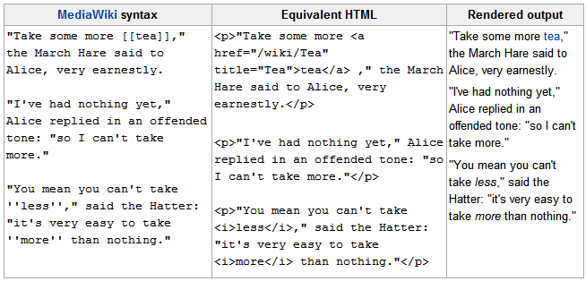
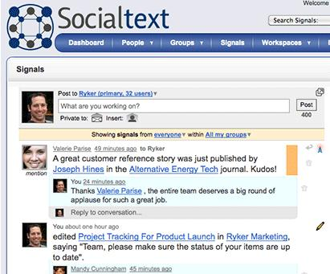

---
authors:
  - serdar

title: "Corporate Social Software: Ingredients (4)"

slug: corporate-social-software-ingredients-4

categories:
  - Articles

date: 2010-06-18T10:15:00Z

tags:
  - lotus-connections
  - social-software
  - lotus-quickr
---

We talked about different aspects of social software before. In this fourth episode of series, I will brief some of the ingredients in a social software. I have to repeat that, social software does not provide a solid solution to be analyzed and implemented towards a 'real' business problem 'in general'. Instead, it should be considered as a service provided for employees who are enthusiastic about new technologies...
<!-- more -->
There are some exceptions, of course... For instance, **Lotus Quickr** is a replacement product for **Domino.Doc** . It may be used to solve some serious 'business problems' like document management or content management. Soon, the new version of Quickr will be released in which several radical improvements are expected. I will blog about some plans as soon as I get '*confidentiality-lifted* ' list of enhancements from IBM team.

Let's summarize some important components of social software. I will skip some of them because we know and (probably) use discussion forums, instant messaging or document libraries often.

#### Wikis

 

Wikis became popular with [wikipedia](http://www.wikipedia.org/). It was a big step for collaborative content editing. Then, many organizations (from small NPO's to large technology companies) utilized wikis for both internal and external customers.

Basically wiki is a rich text content that can be edited by any authorized/anonymous user. No matter how big a change is, a chronological versioning of contents will be saved. An editor may ignore changes between two edits or revert to older versions at any time.

It should not be confused with 'online document collaboration' like in DocVerse (GoogleApps) or Microsoft Groove where wikis do not allow simultanous edits on a single content. It is also not a replacement for document management application (like Domino.Doc/Quickr) which allows check-in/check-out/locking/approval mechanisms. Wikis are edited instantly.

Use of wikis in extranets can be very effective and cheap. Product portfolio can be documented with wikis. Support partners, distributers, resellers and customers may be allowed to change different aspects of these documentation. The most common examples are for software companies like [IBM DeveloperWorks Wiki](http://www.ibm.com/developerworks/wikis/) or [SAP Developer Network Wiki](http://www.sdn.sap.com/irj/sdn/wiki).

Wikis are also being used inside companies. Large companies utilize wikis for different purposes like knowledge capture and discovery or employee self service (IT help desk or HR procedures). In additon, value of wikis can be extracted in very unexpected ways, regardless of company size. Some contents such as company guidelines or quality documentations are generated collaboratively. Compose/pass it on/edit/approve chains slow down the process of document creation. Instead, one may prepare a complete outline, everyone contributes into their own parts simultaneously. In "*The man who should have used Lotus Connections* " video, a simple example was given as creation of a meeting schedule with wikis.

Beyond countless advantages, wiki has a very simple usage as well. A dummy user may learn how to use a wiki in minutes. Rich text editors can be used in addition to **MediaWiki**notation without knowing HTML or other language...

 

 

 

#### Blogs

 

If you are reading this post, you are already aware of blogging concept. A Blog (or 'weblog') is a repository of rich contents composed by single author. Blogs can be categorized, tagged, voted and commented.

In the current social networking world, blogs are very popular. So many individuals (or groups of individuals) are blogging to reflect their opinions about anything. Companies are blogging about their strategies or activities. Politicians, celebrities and journalists are also using blogs to reach their followers. In the corporate world, the rising application of blogging is 'inside blogging'. Especially, large corporations are using intranet blogs to communicate between layers of organization or transfer strategic and tactical issues to 'downstairs'.

Actually, blogging is not an important part of a social software. The functions of blogs are being achieved by very different applications. And as a matter of fact, many companies are using these mechanisms under different names like discussions, announcements etc. But to complete the big picture, blogs exist and should have the same vertical content mechanisms like tagging or commenting...

#### Microblogs

You may have used Twitter, Friendfeed or at least Facebook status updates once in your life... Microblogs are shortened formations of usual blogs. A microblog entry could consist of nothing but a short sentence fragment, a link, an image or an embedded video. Despite its stupidly simple structure, microblogs have found lots of applications from social media communication to online marketing.

 

 

 

Microblogging has taken its place among social software components lately. The most important advantage of microblog is to provide **instant** and **asyncronous** communication between co-workers. It is simple, quick and practical.

However, microblogging has some shortcomings. **Privacy** is one of problems. Knowing that everyone is reading keeps people away of microblogs. The **security of the knowledge** can be accidentally ignored while being shared. Another problem is how people will see microblogs? Every new application in our lives creates a new window (literally) on our screens.

#### Social Bookmarking

 

Again, social bookmarking is not a new concept. It has been evolved in the last decade. Basically, social bookmarking is to clip urls on the web and put them into a tagged, categorized and shared repository. Well-known example is '[del.icio.us](http://delicious.com/)' which has been acquired by yahoo in 2005. Although Delicious was not the first social bookmarking service, the ease of use and support for tagging increased its popularity.

In the corporate world, the first social bookmarking functionality came with **Lotus Connections Dogears** which has been renamed as 'bookmarks' later.

Nowadays, sharing bookmarks are mostly done by standard social networking tools like facebook, twitter or friendfeed. Bookmarklets (toolbar/page buttons to share url's instantly) simplify sharing url's into our microblog environments. You can share, for instance, this blog entry with your facebook friends using facebook icon just below the body. However, it does not provide the capability to save and categorize it for further use.

 

 

 

An important problem with social bookmarks is that sometimes the link becomes broken in time. To avoid this, many content owners provide permanent links for their contents.

#### Task/Duty Management

 

In fact, collaboration systems evolved not to share knowledge at the first place. The biggest problem was to share a **common agenda** between members of a group which has a **common purpose** . When organizations started to leverage **team work** , **coordination** became an important issue. In complicated processes (e.g. construction projects), there are engineering methodologies for project management. But these methodologies are originated from needs of managing resources, optimizing process risk/cost.

 

 

 

Team spaces in Quickr and Activities in Connections are very good examples of task/duty management utilities in social software. They provide capabilities to share a common context (timelines, duties, documents etc.) for teams. Unlike project management, these utilities are useful to create ad-hoc plans, distribute tasks to team members and follow-up.

#### Vertical mechanisms

All social components have a common framework of user interaction. **Commenting** , **voting** and **tagging** mechanisms help users to organize, rank and enrich the content. On an integrated social software, every pieces of information should be open to user interaction.

Contribution is crucial for a social software. People are not only the source of the information, but also participants. They contribute to the content pool confirming the **accuracy** , **integrity** and **validity** of information; improving it by commenting; leverage it by voting etc.

#### Interface

 

With social software, users will be exposed new pieces of information like microblogs, new blog alerts, version changes from wikis, new feeds as well as current updates from traditional applications. A user should monitor these small 'information islands'. Pushing every piece of updates to users' screen is not practical. We need '**content aggregators** '.

New desktops will be fed by (or mashed up) different sources of information. We have shared preview of Project Vulcan lately. You can think of 'dashboard applications' as a primitive version of mashup interfaces. However, dashboard applications are generally made of repositories that push the content into an interface, while a mash-up interface pull them from different sources.

It seems simple to build up an application aggregating different contents into a single screen. But there is an important differentiation here. Pulling data is not the only issue, we should also do it real time... Open your facebook or friendfeed page and wait for a moment. You'll see that new entries will appear without refreshing the page. In a push-aggregation system it is not a big problem to retrieve real-time data. Because it's already stored on the system. However, in a mash-up page, the application does not (and should not) store the past data because it should be calculated according to the current context (your network, position, subscriptions, authorization etc.). Refreshing a mash-up page every minute is an expensive and impractical way to maintain a social software interface.

#### Policies and HR Stuff

 

Buying a social software is not a classical decision to solve a specific business problem. Many companies consider critical problems like document sharing/management, idea sharing, knowledge discovery or locating expertise. They build solutions specifically designed to resolve these issues. But a social software is more than that. I think **the distribution of responsibilities** is crucial here. MIS departments are no longer designers. Instead, they host a social software and regulate it in a corporate environment. There should be guidelines to regulate information sharing, blogging, etc. IBM is a good example here with their regulations like blogging policies. It is a new platform which needs a shift in corporate culture. Different layers in thr organization will need different expectations, concerns and resistance.

#### Seems Complicated, uh?

 

The ingredients of a social software is not limited with these. The key point is that **social software provides a infrastructure for all these components, not only in terms of authentication and management platform, but also in the level of aggregation, anaysis and searching.**

But what is the business value behind it, specifically? It is an another blog topic. Shortly, the way of business (is not changing!) has already changed!

Apart from information, knowledge is not a 'thing' that can be procured, leased or hired. It is '**collective** ', '**collaborated** ' and '**distributed**'. It is hard to catch, record, categorize and file. It has to be generated across a uniform platform. It is also expensive and crucial.

The ingredients seems like a toy. In many times, we face a large resistance to social software in business world mainly because of this perception. I suggest that do not use google for a week. Search delicious, stumpleupon, twitter or blogs to gain necessary information. You'll notice an important difference in social tools.
