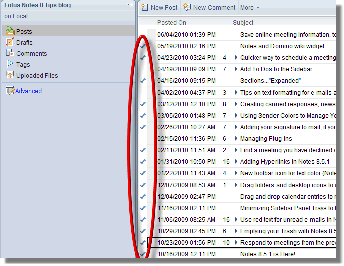

---
authors:
  - serdar

title: "Old fashion document selection...."

slug: old-fashion-document-selection....

categories:
  - Tips & Tricks

date: 2010-06-13T13:40:36Z

tags:
  - domino-admin
  - notes-client
---

Beginning with Lotus Notes 8 version, the new document selection method is very annoying for many users. As you 'noticed', we cannot select documents by 'checking' them anymore. I didn't notice before but [a nice tip published in Lotus Notes 8.x Tips blog](http://www-10.lotus.com/ldd/notestipsblog.nsf/dx/old-school-document-selection-in-a-view) suggests how to bring back old-fashioned selection mark.
<!-- more -->

'Basic Client Configuration' under preferences, has an option, 'Show check marks in margin for selected documents'. If you check this, you may select documents as in the following image.

I can say that it seems ugly in the mail database. If you don't want to use that feature, I would mention an additional trick here.

You know, each composite application including mail database has an additional basic interface. If you press CRTL + ALT buttons while openning an application in your standard client, the database will be opened under '**Basic Interface** ' instead of '**Composite Mode**'.
