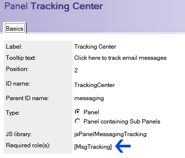

---
authors:
  - serdar

title: "Lotus Domino Administrators: It's time to delegate your mess..."

slug: lotus-domino-administrators-its-time-to-delegate-your-mess...

categories:
  - Articles

date: 2010-07-26T16:45:00+02:00

tags:
  - best-practices
  - domino-admin
  - domino-dev
  - notes-client
---

I had some customer visits last week and those visits remind me that many companies are short in Domino staff. Rule of thumb is one admin per 200 users. But, I wonder how many companies have enough admins... Regarding my customers, the average is one admin per 400-500 users. This is not healthy. Let me suggest some tricks to overcome this annoying workload...
<!-- more -->
**1. Delegate user registrations:**
For very large companies, I strongly recommend automation for registration. It can be fully automatic (HR creates a new personnel in HR application and a domino agent creates the user automatically) or semi-automatic (HR creates a new user request, you only check for some fields and approve) or fully delegated (HR sends a message to help desk, operator creates the user).

There are several issues to be cautioned. For example, if you delegate registration process, you don't have to supply certifier id and password to agents or help desk operators. **CA configuration** is a very useful tool. Basically, it allows you to load certifier information to a special database with encryption. Only specified administrators can use this information to certify new id files. Encryption is made against admin users' public keys. So it is secure as long as admin user id's are safe and secure.

It is also possible to register new users via LotusScript. **NotesRegistration** class can be utilized. Although you may use certifier id, it is preferred to use CA process to be more secure.

CA also provides delegation for some operations like recertifying, moving and renaming users.

**2. Delegate password operations**
There is only one magical word here: "**ID-Vault** ". If you are still pre-8.5, you should immediately upgrade :) ID-Vault, provides low-level administrators to reset passwords, as you already know. If there are hundreds of users in your domino server and you don't get at least one password reset request per day, you should consider revising your password policies...

**3. Delegate group management**
Groups have many different uses in our environments. They provide mail groups for teams and departments, arrange authorization issues for applications and other resources etc.

Many administrators do not want to delegate group management to low-level administrators. Because some groups are very dangerous. One may get full access administration rights by placing himself to 'FullAccessAdmins' group. Or s/he may add an unauthorized user to finance department to receive salary lists. Actually, many admins don't know that it is manageable. Let me introduce or remind some capabilities of public address book.

If you want to delegate full group management rights to a user, you give him/her '**\[GroupModifier\]** ' role from the ACL of the public address book (names.nsf). This role provides full author rights for all group documents. Therefore, you should not assign this role to 'low-level' administrator if you don't prefer them to modify all groups freely. **However, remember that author fields are only valid for users with 'author' ACL level** , which means that an editor can edit any document, regardless of author fields or which roles they have.

There are two fields in Group documents:

Owner or administrator users and groups can edit group document as long as they are defined as author in ACL. I couldn't find any difference between owner and administrator, but to edit those two fields, user should be editor at least. So the low-level administrator may edit group members, but not change administrators of the group. I suggest you to create several different administrator groups and assign them to group documents. An example would be that:

You create a LocalDomainAdmins, GroupAdmins and LocalAdmins groups. The first would be manager level and others would be author-level in the ACL of names.nsf. You assign \[GroupModifier\] role to GroupAdmins group. In this configuration, LocalDomainAdmins will be authorized to change all groups, GroupAdmins to change members of all groups. LocalAdmins would change members of specified groups only (you should authorize those with Administrators field in group documents). This method creates a three phase authorization for groups. If you wish, you may create additional layers. For example, you may give HR administrators rights to modify departmental groups.

Group management security seems to create an additional work for you. However you deal with it once at the beginning.

**4.Know the design of names.nsf**

Similar to group documents, nearly each document in names.nsf has an administrator field and assigned role. That provides augmented administration for all types of configurations. You may specify some users to change the configuration of specific servers. You may delegate administration horizontally or vertically and distribute certain rights to different groups.

For example you have development and testing servers in your environment. For some reason, you don't want to give administration rights to your development team. But they need to deal with their test environments. Separating test domain is a solution. Or you assign them as the administrator (both the administration tab and the security tab) of test server documents, and person documents of test users. They can play with them but cannot change anything on your production system.

Policy management may also be delegated in this way. Just to remind that some policy settings needs certain security rights for their signer. For example, if you unassign "\[PolicyModifier\]" role from a user, policy setting documents s/he saved will be useless.

Finally, remember that in order to use administrator and owner fields in documents, users should be defined author in ACL, not editor.

**5.Delegate database operations**
Database operations like updall, compact and fixup are frequent and time-consuming operations for a Domino Administrator.

Due to a number of reasons, databases may corrupt, view indexes may crash and you may need to fixup databases. Some over-quota users delete a number of messages and ask admins to compact their database to get back under-quota position or a developer asks you to replicate a large database. It is not only pushing a command into the console, but also tracking the result whether if it is successful or not.

The easiest way is to give a low-level administrator '**Full Remote Console Administrator** ' right (from security tab in server document). A console admin may use any console command from replicate to compact. But beware of the risk that s/he may also restart server accidentally. You need to well educate low level admins to use their 'power' for good :)

**6.Delegate monitoring duties**
DDM (Domino Domain Monitoring) has been invented at release 7. Personally thinking, it has been the best thing Lotus ever did! You have the most powerful monitoring tool if you properly use it. It may collect many valuable information from servers and present them to admins in an organized way. DDM is a subject of another blog post with its different functions. I strongly advise you to utilize it.

With DDM, low-level admins may monitor whole domain for security issues, connection problems, agents' CPU and time consumption, database corruptions, replication schedules etc. If they have proper rights, they may also send corrective commands (e.g. fixup command) directly from DDM application.

Low-level admins may also use monitoring tab of Administrator clients. This tool provides a real-time notifications for many servers in a domino domain.

Monitoring operations generally need 'View-only Administrator' access defined in security tab of the server document. DDM or log databases should be separately configured with ACL settings for each database.

**7.Very useful tool: Web Administrator**
Did you know that you may customize the look for web administrator tool? Just open webadmin.nsf database and look into panels. Each panel has a role assignment.

You may create a role and customize a specific panel to be displayed according to your custom role(s). You may even built special administration utilities and place them on a separate panel in web administrator. Of course, do not forget backup your changes before upgrade :)

**Last words**
You should be paranoid while administrating a system. But don't be stupid trying to do everything alone. I always advice my customers to delegate operational tasks and duties to lower-level administrators, help desk operators and self service applications. The first and the most obvious advantage is to have more time for yourself.

Another benefit is that while a lower level administrator will be involved into your administration tasks, s/he slowly begins to learn the job. I see many employees cannot promote because they become indispensable about what they do. As long as you don't train subordinates, you may be stuck with your position and become unhappy :)
