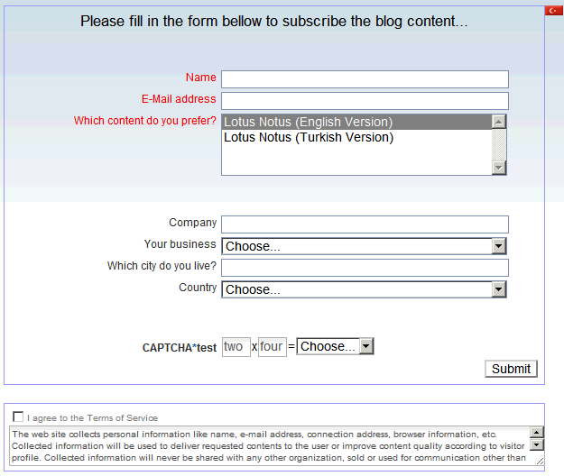

---
authors:
  - serdar

title: "My first XPages application"

slug: my-first-xpages-application

categories:
  - Misc

date: 2010-07-30T16:40:58+02:00

tags:
  - blogging
  - domino-dev
  - xpages
---

I have just finished my first XPages application. Hmm, I know it's too late. I am not guilty, I waited to become ready :)
<!-- more -->
My first XPages application is a web-based newsletter subscription module. I am not happy with my blog's visitor stats. It appears that Lotus pro's in Turkey do not like RSS reading. Many prefer E-mail newsletters. I did a small module to exercise what I learned in workshops. It's on beta right now. Some friends registered and I am still testing newsletter module.

Here are the hottest screen shot, just leaked from Developi Labs :)

It seems ugly. I didn't deal with its design much. I want to share my fresh impressions with XPages in the next post...
