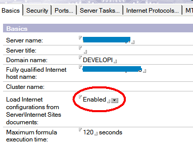
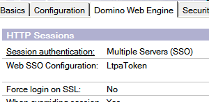
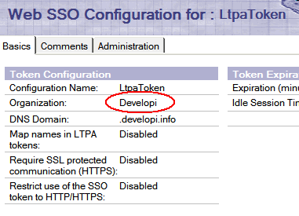

---
authors:
  - serdar

title: "HTTP Authentication from XPiNC: Got help, found bug, worked around!"

slug: http-authentication-from-xpinc-got-help-found-bug-worked-around

categories:
  - Articles

date: 2010-08-27T13:56:10+02:00

tags:
  - domino-dev
  - notes-client
  - security
  - xpages
---

I posted an entry on wednesday: "Need suggestion: Authenticate for HTTP from XPiNC?". It was about showing an HTTP resource inside an XPage on Notes Client with authentication.

Tim Tripcony, blogger at [http://xmage.gbs.com](http://xmage.gbs.com/) commented about the issue. After his great contribution, I found a bug and a workaround.
<!-- more -->
Tim basically suggested to pass a generated token (with session.getSessionToken()) to an intermediate page to complete redirection. However, I couldn't make it work.

Let me give you more details here. Before some version, all domino web engine settings were in server documents. Then Internet site documents entered our world. These documents provide multiple site configuration at a single server. Server documents have a setting for that.

If enabled, most of the HTTP task settings are being loaded from Site documents, as well as other protocol configurations like SMTP, POP3, LDAP, etc.

Let me also remind what the LTPA Token authentication is. We use LtpaTokens for multiple server authentication with a single login. You have two Domino servers and a Websphere Portal, for instance, a user logged in Portal, will also be authenticated in Domino servers; vice versa.

We create an LtpaToken configuration document in names.nsf. It includes a DNS domain (like ".google.com" without host name), list of servers and token keys. In a normal configuration, you generate keys in a random fashion; or you may also use keys, generated elsewhere (like Websphere in portal integration). Keys are automatically encrypted with listed servers' public keys. Finally, you configure those servers as Multiple Servers (SSO) authentication either from internet site document or server document.

When a user authenticates from login form on a server, it gets a session cookie named 'LtpaToken'. This is a base64 encoded text which contains user name, a validation timeframe and a secret key.

Now I will try to explain our situation. Suppose our database permits only authenticated users and we have an XPage with an iFrame inside:

\<iframe src=*"http://mobile1.developi.info/names.nsf"* width=*"800px"* /\>

When we open this XPage from a browser, we login to the server and see a page with an iframe inside, showing 'names.nsf's web interface. This is fine, because when we login to a server, we can access all resources under that domain (\*.developi.info in this example).

Now we open this XPage in Notes Client, the page will be opened, because we are already authenticated in XPiNC, but inside iframe, we'll get login screen. Iframe starts a XULRunner instance which acts as an independent browser.

To overcome this issue, we created a seperate database (redirect.nsf) with an XPage inside (redirect.xsp), open to anonymous. It gets two parameters: A valid token string and a target url. It places the LtpaToken cookie into the response and redirects client to the target URL.

I did the trick Tim suggested. On the **beforePageLoad** of **redirect.xsp** in **redirect.nsf** :

response=facesContext.getExternalContext().getResponse();
token=paramValues.get("token").toString();

response.setHeader("Set-Cookie", "LtpaToken=" + token + "; domain=mobile1.developi.info; path=/");
facesContext.getExternalContext().redirect(paramValues.get("targetUrl").toString());

In iFrame code,

\<iframe src="#{javascript:'http://mobile1.developi.info/redirect.nsf/redirect.xsp?token=' + session.getSessionToken('mobile1.developi.info') + '\&targetUrl=http://mobile1.developi.info/names.nsf'}" width="800px" /\>

Ooops! It didn't work!!! When I open this xpage (with iframe) on Notes client, I am getting login screen with "Your session was expired" error. Because HTTP task was throwing '**Digest verification failed \[Single Sign-On token is invalid\]** ' error (in deep debug trace).

After some digging, I found that my test server has a second LTPA token setting created for web configurations (servers not using internet site documents). getSessionToken() method creates an LtpaToken from the invalid configuration document (which it was belong to another domain). As two configurations have different keys, my token cannot be authenticated into my server.

Fine, I just deleted invalid entry from names.nsf ,restarted my server and tried again. This time there was another surprise. Although my SSO configuration still works well, getSessionToken() method returns null with SSO debug output: "**Entry not found in index** ".

I tried more: I cleared Organization field in my LtpaToken settings document (which I should not do according to Administration Help), restarted HTTP. This time, getSessionToken() returns a valid token but SSO configuration was not working! Because, as written in documentation, if you are using site documents, you should specify an organization.

This is probably a buggy situation. **Session.getSessionToken(...) function is not working on site documents.**

So what I did was simple. A simple idea popped up! **I just copied and pasted my LtpaToken setting document and cleared Organization field in the second one.** Now I have two LtpaToken settings with the same key set. getSessionToken() looks for the one without organization and HTTP task looks for the other. It is a simple workaround but in the production system, I should maintain two seperate configuration. Fair enough!

One last warning, sometimes, session tokens may contain "+" character which is converted to space in url.

token \>\>\> AAECAzRDNzdDQTQ2NEM3N0QxNEVDTj1TZXJkYXIgQmFzZWdtZXovTz1kZXZlbG9waVQzkbU0WjO0evnWuJP3WrVla0+P

will be translated to

token \>\>\> AAECAzRDNzdDQTQ2NEM3N0QxNEVDTj1TZXJkYXIgQmFzZWdtZXovTz1kZXZlbG9waVQzkbU0WjO0evnWuJP3WrVla0 P

You should escape it before passing to query string.

That was the whole story :)
