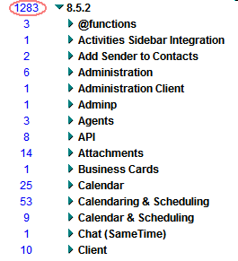

---
authors:
  - serdar

title: "Lotus Notes/Domino 8.5.2 has been announced... At last!"

slug: lotus-notesdomino-8.5.2-has-been-announced...-at-last

categories:
  - News

date: 2010-08-10T08:44:03+02:00

tags:
  - announcement
  - domino-admin
  - ibm
  - notes-client
---

IBM finally [announced release 8.5.2](http://www-01.ibm.com/common/ssi/cgi-bin/ssialias?subtype=ca&infotype=an&appname=iSource&supplier=877&letternum=ENUSZP10-0306). We were such impatient about it.
<!-- more -->
However, we will wait a couple of weeks, because it will be released on **August, 24th 2010** ...

Beyond new features, preliminary fix list is very large!

We will look into details later this week. I have to prepare for my session in LCTY İstanbul 2010 now :)
