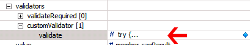

---
authors:
  - serdar

title: "My first XPages application: The good, the bad and the ugly sides of XPages"

slug: my-first-xpages-application-the-good-the-bad-and-the-ugly-sides-of-xpages

categories:
  - Portfolio

date: 2010-08-01T14:36:00+02:00

tags:
  - best-practices
  - blogging
  - troubleshooting
  - xpages
---

Last week, I mentioned [](2010-07-my-first-xpages-application.md)my first XPages application. I wanted to share my fresh impressions about XPages development for newcoming developers...
<!-- more -->
**1. You need a different approach!**

It is not easy if you think of an old-fashioned application architecture. First, **you need to think before start** . Although designing before coding is always a must for a good developer, classical Lotus applications can be easily developed without planning, putting one part on another each time...

In a classic web application (for Domino of course), we tend to use two different design patterns. One is more classical way, that we design a form, two agents for queryopen and querysave, take some inputs and evaluate them in querysave agent. The other is for developers familiar with CGI applications. Create an agent for HTML output and another agent for processing inputs.

In XPages, on the other hand, you need to design a common interface for all screens. I firstly failed in this approach. I thought, I can design different xpages for different steps of the process. I designed one for inputs, one for confirmation, one for failure and another for success pages. Result is that I needed to design the same routines, functions and data connections for each pages which was so ineffective. You can easily utilize script libraries and subforms in classical approach. Don't forget that custom controls are not exact translations of subforms.

XPages cannot be designed like a CGI application as well. Because CGI is a stateless architecture. Each CGI agents differs from XPages in that they don't have to consider their previous states. They are black boxes getting inputs and throwing some outputs.

My first suggestion is to have a pencil and paper. Think about all pages of your application, draw a map between them and try to extract common grounds. Then design a custom control for those ground rules, scenes, menus etc. Finally, place this mother control to all your pages to avoid recurring coding.

**2. I loved XPages way to validate!**

Validation is easy... As long as you don't have very complex needs (like getting some data from somewhere and compare with something else), you just set some parameters and voila! It is done :)

I used client-side validation here. I needed a name, valid e-mail address, content selection and agreement for terms of services. It was easy, just edited 'validate required fields' and it worked. One tip, there is no validation options on the properties page of listboxes. You need to set it from All Properties tree.

One complication raised from CAPTCHA test, we'll come to that.

**3. Checkboxes and Radios have problems**

In the current version, checkboxes and radios are evaluated as singular objects. You need to use groups from other controls but they are not well documented. To create them, you have to dig in the code. I think (and hope) this problem will be fixed in the next release.

You will have problems in validation of checkboxes. But there are good examples in blogs. Just search planetlotus.org for those.

**4. Multi-lingual design is easy but be patient!**

I designed the application for Turkish and English. But one mistake I did was to hurry. I designed the form and changed the language documents before testing. Afterwards, I realized that when I alter fields, the language documents are also changing.

My suggestion is that: First complete the whole application and test it, then edit language documents all at once.

**5. Start from non-english language**

I first started to design English interface. However, when I edit language documents, I realized that I cannot use Turkish characters. Turkish characters should be replaced with their unicode representations (like \\uXXXX). If you start with Turkish (or non-english version), designer will automatically convert them into unicode and editing language documents for English is easier.

**6. CAPTCHA test**

Captcha is a challange-response test to determine that your form is not generated by machine. You can see it in many forms with 'enter the numbers/letters you see in the distorted picture'.

There are several free versions on the net but many of them need some server-side scripting. I just designed a simple test. It asks the result of a computation. It prepares a couple of numbers at the session scope, and validates them on the server-side. If a robot specifically designed to break the test, it succeed. But it is better than nothing.

Validation of captcha test is one complexity. Because there is a problem of documentation for custom validations. Here is a tip I found from an XPages blog (sorry for the author, I forgot...). The following code is for custom validation:



```

result=getComponent("fieldToBeValidated");

// do your tests...

if(testFailed) {
     result.setValid(false);  // Validation failed for this field
     return "Test failed... Use your math skills...";        // Return the error message.        
}

```

<br />

**7. Poor documentation**

The most ugly side of XPages is the documentation! There is not any at all... Designer help only contains class structures and references which are not very different than what you know.

Property definitions of controls, event hierarchies, validations, bindings and many other important aspects are missing in documentation. Wiki does not help in many cases. The most useful resources are blogs. Search planetlotus.org again.

In addition, because you use JavaScript and JSF (which is based on J2EE) under the table, hand those references ready because sometimes you may need them. For example, facesContext object can be used to reach J2EE classes that you can utilize some low-level operations. You can redirect to another XPage with "context.redirectToPage(someXPage)". But if you need to redirect to another 'non-xpage' address, you have to use some J2EE: "facesContext.getExternalContext().redirect(someURLString)". External context is the J2EE equivalent for JSF context.

**8. Learn JavaScript**

As I blogged before, in new horizon series, JavaScript is the key technology here.

I am lucky about it. I were involved in a project several years ago which had a very complicated JavaScript infrastructure. I learned the main advantages of prototype programming from a real expert in this area.

My missing part is Dojo. I didn't learn it yet but it is a must at the client side. Luckily, there are hundreds of examples on the community sites.

**9. Test it with browsers**

All web developers know that it is annoying to be compatible with different browsers. I always believe in adapting w3c standards. However, even firefox violates those standards sometimes.

Test your application with different browsers at different stages. Final test will mostly let you down. After you complete the application, you may see a major problem on a specific browser and you have to redesign some parts over. That means you have to test all application again. Instead, you may notice problems earlier if you test it more frequently.

**10. Catch all errors**

Web developers also experience debugging problems in coding Domino. It is mostly the same for XPages. With standard development environment, default error pages present enough information for debugging. But for production, default error pages have a serious risk. They show your scripts to users, which is a quite dangerous situation.

The solution is to catch all errors and prepare your own error logging. Try-catch statements are powerful for javascript coding.

**11. Security issues are not different**

In XPages, standard security issues are not very different from the classical approach. You need to hide your views from web clients, set proper ACL for your database and use reader fields to protect important documents.

Do not forget the following rules about your users:

- They have enough times and motivation to hack your application,
- They know all about Lotus technologies,
- They are well-aware of the architecture of your application,
- They are well-equipped with tools they may need (sniffers, brute-force attackers etc.)
- They are good at social engineering.

**12. Think about the future**

I have examined different applications developed by many developers, including those worked for me. The common pattern is often the same. First stage is the learning curve where the freshman developer makes an application clumsily. As they learn more about notes development, their application becomes more solid, robust and effective. Real pro's develop their own styles, using subforms, script libraries more effectively. I didn't see any notes developer yet, starts with modular programming.

In XPages, custom controls are more easier and more effective than subforms. They are very independent from their mother XPage. Script libraries, on the other side, are similar. To use them productively, you have to use prototyping and dojo.

**13. Final words: A roadmap**

It is time to plan your XPages skill development. First rule is being patient about it. I don't recommend diving into a real application directly.

* First, you refresh your knowledge about basic technologies. These are **HTML** and **CSS** knowledge, **Ajax** capabilities, **JavaScript** notions, **XML** etc.
* Get ready for **Web 2.0**. New application architecture is a different challenge. Read about new model-view-controller scheme of web 2.0 applications. It is harder to develop a classical application than web 2.0 application in XPages.
* Get some basic workshops. If you are working for a business partner, **VIC (Virtual Innovation Centers)** has a three-day XPages Workshop in the PartnerWorld site. Ask your local IBM representative to access online workshops. An introductory training (D8L55) is also provided by authorized training centers.
* Use what you learned in the introductory training first. That will help you understand what is missing. I think that jumping directly to application development training is not a rational approach. You may lose yourself in the jungle. 40-50 hours of struggling will be needed. Then you might say that "I need to learn more about JavaScript, or custom controls, or dojo".
* Now you are ready to get a real education. Authorized training centers provide "**D8C51: IBM Lotus Domino Designer 8.5x: Introduction to Application Development (5 days)** " or more recent one "**D8C55: Building XPage Applications with IBM Domino Designer 8.5.1 (4 days)**".
* Use **planetlotus.org** to dig into XPages blogs. Subscribe them and short-list important articles. They will be very useful in time...
