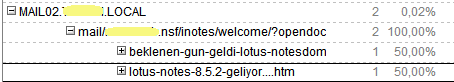

---
authors:
  - serdar

title: "Be careful to click links on iNotes!"

slug: be-careful-to-click-links-on-inotes

categories:
  - Tips & Tricks

date: 2010-09-30T16:11:53+02:00

tags:
  - domino-admin
  - security
---

The image below is taken from my blog's stats database. It shows referrer information of my visitors.
<!-- more -->

As you see, the user clicked a link from his/her iNotes screen to reach my blog page. The situation creates a security breach. I have some information about the visitor like where s/he is working and what his/her name may be. A small linkedin/facebook search may provide more info, enough for some social engineering...

For some reason, I cannot login to ideajam. I'd be happy if someone creates a suggestion to fix it.
