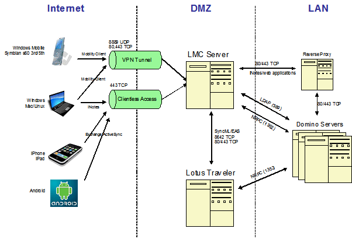

---
authors:
  - serdar

title: "Lotus Mobile Connect: Review"

slug: lotus-mobile-connect-review

categories:
  - Articles

date: 2010-10-08T10:40:00+02:00

tags:
  - ibm
  - lotus-traveler
  - mobile
---

IBM has changed the licensing model at the beginning of 2010 and promoted Lotus Mobile Connect client licenses to enterprise customers. I have posted a Turkish entry about LMC and this is the English version with a little extension. I try to summarize some key features of this great product.
<!-- more -->
If you are like me, working from anywhere (mostly my cafe-office: Starbucks), [Telecommuting](http://en.wikipedia.org/wiki/Telecommuting) is great. However, working remote creates a great security breach.

Lotus Mobile Connect is a kind of mobile connection and VPN software which was named as Websphere Everyplace Connection Manager before moving into Lotus portfolio. WECM was an expensive software. However, LMC has decreased licensing costs significantly, especially after [the entitlement](http://www-01.ibm.com/software/lotus/notesanddomino/additionalswentitlements.html) into "**IBM Lotus Domino Enterprise Client Access License** ". Currently, you only invest in PVU-based server licenses if you have these user licenses.

LMC, also provides some important features different from mainstream VPN applications. You may change NAT settings or modify your topology without dealing with firewall issues. **Dynamic session profiles** allow admins to change security settings on-the-fly and to push changes into client software. Clients may access LMC from different ports, including standard HTTP/HTTPS ports which allows them to work from restricted networks. My favorite feature is '**Seamless Roaming** '. For instance, when you upload a large file, LMC client may roam your connection from Wi-Fi to 3G or GPRS seamlessly and without disconnection. Clients can be restricted to use specific devices for additional layer of security.

There is also an API provided by LMC. Using API, your applications (mobile or desktop) can be integrated to LMC client. In addition, some administration operations can be customized. for example, you may store your devices in a database, synchronize them with LMC. User profiling can be customized or billing data would be retrieved programmatically.

Client support is better in the latest release: Windows (including Windows 7), MacOS (10.4, 10.5, 10.6), Symbian (S60/S80), Windows Mobile (including 6.5) and Linux (RedHat 5.4). LMC is also integrated into **Lotus Traveler** and **Lotus Sametime** clients on mobile devices. In addition, with '**Client-less access** ', browser-based access can be secured to web applications like iNotes. Apple iPhone and iPad devices may use iNotes Ultra-light or Lotus Traveler via client-less access. LMC 6.1.4 also adds **Lotus Redirector support** to simplify integration with Domino server environments. You have also different authentication techniques including **LTPA token** s which provides SSO implementations.

Here, I should emphasize that LMC is an important utility covers up the most important deficiency of Lotus Traveler software. Although alternative mobile platforms have their own secure connection methods, Traveler normally counts on SSL technology. LMC integrated to Traveler has been used in a project which has been awarded with "**IBM Lotus Software: Best BP Project Award** " in Turkey.

Encryption and other features are listed in [here](http://www-01.ibm.com/software/lotus/products/mobileconnect/features.html) and [here](ftp://ftp.software.ibm.com/software/lotus/lotusweb/product/mobileconnect/datasheet.pdf)...

What should you know about it?

Firstly, documentation is limited with this product. You should have a good handling of networking concepts to understand settings and configuration.

A standard configuration can be implemented easily, applying step-by-step procedures from the documentation. However, that would only give you a working access management application. You have to configure different parameters for your own use. For example, depending on your project, packet structures would be optimized. If you need different profiles for users, NAT's and IP blocks should be properly configured to meet 'who will access what' issues. Although using NATs simplifies the configuration, it is not the best way if you have large number of users and high level of activity.

LMC stores user account data (even connected to an LDAP resource, some data should be handled seperately), configuration, session and accounting/billing information on the persistent data storage. We have different storage options here. By default, it stores all data in local file system. But you have to be careful. **Local storage should not be used in production** . Recently, one customer had issues like frequent crashes affecting their LMC server. Local storage begins to crash after 100 users and normally, there is no way to convert the storage option...

We have installed a new instance for the customer, cloning each configuration element one by one. If you don't use LDAP for users and don't know their passwords; there is no way other than reassigning new passwords for all users. In our case, although they were not using LDAP, we were lucky since there was a specific password construction rule for each user. We have used command-line tools to create a large Excel file for current users and recreate them on the clone system.

I suggest using DB2 for the persistent data storage. Depending on the level of activity or your topology, you may have to use a seperate database server but it is a bit complicated to use a remote server.

For clientless access, there will be a single point of entry to avoid using different network adapters, IP addresses and SSL certificates. So using reverse proxy is a good idea to provide access for different applications on different servers behind LMC.

That's all for now. I am planning to have two large deployments this quarter. I'll keep this post updated in case.
