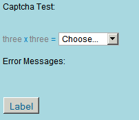
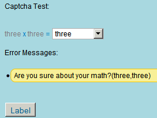

---
authors:
  - serdar

title: "A simple CAPTCHA test for XPages..."

slug: a-simple-captcha-test-for-xpages...

categories:
  - Tips & Tricks

date: 2011-01-29T15:13:30+02:00

tags:
  - domino-dev
  - xpages
---

While all are chatting around Lotusphere 2011, I am working for the community :)

Here is a simple CAPTCHA test for XPages...
<!-- more -->
It is not a turing test, actually. But it will keep spammer bots away until they become obsessed with your site...

You can [download a sample database](http://www.developi.com/_files/CaptchaSample.zip) (***see update below if you have problems*** ). You are free to use, alter, extend or distribute this code. Just don't forget credits :) The screenshots are here:





It contains a custom control and a script library (SSJS). You may simply import these two into your database and include the custom control on your page. As I said, it is not a turing test. It just makes it difficult to exploit web forms. However, it is not impossible to break it...

The custom control also supports multi-language. Just update the list of languages supported and setStrings() function for custom strings...

```js
// .....
var LANGUAGES=["en","tr"]; // Languages supported. First is default...
// .......
this.setStrings=function() {

captchaTexts["en"]=["zero","one", ... ,"twentyfour","twentyfive"];
captchaTexts["tr"]=["sıfır","bir", ..., "yirmidört","yirmibeş"];

switch(captchaLanguage) {
    case "en":
            this.validationMessage="Are you sure about your math?";
            this.emptyMessage="You forgot? Or you don't know about Math...";
            this.chooseString="Choose...";
            break;
    case "tr":
            this.validationMessage="Matematik bildiğinizden emin misiniz?";
            this.emptyMessage="Unuttunuz mu? Yoksa matematikle sorununuz mu var?";
            this.chooseString="Seçiniz...";
            break;                
    }                
}
```


**UPDATE:**
I noticed there is a problem with serialization in pre-8.5.2 versions. So I uploaded a different version as R2.0 [here](http://www.developi.com/_files/CaptchaSample_R2.0_201105.zip). Notice that the object structure and custom control implementation has been changed here and you should see different places for multilingual texts...
