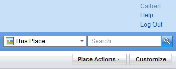

---
authors:
  - serdar

title: "Customizing Quickr for Domino 8.5.1 (part-1)"

slug: customizing-quickr-for-domino-8.5.1-part-1

categories:
  - Articles

date: 2011-01-26T11:02:00+02:00

tags:
  - lotus-quickr
  - series
---

I have been dealing with the user group site for days... When I first designed LUG site a couple of years ago, I told: "Hey! it's not easy to customize Quickr for Portal. You have to know this, this and a bit of these...".

However, right now, I am totally against 30-year-old-me... I should have looked at the Domino version!

I want to share my experiences in customizations to save your time. I am sorry that I cannot provide a step-by-step guide for this. Instead, I will explain the major parts of customization and try to show how I overcome these issues. Even if you know, please comment your feedbacks about my mistakes...
<!-- more -->

#### What we have...

<br />

First of all, you need to check these [wiki pages](http://www-10.lotus.com/ldd/lqwiki.nsf/dx/Quickr_8.5_Theme_Customization__list_of_related_Wiki_articles). Even though I appreciate their effort, it's not enough (sorry guys!). IBM Lotus should care about the short-documented products. It is certain that the community has a great contribution into product documentation. But it does not make you social to facilitate product wikis.

#### What is a theme? Do we know what we are customizing?

<br />

I have consumed a serious amount of time to discover what the theme is! Documentation mentions about a single html file (page.htm) that construct the basic layout of a quickr page. There were several candidates in different folders in html/qphtml/skins directory. I changed every one of them to see if anything changes on the page. Nope! They are not being used. I were aware of that places are taking theme information from their nsf databases themselves, but there has to be an html file that constructs the layout of landing page. Now I know there isn't :) As far as I understand, there is a custom theme configuration for the landing page, but we dont have permission to change it. Sucks!

#### Start with a sample place and custom theme...

<br />

I gave up with the landing page and started to customize my own theme. I created a sample place, copied contents of the "/html/qphtml/skins/quickr" folder into my computer and uploaded them into a custom theme.

To do this, open your sample place, click "Customize" button, select "Custom themes" and click "Create a Custom Theme". Name your theme, upload your files and click next. After you save the custom theme, you can select it from "Choose a Theme" button at the customization menu. Remember, if you make any mistake and become unable to open your customization menu, you may reset your theme by changing url: "http://\[DOMINO SERVER\]/LotusQuickr/\[PLACE NAME\]/Main.nsf/?opendatabase\&ResetTheme"...

Don't forget that, by 8.5.x, there are no different pages for different layouts. I mean, formerly you had to provide seperate pages for 'Page', 'Edit' and 'List Folders'. Now you will need only one file: "page.htm". You may use a blank file for the others. In addition, you may provide an empty stylesheet file at the custom theme, because it is not practical to upload it for every changes.

I created a sub directory (/html/qphtml/skins/lugtheme) to put my files into. Css and image subfolders are obvious. I'll explain the other two later.

![@@\[BANNER.LOGO_ALT\]@@](../../images/imported/customizing-quickr-for-domino-8-5-1-part-1-M2.gif)

#### Page Layout

<br />

Page.htm file provides a layout for your theme. Every other updates will be occuring with dojo calls inside your page. The layout has been (surprisingly well) explained at [here](http://www-10.lotus.com/ldd/lqwiki.nsf/dx/Quickr_8.5_Theme_Architecture_Overview). If you are familiar with oneuiv2 theme, it will not take much time to understand what's going on here.

Actually, there is not much changes in this page. Here is a list of what I did here:

**I imported my CSS:**
You may import your CSS file inside HEAD tags here. There are two options. If you want to import the stylesheet file that you have uploaded into the custom theme:

```
<link rel="stylesheet" type="text/css" href="stylesheet.css" />
```

<br />

<br />

As I said, it is not practical to upload every changes again and again. Instead, I preferred to put my css into the theme folder I just created:

```
<link rel="stylesheet" type="text/css" href="/qphtml/skins/lugtheme/css/stylesheet.css" />
```

<br />

<br />

**I changed the logo:**
You may change your logo directly in the stylesheet. Logo is placed as a IMG tag:

```

```

<br />

<br />

You may change css to put your logo as a background image to this object. I don't like to deal with it if I have a chance to overwrite HTML. So I did this:

```
HTML code:


CSS File:
.lugLogo {position:absolute; z-index:1;}
```

<br />

<br />

**I relocated the breadcrumb:**
One thing I don't like about the default theme, there is an unefficient use of spaces on the screen. For instance, this is the default theme:


The important thing is the content. But there is an inefficiency because it starts after around 220px. I changed this like:


I replaced the place name with the breadcrumb and also played with the CSS to relocate action button. there is a small detail about relocation of action button. If the detail section under the header is bigger, buttons would lost orientation, so I decreased their font-size. Here is the css code:

```
div.lotusHeader { margin-top:0px; margin-bottom:5px;}
div.lotusHeader div.lotusMeta {font-size:0.9em; }
div.lotusHeader { float:left; }
div.qkrActions { float:right; width:auto; margin-top:0px; margin-right:-5px;}
div.lotusMeta div.qkrTextField {width:auto !important; }
```

<br />

<br />

**I fixed a Chrome problem:**
You should always test your design with different browsers. There was a strange problem with Chrome. On the top-right corner, you may see this:



UL element is broken into vertical orientation. The mystery becomes more interesting. I am adding "display:list-item;" to its style directly from developer tools of chrome and it becomes horizontal again. However, when I add it from stylesheet, it does not work! So what I did is funny. I gave an ID to the UL and placed this script:

```
//Chrome fix
dojo.addOnLoad(
   function(){
           dojo.byId('topRightUL').style.display="list-item";
   });

```

<br />

<br />

**I customized Footer:**
The footer part is interesting. Eventually I figured it out how it works. On the page.htm file, you can see it is just a dojo widget, as other elements...

```
<div dojoType="quickr.widgets.misc.footer"></div>
```

<br />

<br />

Widget is being processed by javascript API. It uses an XSL file (footer.xsl) which is located under "\\html\\qphtml\\widgets\\misc" folder. I copied under my theme folder and changed as I wanted. Finally I changed widget code as the following:

```
<div dojoType="quickr.widgets.misc.footer" xslSource="/qphtml/skins/lugtheme/widgets/cFooter.xsl"></div>
```

<br />

<br />


You can find an alternative method [here](http://www-10.lotus.com/ldd/lqwiki.nsf/dx/Editing_the_footer_links_in_a_Quickr_Domino_Place). Remember that xslSource is being cached. You need to restart HTTP when you modify this file.

Widget customization is an important feature. I could not find enough documentation about it. I discovered xslSource parameter by engineering javascript API. That may provide further opportunities because most of the page elements are constructed by these widgets and some of them are using XSL files. Read [here](http://www-10.lotus.com/ldd/lqwiki.nsf/dx/Extending_the_Widget_Registry)...

#### Do you support multilingual interface in your customization?

<br />

Although LUGTR site will be mainly in Turkish, I have to support multilingual interface coming with 8.5.x. But how?

Multilingual data has been placed into several segments in Quickr interface. One of them is inside the servlet that interprets haiku context. We cannot interfere with that, obviously. The second part is coming with dojo, which I don't prefer to modify :)

There is also template-based multilingual string repository laid under "/html/qphtml/skins/quickr/nls" folder. The repository is being loaded into q_LocaleUtils javascript object. If you open one of files in this directory, you can see that there are javascript array objects inside .js files. There is one default "QuickrStrings.js" in nls folder and one per each language in appropriate sub-folders (en, tr, de, etc.).

```
{

  GENERAL: {
          LOADING:                                        "Loading...",
          WORKING:                                        "Saving...",
          WINDOWTITLE:                   "Lotus Quickr",
          SKIPTOMAINCONTENT:         "Skip to main content link. Accesskey S",
          NOT_IMPLEMENTED:                  "This is not yet implemented",
          DROPDOWNMENUICON_ALT: "Show menu"
  },
         
  BANNER: {
 
          LOGO_ALT:         "Lotus Quickr",
....

```

<br />

<br />

Although we may use this repository by directly editing these files, it is not appropriate. Because in any fix pack installation, this directories may be reset to their initial states. So I have constructed a similar directory structure in my theme directory and put my strings into there. Then I instructed javascript engine to load my strings.

```
<script type="text/javascript">q_LocaleUtils.loadStringFiles("LUG_ext", "/qphtml/skins/lugtheme", "quickrstrings");</script>
```

<br />

<br />

You may place this code between HEAD tags in your page.htm file. Proceed with it right now. Finally, we will place all these scripts to an extension script for more elegant looking :) When you want to get a string resource, you have two options: Using dojo or Javascript:

```
<div dojoType="quickr.widgets.misc.textlocalizer" key="CUSTOM.CUSTOMKEY"></div>

<script>alert(q_LocaleUtils.getStringResource("CUSTOM.CUSTOMKEY"));</script>
```

<br />

<br />

You may use javascript notation to customize links for different languages.

#### What is next?

<br />

I am still working on the new theme. I will blog more about my improvements. However, there are still unresolved issues for me and waiting for your comments.

* I still don't know how I can customize the landing page. I think I will play with some elements in lotusquickr\\main.nsf database.
* It may be a good idea to put 'What's new page' on the home page of the place.
* A convenient method to change the content layout is needed. I can play with some XSL files to relocate RSS link for instance. But modifying standard widget elements may create problems in upgrades.
* I want to change business card widget.

<br />

Hope this post helps you...
