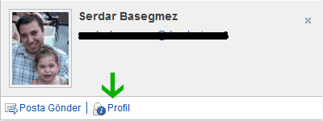

---
authors:
  - serdar

title: "Customizing Quickr for Domino 8.5.1 (part-2)"

slug: customizing-quickr-for-domino-8.5.1-part-2

categories:
  - Articles

date: 2011-02-23T19:00:00+02:00

tags:
  - dojo
  - domino-dev
  - lotus-quickr
  - series
  - social-software
---

My latest [](2011-01-customizing-quickr-for-domino-8.5.1-part-1.md)post was about Lotus Quickr for Domino customization. While designing [Turkish Lotus User Group](http://www.lotusturkiye.org "Turkish Lotus User Group") site, I have learned lot about this customization issue.

I said that it was poorly documented, whereas IBM released [this handy presentation](http://www-10.lotus.com/ldd/lqwiki.nsf/dx/Lotusphere_2011-AD305-Deep_Dive_on_UI_and_Server-side_Customizations_for_IBM_Lotus_Quickr_for_Domino_8.5) about the general concept of widget customization. I wish I had seen this before I have consumed hours to understand what's going on. Unlucky me :)
<!-- more -->
OK. I am posting my story about how I customized [LUGTR Quickr site](http://www.lotusturkiye.org/lugtr) business card and footer (which I mentioned on my previous post) widgets.

About business card, don't raise your expectations, because I did not have time to do the essential part (getting additional data to the business card). I just try to explain how to place a photo on the business card and change the layout slightly. Remember, we don't have Lotus Connections Profiles. If we had, it would not be necessary to change anything, because it already provides enough customization.

First you should decide to change what. Is your change going to be available for whole Quickr implementation, or just for a customized theme. I did the business card issue for the whole site but the footer was just customized according to the custom theme...

Let's begin with the footer. Footer is a widget, named as "**footer.js** " placed under "\\qphtml\\widgets\\misc" directory (relative to "/data/domino/html" folder). You can see that widget names explains their path...

If you look at the widget script, you can see these lines in the *postCreate* function:

```js
///....
var xmldoc = this.getXmlDocFromString('<?xml version="1.0" encoding="utf-8" ?><entry></entry>');

this._xsl = (this.xslSource.length == 0) ? this.getWidgetLocation() + "/footer.xsl" : this.xslSource;        

var _xslParams = new Array();
_xslParams['WIDGETID_PARAM'] = this.id;
_xslParams['TABLE_SUMMARY'] = window.q_LocaleUtils.getStringResource("FOOTER.SUMMARY");
_xslParams['IS_OFFLINE'] = window.q_BaseLoader.environment.isOffline;

var res = this.transformContent(xmldoc, this._xsl, _xslParams);
///....
```

<br />

Don't look for functions like "*this.getXmlDocFromString()* " or "*this.transformContent()* " in this javascript file. They are inherited from "*quickr.widgets._transformer* " widget. What this script is doing is simple. It creates an XML DOM (empty one here), put some additional parameters and transform it to some HTML DOM object and place it inside the related div object (in page.htm file).

```html
<div dojoType="quickr.widgets.misc.footer"></div>
```

<br />

You can also see that the default XSL file (footer.xsl) is located under "\\html\\qphtml\\widgets\\misc" folder. It uses the default one if nothing defined under "xslSource" parameter. Here we see a problem. "xslSource" parameter is handy, because some widgets don't take any parameters from their declaration. In business card, we'll see how we will handle if it's the case.

Now, look at the XSL file. I will import some important parts here.

```html
<!-- ... -->
<xsl:output method="html"  encoding="utf-8" />

<xsl:param name="WIDGETID_PARAM" select="'*DEFAULTWIDGETID*'" />
<xsl:param name="IS_OFFLINE" select="''" />
<xsl:param name="TABLE_SUMMARY" select="''" />
...
<div class="lotusFooter" id="lotusFooter">
     <table cellspacing="0" width="100%" summary="{$TABLE_SUMMARY}">
             <tr>
                     <th><div dojoType="quickr.widgets.misc.textlocalizer" key="FOOTER.LOTUSQUICKR"></div></th>
                     <th><div dojoType="quickr.widgets.misc.textlocalizer" key="BANNER.HELP"></div></th>
                     <xsl:choose>
                     <xsl:when test="$IS_OFFLINE = 'true'"></xsl:when>
                     <xsl:otherwise>
                     <th class="ConnectorSection"><div dojoType="quickr.widgets.misc.textlocalizer" key="FOOTER.CONNECTORS"></div></th>
                     </xsl:otherwise>
                     </xsl:choose>
<!-- ... -->
<li><a href="javascript:;" onclick="dijit.byId('{$WIDGETID_PARAM}').openQuickrInfoPage('0337C2FE18A2F9EB05257291006F0D04');"><div dojoType="quickr.widgets.misc.textlocalizer" key="FOOTER.ABOUT"></div></a></li>
<!-- ... -->
```

<br />

The first part defines internal parameters to be used in transformation. We remember these from the js code which sets these parameters before transformation. You can see that "*{$TABLE_SUMMARY}* " notation provides us to use it at the HTML output. You place multilingual text with "textlocalizer" widget. The most important part, you can use selective output here. The link to download Quickr Connector plugin will not be printed if the user sees the page offline.

I copied this XSL file under my theme folder and changed as I wanted. Finally I changed widget declaration (in page.htm file) as the following:

```html
<div dojoType="quickr.widgets.misc.footer" xslSource="/qphtml/skins/lugtheme/widgets/cFooter.xsl"></div>
```

<br />

I will not get into details here. It's just HTML. I changed the table to 3 column-layout and put sponsor links to the wider part (don't use styling on the XSL. The browser caches this file.) One thing you shoud be careful is to use XML notation in XSL file. Close all your tags (many designers don't close "\< br \>" tag, for instance)...

Let's get to the business card issue, which is a bit more complicated. This is the standard business card on QuickrD:

![@@\[CPEOPLE.MOREINFO\]@@](../../images/imported/customizing-quickr-for-domino-8-5-1-part-2-M2.gif)

Let's begin with the simple one: Changing the photo. Photo source is set automatically, by qpconfig.xml configuration. Here, I will open a discussion (which I am not the first) to question why Quickr has a different business card system than Sametime? Yep, it seems idiotic (and mysterious) that Quickr cannot take advantage of Sametime business cards. As you know, most general technique in Sametime is to store business card photos inside LDAP. I tried several alternative technique but they are not efficient.

Photos are coming from a URL request. There is a [suggestion by Vincent Cailly](http://www-10.lotus.com/ldd/lqwiki.nsf/page.xsp?documentId=0BAA2AB5789BB1A385257535005F7595&action=openDocument) on the wiki that designing a servlet to get photos directly from LDAP. I prefer not to do that because Java Servlet is a very resource-consuming task. I had my check-in application (thanks to Julian from [YouAtNotes](http://www.youatnotes.com/)) which contains all avatars. I simply created an agent and modified qpconfig.xml:

```vbscript
'...
email = LCase(getURLParam(session.documentContext.query_string(0), "e="))
'... /*** Get avatar url with some lookups ***/
if result(0)="" Then
     Print "["+default_avatar+"]"
Else
     Print "["+result(0)+"]"
End If
```

<br />

```xml
<!-- ... -->
<user_photo_source>
<directory>
 <url>
   <![CDATA[ /registration.nsf/getavatar?OpenAgent&e={email} ]]>
 </url>
</directory>
</user_photo_source>
<!-- ... -->
```

<br />

That was the easy part :) Rough part is to modify the layout and include more details... Let's examine the business card widget (/qphtml/widgets/people/personcard.js):

```js
//...
var xsl = this.getWidgetLocation() + "/personcard.xsl";        

// default: search for member name (in Contacts db)
this.generateXmlString = this.generateXmlString_Member;
var xmldoc = this.getXmlObject();
var xmlParams = new Array();
xmlParams['WIDGETID_PARAM'] = this.id;
xmlParams["GROUP_ROLE"] = this.role;
var content = this.transformContent(xmldoc, xsl, xmlParams);

var bFound = (typeof content == "string" ? content.length > 0 : content.firstChild != null);
if (!bFound) {
     // Name not found (empty response), so force new search for name in directory.
     // We must supply the role in this case!
     this._xmlString = "";
     this.generateXmlString = this.generateXmlString_LDAP;
     xmldoc = this.getXmlObject(true);
     content = this.transformContent(xmldoc, xsl, xmlParams);
     this._xmlString = "";
}
///...
```

<br />

There is a small trick here. In quickr, persons may be internal or external. The script first tries to get the internal member, if failed, it gets the external one.

We have two important problems in customization. The first problem is that it does not get a declarative parameter for XSL. So If we want to implement an alternative XSL to change its layout, we have two options. The first is to modify "*personcard.xsl* " file. You don't want to do this :) Because after each upgrade (even minor ones), you have to monitor these changes. What I did here is funny... I inherited this widget and created a new widget in my theme folder (/qphtml/skins/lugtheme/widgets/personcard.js). I also inherited the only function that calls XSL file:

```js
dojo.provide("quickr.widgets.people.personcard");

dojo.provide("lugwidgets.personcard");
dojo.require("quickr.widgets.people._personcard");

dojo.declare("lugwidgets.personcard",  [quickr.widgets.people._personcard], {
          postCreate: function() {
            try{
              //......... (the same stuff)...........

              //Customized here*****************
              var xsl = "/qphtml/skins/lugtheme/widgets/cpersoncard.xsl";

              //......... (the same stuff)...........
            }catch(ee){
            }
          }
});
```

<br />

I created the new XSL file in the custom widgets folder. In the customized XSL, I added the following part just after "Send Mail" button:

```html
<li>
  <a href="javascript:openProfile('{@ca:email}')">
    
    <span class="qkrPaddingLeft2px" dojoType="quickr.widgets.misc.textlocalizer" key="CPEOPLE.MOREINFO"></span>
  </a>
</li>
```

<br />

Now we have to configure widget registry to replace the ordinary widget with our new widget. QuickrD has a declaration file named "*/qphtml/widgets/resources/widgetRegistryConfig_ext.js* ". This can be used for widget additions and modifications. The documentation above explains it with great examples. My extensions are like that:

```js
//*** Customized for LUGTheme

{
 registerWidgets:
 [
             {
                     type: 'registerstrings',
                     id: 'lugtr',
                     path: '/qphtml/skins/lugtheme',
                     fileName: 'quickrstrings.js'
             },

             {
                     type: 'REGISTERMODULEPATH',
                     name: 'lugwidgets',
                     path: '/qphtml/skins/lugtheme/widgets'
     },
     
             {
                     type: 'globalreplace',
                     source: "quickr.widgets.people.personcard",
                     use: "lugwidgets.personcard"
             }
             
     ]
}
```

<br />

We also register our multinational strings at this point. Finally, here is what we get:



We mentioned about two problems. The second problem is that the xml data containing user information ("*{@ca:email}* ") is coming from the atom engine of Quickr servlet. I could not find a way to change this. Here is the result of atom call:

```xml
<content type="application/xml">
     <ca:member
             ca:id="(some url)"
             ca:DN="CN=some name,O=some org"
             ca:type="user"
             ca:email="some email"
             ca:display-name="some name"
             ca:first-name="some firstname"
             ca:last-name="some surname"
             ca:phone-number="some phone"
             ca:description="some description"
             ca:role="some role - owner, reader, etc.">
     </ca:member>
</content>
```

<br />

What you can do is (and what I will) to extend the widget to get additional information (in JSON or XML format) from a domino agent and put this into XML object that will be transformed. When I do it, I'll blog. Meanwhile, I'd like to hear you if you have smarter solution.

#### What we learned...

Customizing Quickr is not a great issue for me anymore. The crucial part of customization is to be immune against version changes. Up to now, we would not lose anything we customized. Remember, extensions will be preserved during upgrades. We should only be careful if lab guys redesign the person card widget entirely, which seems more possible in major upgrades.

In addition, we keep all customized files together in the theme directory. That would help you to move your changes server to server. Only the widget extension file left out.

One last thing. Our business card customization will be valid for entire QuickrD installation. If you want to modify a widget for only specific theme, as told in wiki article, you can use selective modifications in the widget registry (in fact I didn't test it with 'globalreplace'):

```json
{
     type: "some type",
     condition: "some javascript condition",
     source: "some widget",
     use: "some widget"
}
```

<br />

**UPDATE, regarding feedback :)**

Anna is curious about how I changed the way inline list I have changed. Let's publish what I did there... In **page.htm** file:

```html
<ul class="lotusInlinelist" id="topRightUL">
        <li class="lotusFirst">
                <div dojoType="quickr.widgets.misc.myusername"></div>
        </li>
        <li id="lugRegisterLink" style="display:none">
                <a href="/registration.nsf/register.xsp"><div dojoType="quickr.widgets.misc.textlocalizer" key="LUGTHEME.REGISTER"></div></a>
        </li>
        <li id="lugProfileLink" style="display:none">
                <a href="/registration.nsf/editprofile.xsp"><div dojoType="quickr.widgets.misc.textlocalizer" key="LUGTHEME.EDITPROFILE"></div></a>
        </li>
        <li>
                <div dojoType="quickr.widgets.misc.helplink" id="helplink_top" helpPageId="31AA4C92876F063705256708001671E2"></div>
        </li>
        <li>
                <div dojoType="quickr.widgets.misc.loginlogout"></div>
        </li>
</ul>
```

<br />

As seen, username, help link and login/logout links are built by a widget. I needed a fourth link, either register for anonymous users or edit profile for registered users... Normally you may define a simple widget to do this. But I preferred a much simpler way. You will see a couple of list items there. First is to the registration page, the other is to the edit profile page. Both are set as hidden with style definition: "*display:none* ". Bold parts are comming from my customized multilingual registry. I have another javascript on the same page:

```js
dojo.addOnLoad(function() {
        dojo.byId("lugRegisterLink").style.display=q_BaseLoader.user.userName=="Anonymous"?"":"none";
        dojo.byId("lugProfileLink").style.display=q_BaseLoader.user.userName=="Anonymous"?"none":"";
});
```

<br />

This code ensures that anonymous and non-anonymous users will be able to see the appropriate links.

But remember this: In Quickr, page.htm will be loaded once. Every other changes will be done on the same html. So if your situation does change with navigation (as in case of the breadcrumb) setting this on the page.htm will not be enough. Dojo fire some events during navigational changes and you should bind to them. For our username-based case, page is refreshed in login/logout events so we did it very easily.
