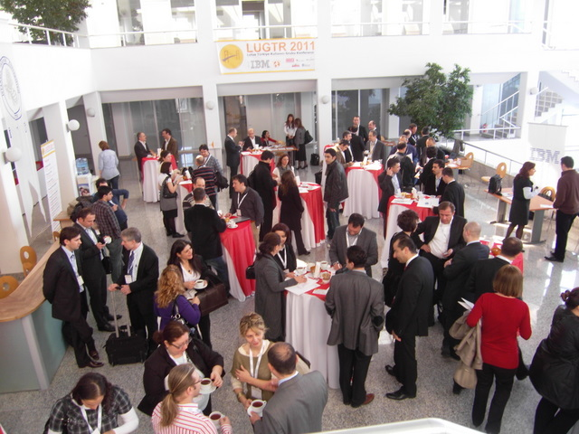

---
authors:
  - serdar

title: "Afterthoughts about LUGTR 2011..."

slug: afterthoughts-about-lugtr-2011...

categories:
  - Conferences

date: 2011-03-19T18:00:00+02:00

tags:
  - community
  - ibm
  - lugtr-conference
---

After a [long journey](2011-03-after-a-long-journey-turkish-lotus-user-group-conference....md "after-a-long-journey-turkish-lotus-user-group-conference....htm"), we finally passed the conference... We recorded everything but I didn't have any chance to view videos yet. I will put them online if they are good enough...
<!-- more -->
At the beginning, our keynote speakers Ed and Uffe had excellent presentations. Ed mentioned about the future of Notes/Domino software, LotusLive and XPages... The most important point is the commitment of IBM in application development.

Uffe evaluated the role of Lotus software in the social business transformation. He specifically explained the phase out of E-mail from our scope and the importance of activity streams in the new schema of information systems...

Ozgur Uckan and Denis Sener presented "Business, Socially!" session. They emphasized very important points. I liked the anology of "waved sea" and "waved ocean" about MIS and technology components. According to Ozgur and Denis, the problem is that IT has not been able to solve its basic problems like using spreadsheets and e-mail for MIS. Now, the market puts a much more complicated mechanism on top of this problematic structure: Socialization of everything.

We passed afternoon sessions without any crisis, except a couple of timing problems. I would speak later about those sessions after I read evaluation forms...

In the closing sessions, we had our little mini-quiz show. We made some participants very happy :) The best surprize was that our netbooks have been transformed to notebooks which I learnt after the organization. It probably became a good surprize for winners...

So far, I got excellent feedbacks from chats, blogs and messages.

I would like to express my best feelings for everyone supported and participated...

Esra, Özcan, Gulizar, Pınar, Mine, Jale, Server and other IBMers from the local team did great job for this event as well as Manfred, Maciej, Delia, Wojciech and others from CEE IBM team. I think I forgot to mention about our executive team in my opening speech. Sorry about that!

However, it was not perfect! Here are some frustrations about the organization:

* Everybody satisfied, but I did not! Participation was not enough: 120 attendant out of 190 registrations! We had 350 members in our user group and I expected at least 200 members there. People also left the event very early. At the closing session, there were only half of the participants.
* Of course, academic corner let me down. There was at least 10 academicians and 3-4 student clubs confirmed. **No one** (yes zero!) attended to the academia corner meeting and we canceled it, unfortunately.
* I was not satisfied with the coverage of technical sessions. I liked each sessions in their context but a user group event has to cover more subjects. One XPages session and single administration topic would not be enough.

 

At the bottom line, we had some great winnings. A number of Lotus professionals, partners and IBMers activated their twitter accounts, for instance. The number of followers for @LUGTR account have been tripled during last month. Members of LUGTR are now aware user group's capability. As I spoke to our sponsors, they are also very happy with the organization. Great momentum achieved on thursday, motivated people to **participate** in the user group and **leverage** the value of Turkish Lotus community...

Maybe it was the most important that first time in my life I have heard almost nothing negative about Lotus Software in such event!

One last thing I can say is about [Ed Brill](http://www.edbrill.com "Ed Brill") and Uffe Sorensen... I had the chance to have a wonderful dinner with them. They are just great! It is not only their deep knowledge and broad sight about their job, but also that Ed and Uffe have a modest, polite and egoless approach to everyone.

The event has ended, indeed but we are not done. Next week LUGTR executive team will have a meeting to decide what is next...

###### \* Thanks to Julian for the photo...
