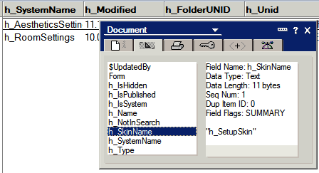

---
authors:
  - serdar

title: "Customizing Landing Page of Quickr for Domino 8.5.1 (part-3)"

slug: customizing-landing-page-of-quickr-for-domino-8.5.1-part-3

categories:
  - Tips & Tricks

date: 2011-03-05T12:56:40+02:00

tags:
  - dojo
  - domino-dev
  - lotus-quickr
  - series
---

I am blogging an interesting finding now :)

I have posted [part-1](2011-01-customizing-quickr-for-domino-8.5.1-part-1.md) and [part-2](2011-02-customizing-quickr-for-domino-8.5.1-part-2.md) for the customization of Lotus Quickr for Domino 8.5.1 so far.
<!-- more -->
These articles were related with the theme customization and as I said before, theme selection is disabled for the landing page (which is a special type of a place in "*/LotusQuickr/lotusquickr/main.nsf* "). Another difference is that no widgets are being used in the landing page. It has (almost) standard HTML layout... There are some tags like "*QuickPlaceSkinComponent* " which are replaced with appropriate HTML blocks by the Quickr servlet. You can find the exact layout in "**page.htm** " file which is in "*\\domino\\html\\qphtml\\skins\\setup* " folder.

I think we are unable to customize the landing page because the development team is planning to make bigger changes in this structure. So if you are sure to do this, think twice because you would not be able to use this customization on the next versions (8.5.2 or beyond)...

OK. The question is: "**How to customize the landing page?** "

**Literature(!) Review**

To make some easy modifications, there is [an article](http://www-10.lotus.com/ldd/lqwiki.nsf/dx/Editing_the_footer_links_in_a_Quickr_Domino_Place) in Quickr wikis. A simple footer modification can be done via javascript according to this article. This may give an idea if your customization is scriptable :)

Gary Ernst sent a method to [Michael Urspringer's wiki](http://www.urspringer.de/quickr) (great source of information!) about [how to load a theme to the landing page place](http://wiki.urspringer.de/doku.php/qfaq/development/how_to_change_the_design_of_the_quickr_landing_page) for Quickr 8.0.x and 8.1/8.2. I have tried this on version 8.5.1 and I failed. It just gets messy. But this article helped me to find a way to modify landing page.

**Preperation**

We will first backup the databases we will modify: "*/LotusQuickr/lotusquickr/main.nsf* " and "*/LotusQuickr/resources.nsf* ". Don't forget that Quickr highly depends on universal id's. Therefore, do not use "new copy" for backups. You can either create a new replica or OS-level copy while server is not running.

In addition, we will be changing values of some fields while working. So I suggest using a basic agent to make these changes. I am using [Dan Velasco's reusable agent](http://www.dominopower.com/issues/issue200003/reuse001) to do this. Create this agent in both databases. You need to disable the following line (in CreateFieldChoiceList routine) because there is no form in our databases:

```
Set form = currentDB.GetForm ( formName )
```

<br />

<br />

**Inside Themes**

First, I need to explain how themes work. Open main.nsf database of a usual place and navigate between views of "System" folder...

The theme information is based on "skins" and "skin groups" in Quickr. When we upload a "page.htm" into a custom theme, it creates a "skin" document in main.nsf database. Therefore, each skin document refers to an HTML or CSS file to be used in visual rendering. Although in 8.5.1, custom themes are using only page.htm, we still upload other files. These skin documents are also grouped under "skin group" documents where the name of a theme comes from the group document. Here, we can see our custom themes we built before:


Each skin document contains "h_SkinGroupUnid" field to connect their skin group document. Skin group settings have a field called "h_SystemName". Each place database contains a setting document named "h_AestheticsSettings" (in System\\Settings view). This document contains the theme information (h_SkinName field) matching the h_SystemName field of the skin group.

A bit complicated, huh? Navigate through standard places and you will understand those connections better.

Likewise, the landing page is a specially designed place. So it uses all facilities of a place. There are a number of haiku fields, content documents and place settings in its database. One main difference is that it does not contain any skin/skin group information. However, if you analyze its "h_AestheticsSettings" document, you'll see it has a skin connection:



So, the question becomes obvious: Where the hell this "h_SetupSkin" is stored? The answer is the **resources.nsf** database... We know this database from the QuickrLoginForm design element. When we look at this database, you may see that. There are all default skins and skin groups in this database. Places newly created are also taking theme information from this database.

If you analyze those skins further, you may see that 4 different files are being used in h_SetupSkin (find the value of "*h_SkinGroupUnid* " from **Skin Groups** view and lookup this id in **Skins** view). Files are embedded into MIME fields here...

**Create Custom Themes**

In **Resources.nsf** database, create two folders named as "**Custom Skins** " and "**Custom SkinGroups** ". Inherit their designs from "**System\\Skins** " and "**System\\Skin Groups** " views respectively. Then copy "*h_SetupSkin* " skin group document and paste it into "**Custom SkinGroups** " folder. Copy related skin documents (there are 6 docs) from "**System\\Skins** " view and paste them into "**Custom Skins** " folder. Now, use "Change Field" agent to make corrections.

In "**Custom SkinGroups** " folder,

- Change "*h_SystemName* " field to "*h_SetupSkin2* " in our skin group document.
- Copy its universal id.


In **Custom Skins** folder,

- Select 6 skin documents here and change "*h_SkinGroupUnid* " fields to the universal ID we just copied (in my case: 6876CA7E57362168C225784A0043F179)...

Open **System\\Settings** view in landing page's **main.nsf** database and see "*h_AestheticsSettings* " document here. Change the value of "*h_SkinName* " field to "*h_SetupSkin2* " for this document.

Now we have a custom theme configured. However, since we created an exact copy, it is the same as previous... How are we going to change this? We have to upload our htm files somehow.

**Change Contents**

Here, I am proud of myself because my solution is a piece of art :)))

Open your designer, open **Resources.nsf** database and create a form named "**SkinEditor** ". Place single text field named "*TempBody* ". Make sure checking "Automatically enable Edit mode" in form properties. Put the following codes into QueryOpen and QuerySave events:

```
Sub Queryopen(Source As Notesuidocument, Mode As Integer, Isnewdoc As Variant, Continue As Variant)
        Dim doc As NotesDocument
        Dim mime As NotesMimeEntity        
       
        Set doc=Source.Document
        Set mime=doc.GetMIMEEntity("h_Body")        
        Call doc.ReplaceItemValue("tempBody", mime.ContentAsText)
End Sub

Sub Querysave(Source As Notesuidocument, Continue As Variant)
        Dim session As New NotesSession        
        Dim doc As NotesDocument
        Dim mime As NotesMimeEntity        
        Dim stream As NotesStream
       
        Set doc=Source.Document
       
        Set mime=doc.getMIMEEntity("h_Body")
        Set stream=session.createStream()
       
        Call Stream.WriteText(doc.tempBody(0))
       
        Call mime.setcontentFromText(stream, "text/html; charset=windows-1252", ENC_BINARY)
       
        Call doc.Save(False, False)        
End Sub
```

<br />

<br />

Now go to the design of "**Custom Skins** " folder. Change "Form Formula" as "**SkinEditor** ".

We did it! We can edit html and css files on the Notes Client. Go to the "Custom Skins" folder, double click any skin component, do your edits and save...

**Notes**

- We may also create these skin group and skins in **main.nsf** . I don't know why I preferred this :) It first looks at its own database, then resources.nsf.

- **DURING ANY UPGRADES** , you will lose all changes in resource.nsf (and the landing page probably), including document modifications, new design elements, etc... So keep your backups safe...

- Landing page themes are not widget-based. So all html files are being used. For example the main landing page (the one contains my places) uses "**list.htm** "; Site administration uses "**page.htm** ", Time zone edit page uses "**edit.htm** ", etc. To find which page uses what, look at the html source when you are browsing the page. In the page source, find the text "*h_CurrentSkinType* ". You will both make sure it is using te right skin group and learn what page it is using.

```
.......
fieldNames.h_CurrentSkinName = 'h_SetupSkin2';
fieldNames.h_CurrentSkinType = 'h_ListFolder';
.......
```

<br />

<br />

- To Customize Place administration pages, you need to work on admin.nsf database but its default theme is different. Don't use one on another...

- Remember, I only found the method. But I am not using my places in my implementation. Make sure to test everything (and share your results)!

I hope it helps. If you find any method more useful than this, I'd like to hear that.
