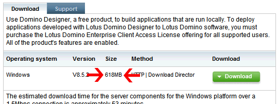
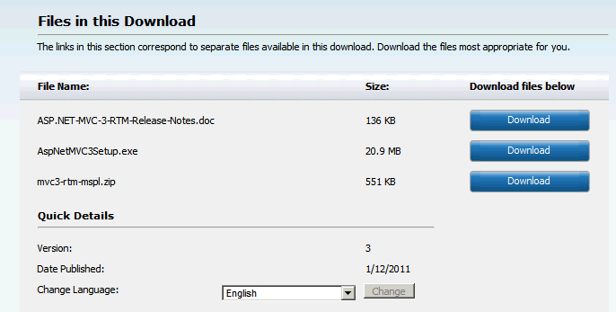

---
authors:
  - serdar

title: "Lotus Domino has a disadvantage to be a RAD..."

slug: lotus-domino-has-a-disadvantage-to-be-a-rad...

categories:
  - Misc

date: 2011-03-24T19:45:46+02:00

tags:
  - community
  - fun
  - opinion
---

Certainly...

Let me explain why...
<!-- more -->
We are going to Domino Designer home page to download it.

Oh my god! 618 MB means that I can download it in 105 minutes by my humble ADSL connection!

Ooops.. I need a faster RAD tool... Let me look at the closest rival of IBM. Maybe they have a faster solution.

Hey, I found it... They named it as ASP.NET MVC... I don't know what it is. I never heard of it. But it used some buzzwords like model, view, controller... It must be a good solution. Let me open it...

Now I am relieved. It is so small that I can download it less than 5 minutes.

Rapid application development tool should be such rapid!

I finally found the right tool to develop my enterprise applications for my enterprise customers in less than 5 minutes. According to what I read, even my baby can develop application using this. I am so impatient to suggest it to my customers. Think about it. It really decreases your customers' TCO. There are hosting services $1 per month with 20GB storage. I can market this as a cloud-ready framework. Cool...

This was a good benchmarking for rapid application development...

###### P.S. It is just a coincidence that I posted this entry on the same day with Jake... Curious? [Click here](http://www.codestore.net/store.nsf/unid/BLOG-20110324-0531)...

 

 
