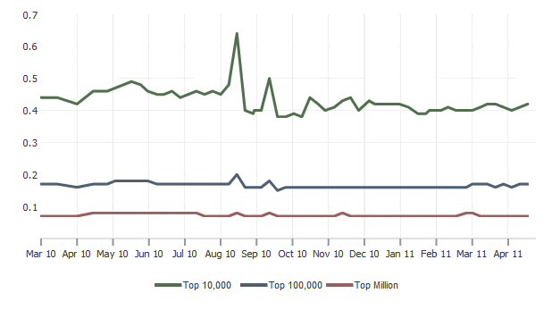

---
authors:
  - serdar

title: "Dojo vs. jQuery: Can you compare?"

slug: dojo-vs.-jquery-can-you-compare

categories:
  - Misc

date: 2011-04-30T15:49:37+02:00

tags:
  - dojo
  - domino-dev
  - javascript
  - xpages
---

I was talking about Javascript frameworks, especially jQuery and Dojo toolkits.

I just saw this. I didn't use jQuery, but such difference in [builtwith.com](http://builtwith.com/) stats was a great surprize for me:
<!-- more -->
This is [the usage of jQuery](http://trends.builtwith.com/javascript/JQuery):

And this is [the usage of Dojo Toolkit](http://trends.builtwith.com/javascript/Dojo-Toolkit):

I know those are apples and oranges but wow!
