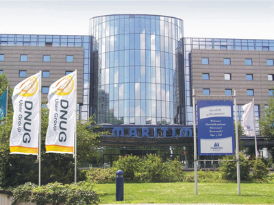

---
authors:
  - serdar

title: "After my first DNUG conference..."

slug: after-my-first-dnug-conference...

categories:
  - Conferences

date: 2011-05-21T19:30:00+01:00

tags:
  - community
  - user-groups
---

So DNUG is over. Including preconference, DNUG was a three-day conference.

As I said before, most of the sessions were in German. so my participation doesn't count to be educatory :)
<!-- more -->
In my long travel, my point was to see other Lotus communities and user group conferences. DNUG is a great organization. They have been gathering for 17 years and twice a year. While we couldn't find 100 persons together in a free conference in LUGTR2011, getting hundreds of people from different cities of Germany is a great success. Looking at tens of pages in the agenda (thanks to Google Translate), the content is very comprehensive. Not mentioning about the academic support.

The German Lotus community was interesting to me. I am going to participate UKLUG and when I look at the list of participants, I see lots of familiar names and faces. Because most of the participants are either blogger or constant blog readers/commenters. I don't think I am going to feel stranger there.

However, German community does not seem to be participating the PlanetLotus circle. It's not because they are not social. There are guys I met that are participating DNUG organization for decades. Everybody knows each other. There are very close relationships, nice chats, good music and lots of beer :)

I was not lucky about sessions. Although German language has similar characteristics to Turkish, I couldn't learn a simple sentence yet. It is so hard for me. Anyway, I have seen familiar faces and met with great people in the conference.

Let's mention about news from the conference. I blogged about the day-0. Social business was everywhere again in this event. Sametime 8.5.2 was an hot topic not only because of its new features but also Skype acquisition of MS made people more curios about this product.

On the technical keynote, Ed Brill, Kevin Cavenough and Chris Crummey talked about new versions and strategies. Including a couple of sessions I could attend, some important points:

- Lotus Sametime 8.5.2 has no Lotus brand if you heard. That's not a shocking news. The new version is expected to be released within a couple of months.
- Lotus Notes/Domino 8.5.3 is expected to be released around September and the version 9 in 2012.
- Project Vulcan comes with the "Social Mail Experience" (via Ed Brill). This is a good branding! A large change in the E-mail paradigm has been well-labeled :)
- Chris Crummey (He's a great presenter, BTW) has shown great demoes on the new Sametime experience and Vulcan client for iPad. He also showed extensive use cases for Live Names.
- Martin Donnelly (Architect in XPages team and coauthor of Mastering XPages book) presented some good XPages stuff and according to him, XPages is ready for the next release.
- Robert Ingram presented the possible IBM strategy on mobility. Within the context, he implied that IBM 'may consider' supporting Windows Phone 7 in the future. It's tough...
- Lotus Mobile Connect also seems to be renamed as IBM Mobile Connect :)
- Because of the technical problems, IBM has no plan to implement an iPhone client for Traveler. But Rob told us they found a way to implement Sametime chats with a native application.

I will blog another entry for XPages news...
