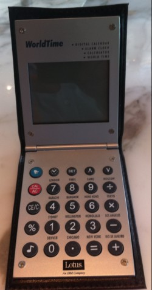
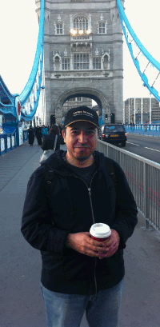

---
authors:
  - serdar

title: "After my first UKLUG event: I was there..."

slug: after-my-first-uklug-event-i-was-there...

categories:
  - Conferences

date: 2011-05-31T17:08:00+02:00

tags:
  - community
  - user-groups
---

UKLUG is over days ago. I am tired of getting around London and thinking about how I am going to organize so many things in a blog post about UKLUG...

This blog post was hard to edit. I started at Manchester-London train, continued between my coffee breaks during London trips and ended in the plane returning home. I have completed whole a week after UKLUG, sorry for that (if you care)...
<!-- more -->
Starting with the participation... There was so many people there. I don't know the exact number, but it was crowded. So many people participated from Atlanta,US to Bologna, Italy... As I blogged about DNUG, I saw many familiar faces and names in UK where most of the participants were social contributor (as a blogger and/or commentor) to the yellowsphere circle...

Sessions! After a fully German DNUG, I did not even care British/Irish/Scottish language barriers during talks... Since I have been educated under American format, those are like torture to me, normally :)

First day started with the 'Opening General Session' by **Ted Stanton** from IBM. If you followed twitter streams and other blogs, you would probably be aware that the session was mainly concentrated on Exceptional Web Experience demos. You may also know that the most popular topic of the whole event has been revealed during the OGS... We have learnt that (for the first time two IBMers told this):**Lotus brand will be disappearing with other brands like Tivoli, etc...**

I won't go into details on all sessions but I should say some words on a couple of those...

Tim Tripcony from GBS has presented a very good session on XPages themes. He mentioned about remarkable uses of themes to accelerate development with lesser errors and cleaner coding... Paul Mooney presented a long "AdminBlast" session on administration tips and tricks... You should really download and see these two sessions...

Another session was "**21 years of Lotus and till going strong** " by Carl Tyler... Carl has been working around Lotus and IBM for a long long time. He mentioned about first PC experiences in IBM, pre-IBM and post-IBM years of Lotus Software. It was a great session with flashbacks. Especially, Lotus Notes 1.0 demo (Demo Demo Demo!) was an history lesson :)

I won a 'great' prize there...

Yep, it's a simple desk clock with several stupid features and it doesn't work now (battery?). However do you see the logo at the bottom? Geeky huh? This is a very historical object and I will be rich :)

Let's stick to the point...

UKLUG is a very different event than DNUG in different aspects.

DNUG is an extremely professional event. I don't mean UKLUG is not serious but you evantually notice that people are paying for DNUG. And they are paying a lot in my opinion and we have discussed if this pays back evantually. As I said, it's a European version of Lotusphere event. The difference can be seen at various levels. Small mistakes, delays or problems have been ignored during UKLUG. Because every people in the conference was aware of that Warren and his friends have sacrified their time and efforts with a volunteer duty. But DNUG visitors were not that forgiving...

Looking to teams behind both user groups, it gets more interesting... I have been able to chat with Jürgen Zirke (from DNUG board) for about an hour. Because they had a team of manager, assistants and event professionals responsible to coordinate everything. However, I waited half an hour for a guy in UKLUG team just to say 'Hi!'...

There were three to five parallel sessions in UKLUG. On the other hand, I saw nine parallel session at a time in DNUG, which was a bit unnecessary... I can't really judge the contents of sessions (because DNUG was German) but two important things have been achieved by DNUG. Firstly, they made universities involved to the picture. In addition, they had interest groups which seem quite perfect idea for local user groups to improve their members' knowledge and practice in detailed technical issues.

DNUG is an event of more closed (but warm) community. Almost everybody knows each other in the conference but they have been met physically, not virtually (except their German forum). I have known many participants in UKLUG from virtual social media. Some people also know me from my blog or LUGTR activities. That was the greatest difference between DNUG and other user groups...

Fun? Sure! UKLUG was also fun. We went to a pub (sponsored by Crossware!) in the first night and tasted some cool English beers. There was geeky chats, serious talks, critics, jokes and fun in Manchester.

A few words for UK...

I was in UK for the first time. Lot heard about UK but less was as I expected. We were always proud of Istanbul is a diverse city. Now I'm not, after visiting London. I didn't see any British in London for a couple of days :) I walked and walked a lot in London. They would not understand me ever, but it is so annoying and confusing to take the left on the traffic! Thanks to my iPhone, I found my way mostly.

I've seen lots of museums (British, Natural History, Science and Greenwich) and bridges. I celebrated the championship of Barça with hundred English sad supporters and got congrats in a very gentleman style. Met with English-style full breakfast, fish and chips and a brown liquid so-called coffee.

Anyway, I have spent much money for my UK visa and it lasts in November. So I'll be back again. Still keeping the oyster card and 3Mobile sim :)

Now, I am trying to recover my absense period. June will be a difficult month for me. I am moving my company to Istanbul which means a new office, some construction and lots of paperwork. But I will try to blog meanwhile!

Probably you will get excellent news from me this summer, both in business and personal :) Just stay tuned...
