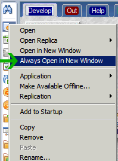

---
authors:
  - serdar

title: "Bookmarks opening in new window always..."

slug: bookmarks-opening-in-new-window-always...

categories:
  - Tips & Tricks

date: 2011-05-26T17:30:00Z

tags:
  - notes-client
---

One thing that makes me really annoyed about Eclipse based Notes client is the CTRL-TAB key issue. Design team has lifted this key combination as Lotus Notes moved into Eclipse in the R8.
<!-- more -->
At UKLUG, Mary Beth Raven cleared the issue at last (or I hear that for the first time). The design team canceled this key combination due to the accessibility principles. Because according to this principles, Ctrl-tab is an advised combination for rich text fields.

Naturally, one thinks about why all browsers use it? They are not implementing an accessibility rule. IBM has decided to change this long time ago, before these browsers begin to use it. Why IBM waited so long is another issue, I don't know :)

Anyway, Good news... Because they are planning to use this combination for tabs again in next releases. Until that, I have a small tip for 8.5.2 users...

Sometimes I am reading a message and writing another one at the same time. Since I am unable to user CTRL-TAB, I am right clicking the tab and open the second message in new window. There is no easier way.

But for some situations, I discovered that I am using to different applications at the sametime. For example I am reading a technote from local knowledge base database and editing a blog entry or composing a new message at the sametime. So It would be better if my blog database will be opened in new window everytime. It is possible...

Just right click on a bookmark icon and select "Always Open In New Window"

That's all...
