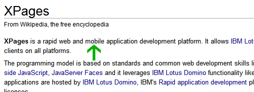

---
authors:
  - serdar

title: "Using XPages for Mobile Applications? Wrong!"

slug: using-xpages-for-mobile-applications-wrong

categories:
  - Misc

date: 2011-05-05T08:54:15+02:00

tags:
  - domino-dev
  - mobile
  - pov
  - xpages
---

Are you willing to design Mobile Applications with XPages? Don't bother. You can't :)

What? But they say you can?

Nope!
<!-- more -->
Because I'm not comfortable with this phrase :)))

We are able to design **Mobile Interfaces with XPages** or **Mobile Browser Applications** (if you are using HTML5)...

There is a concept of **(Native) Mobile Application** which is a piece of code working on the phone and developed with the native SDK of those devices. Non-technical people don't see the 'Native' word here so it is confusing in my humble opinion.

I see this misunderstanding a lot, even from IBMers.

OK, this can be argued. Because we don't use the term '**Web Interface** ' instead of '**Web Application** '. However, there is no other possibility if you are designing web something. In addition, it was actually '**Web-based Application** ' :)

In mobile case, it confuses people (especially demanding executives from LOB). In a sales meeting, if you say 'We can design Mobile Applications with XPages', they will have a different expectation.

There are also pragmatic approaches which make more sense. Since we can't correct this widely misused phrase, Web-based Mobile Application may be more acceptable, at least.

So we can't develop 'native' mobile applications with XPages? Actually you can make it with ready templates. But they will not have all advantages of native applications. So you need to have a good mixture of native SDK, REST, Web Services and Feed techniques.

BTW, after the iPad revolution, they would be called as '**Portable (Web/Native) Applications** ' as Patrick Kwinten suggested in his comment to Niklas Heidloff's [blog post](http://heidloff.net/home.nsf/dx/04152011024119AMNHE9UW.htm).
