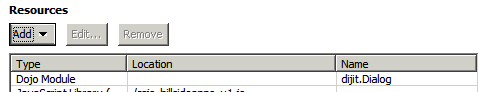

---
authors:
  - serdar

title: "XPages Tip: A modal waiting dialog for background processes."

slug: xpages-tip-a-modal-waiting-dialog-for-background-processes.

categories:
  - Articles

date: 2011-05-10T13:42:00+02:00

tags:
  - dojo
  - domino-dev
  - javascript
  - xpages
---

When there is a background processing where the user should wait until it's done, I don't want him/her to click anywhere else in the screen. But I also want the user to know s/he'll have to wait.

Overdemanding?

I found a very simple solution to this problem. Sure there is more elegant solutions without dojo, but let me share it...
<!-- more -->
This is the main screen:


When user clicks the pointed button, there is a background process which would take 20-25 seconds. It is a long time for a web application. So we will somehow alert user that s/he has to wait a moment...

This is the initial code of the button:

```
<xp:button value="Puanla..." id="button1" styleClass="lotusBtn">
    <xp:eventHandler event="onclick" submit="true" refreshMode="partial" refreshId="termsPanel">
            <xp:this.action><![CDATA[#{javascript:scoreTerm(termEntry.getDocument())}]]></xp:this.action>
    </xp:eventHandler>
</xp:button>
```

<br />

<br />

First we activate dojo and add needed modules in our XPage/custom control:




Now we will create our dialog div. You can create it anywhere in the page:

```
<div id="progressDialog" dojoType="dijit.Dialog" title="Please wait...">
     <div>
             <xp:image url="/inProgress.gif" id="image3"></xp:image>
     </div>
</div>
```

<br />

<br />

We could use "xp:panel" tag here and set dojo attributes. It's a matter of preference. "inProgress.gif" is an animated image just to create an illusion of progress :)

Now we create a couple of client side javascript functions to show and hide this dialog. Here is a little trick. We don't want the dialog closable. Since I could not find a solution for 'non-closable' dialog, just googled and used this approach.

```
function scoringCompleted() {
     dlg=dijit.byId("progressDialog");
     dlg.hide();
}

function scoringStarted() {
     dlg=dijit.byId("progressDialog");
     dlg._onKey = function(){return false;};
     dlg.show();
}
```

<br />

<br />

Here (in the bold part), we set a widget event to prevent "ESC" key. Escape keystroke stop loading of the page but does not close the dialog. If you are using a background agent for processing, escape will not stop the processing. Meanwhile, a little close icon is automatically placed on the title bar of the dialog. We should hide it as well. Put the following code to the CSS file.

```
#progressDialog .dijitDialogCloseIcon {display:none;}
```

<br />

<br />

Now, it comes to the crucial part. We want to show our dialog when background process started and hide it finally. We simply change the button code as follows:

```
<xp:button value="Puanla..." id="button1" styleClass="lotusBtn">
     <xp:eventHandler event="onclick" submit="true" refreshMode="partial" refreshId="termsPanel"
                     onStart="scoringStarted()"
onComplete="scoringCompleted()">
             <xp:this.action><![CDATA[#{javascript:scoreTerm(termEntry.getDocument())}]]></xp:this.action>
     </xp:eventHandler>
</xp:button>
```

<br />

<br />

Result is something like that:


Remember, onStart and onComplete parameters will only work with partial refresh... You may also use onError for handling errors (like time out).

**UPDATE!!!**

Tim suggested far better solution to use **dojox.widget.Standby** . I updated start and complete functions and now there is no need to create divs or css on my page. It may be parameterized laterfor different purposes. Here are my functions:

```
function scoringStarted() {
       if(this.fullStandby==null) {
               this.fullStandby = new dojox.widget.Standby({
                       target: document.forms[0] // it was dojo.body() which creates a problem in some dojo versions.
               });
               document.body.appendChild(fullStandby.domNode);
               fullStandby.startup();
       }
       fullStandby.show();
}

function scoringCompleted() {
       if(this.fullStandby!=null) fullStandby.hide();
}
```

<br />

<br />

Target object can be customized for a region in screen...
