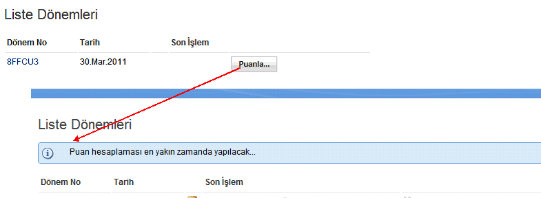

---
authors:
  - serdar

title: "XPages Tip: A simple CC for prompting SSJS messages to UI..."

slug: xpages-tip-a-simple-cc-for-prompting-ssjs-messages-to-ui...

categories:
  - Tips & Tricks

date: 2011-05-02T09:00:00+02:00

tags:
  - domino-dev
  - xpages
---

Too many abbreviations :)

This is probably given before, but I have received a question last week and it would be useful sharing this.

When you run a server-side code at your XPage, your operation may be successful or failed. A newbie developer asked me how to acknowledge the user about the result, like MessageBox functionality in Lotusscript.
<!-- more -->
Usually, that's not possible, you know. Because the code is running between state transitions. I am using a simple custom control to do that.

```
<?xml version="1.0" encoding="UTF-8"?>
<xp:view xmlns:xp="http://www.ibm.com/xsp/core">

      <xp:div styleClass="lotusMessage lotusInfo" role="alert"
              rendered="#{javascript:viewScope.MessageText!=null || sessionScope.MessageText!=null }">
              <xp:image id="image3">
                      <xp:this.url><![CDATA[#{javascript:severity=viewScope.MessageType || sessionScope.MessageType || "";
                                                              viewScope.remove("MessageType");
                                                              sessionScope.remove("MessageType");

                                                              severityseverity==""?"Info":severity;

                                                              return "/icon"+severity+"16.png";}]]></xp:this.url>
              </xp:image>
              <xp:span>
                      <xp:text escape="true" id="computedField4">
                              <xp:this.value><![CDATA[#{javascript:message=viewScope.MessageText || sessionScope.MessageText;
                                                              viewScope.remove("MessageText");
                                                              sessionScope.remove("MessageText");

                                                              return message;}]]></xp:this.value>
                      </xp:text>
              </xp:span>
      </xp:div>
</xp:view>
```

<br />

<br />

We can use either sessionScope or viewScope to transmit our parameters. Here is a SSJS example for this:

```
function someFunction() {

      // Do Something Useful...

      if(successful) {
              viewScope.MessageType="Info";
              viewScope.MessageText="Operation Completed Successfully...";
      } else {
              viewScope.MessageType="Error";
              viewScope.MessageText="Some Error Occured...";
      }
}
```

<br />

<br />

When the page is refreshed (fully/partially), we check for viewScope and sessionScope parameters, show the message and clear them not to duplicate it. It may not be cleared at that moment and extended with a close button that clears the message from the scope. Severity options are determined with the icon names.

Here is the example how it worked... We click the button, it processes some information in background (server-side) and after refresh, it informs user about the result.


