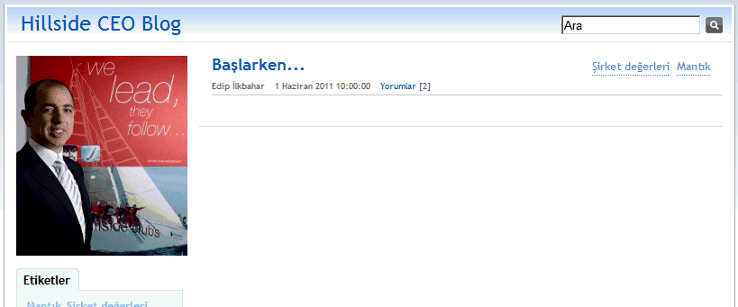

---
authors:
  - serdar

title: "CEO Blog with DominoBlog template..."

slug: ceo-blog-with-dominoblog-template...

categories:
  - Portfolio

date: 2011-06-03T08:59:00+02:00

tags:
  - developi
  - domino-dev
  - social-software
  - xpages
---

We were dealing with a cool project for a couple of weeks.
<!-- more -->
My client is [Hillside Leisure](http://www.hillside.com.tr/) which created the pioneer and leading brand in 'Feeling Good' business with 2 astonishing hotels, 3 sports/recreation centers, 4 cinemas and a large SPA chain. Their brand is unique with the service quality approach which has been saturated into the corporate culture... You should stay at [Hillside Beach Club](http://www.hillsidebeachclub.com/) to understand that.

Corporate culture is hard to seed, manage and quantify. Being decentralized to several cities with hundreds of different persons makes it harder. The leadership becomes crucial to spread the word. In this situation, Hillside faced a similar problem like all decentralized companies: Who will spread the word, and how? CCTV? Nope!

We came into the picture and CEO Blog has born in Hillside Group...

Lotus Domino is cool. In only one day, we designed a new blog using the classical BlogTemplate.

This is just a start. We'll look at the acceptance, contribution and the value. Next step may be to extend it to senior managers or perhaps all employees?

Hillside was my employer between 1999-2002 and also my client since 2003. I have developed over 40 applications during this time and honestly, it is one of the most exciting applications ever. This is the time a company moving into the next phase in Computing :)
