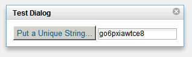

---
authors:
  - serdar

title: "Dojo Dialogs in XPages: Deep dive into Partial Updates..."

slug: dojo-dialogs-in-xpages-deep-dive-into-partial-updates...

categories:
  - Articles

date: 2011-06-18T15:56:00+02:00

tags:
  - best-practices
  - dojo
  - domino-dev
  - xpages
---

If you are not yet decided to use Extension Library, you still have to use ordinary dojo dialogs and partial update tricks in your applications.

I have dived into the world of partial updates recently. We will complicate things in this post. Ready? Go!
<!-- more -->
We know how to use a dojo dialog, right? Let's have a simple example here...

```
<?xml version="1.0" encoding="UTF-8"?>
<xp:view xmlns:xp="http://www.ibm.com/xsp/core" dojoParseOnLoad="true" dojoTheme="true">
        <xp:this.resources>
                <xp:dojoModule name="dijit.Dialog"></xp:dojoModule>
        </xp:this.resources>
        <xp:button value="Show" id="button2">
                <xp:eventHandler event="onclick" submit="false">
                        <xp:this.script><![CDATA[dijit.byId("#{id:dlg}").show()]]></xp:this.script>
                </xp:eventHandler></xp:button>
        <xp:br></xp:br>
        <xp:panel id="dlg" dojoType="dijit.Dialog">
                <xp:this.dojoAttributes>
                        <xp:dojoAttribute name="title" value="Test Dialog"></xp:dojoAttribute>
                </xp:this.dojoAttributes>
                <xp:inputText id="target" value="#{viewScope.testValue}"></xp:inputText>
        </xp:panel>
</xp:view>
```

<br />

<br />

It's pretty straight forward, right? When we click the button, it launches the dialog and it seems like:


Now let's complicate things further. We will add some extra feature. I would like to add partial refresh inside the dialog.

```
       <xp:panel id="dlg" dojoType="dijit.Dialog">
                <xp:this.dojoAttributes>
                        <xp:dojoAttribute name="title" value="Test Dialog"></xp:dojoAttribute>
                </xp:this.dojoAttributes>
                <xp:button value="Put a Unique String..." id="button1">
                        <xp:eventHandler event="onclick" submit="true" refreshMode="partial" refreshId="target">
                                <xp:this.action><![CDATA[#{javascript:viewScope.testValue=@Unique();}]]></xp:this.action>
                        </xp:eventHandler></xp:button>
                <xp:inputText id="target" value="#{viewScope.testValue}"></xp:inputText>
        </xp:panel>
```

<br />

<br />


If you have some experience, you'll know that it won't work! The reason is simple as many bloggers suggested... You may see further examples and solutions in a [post by Mark Hughes](http://blog.hughesconnect.com/?p=21) and [Jeremy Hodge's reusable solution](http://xpagesblog.com/xpages-blog/2010/4/10/xpages-compatible-dojo-dialog-reusable-component.html)...

Let me explain the problem in the simplest way. When you declare or create a dijit.Dialog, dojo parser takes the DOM object (the panel in this example) and moves it to the end of the body structure. This is not a big problem for us. But when we need partial refresh, it is designed to work with controls **inside** FORM tags. So it will not work...

The solution that has been offered by Mark and Jeremy is simple. After the dialog's creation, we are moving it back inside the FORM tag. But we should not use declarative creation this time. Let's see how:

```
<?xml version="1.0" encoding="UTF-8"?>
<xp:view xmlns:xp="http://www.ibm.com/xsp/core" dojoParseOnLoad="true"
        dojoTheme="true">

        <xp:this.resources>
                <xp:dojoModule name="dijit.Dialog"></xp:dojoModule>
        </xp:this.resources>
        <xp:button value="Label" id="button2">
                <xp:eventHandler event="onclick" submit="false">
                        <xp:this.script><![CDATA[id="#{id:dlg}";

var dialogWidget = dijit.byId(id);
if( dialogWidget ) return dialogWidget.show();
dialogWidget = new dijit.Dialog( { title: "Test Dialog" }, dojo.byId(id));
var dialog = dojo.byId(id);
dialog.parentNode.removeChild(dialog);
var form = document.forms[0]; form.appendChild(dialog);
dialogWidget.startup();

dialogWidget.show()
]]></xp:this.script>
                </xp:eventHandler></xp:button>
        <xp:div id="dlgWrapper" style="display:none">
        <xp:panel id="dlg">
                <xp:button value="Put a Unique String..." id="button1">
                        <xp:eventHandler event="onclick" submit="true" refreshMode="partial" refreshId="target">
                                <xp:this.action><![CDATA[#{javascript:viewScope.testValue=@Unique();}]]></xp:this.action>
                        </xp:eventHandler></xp:button>
                <xp:inputText id="target" value="#{viewScope.testValue}"></xp:inputText>
        </xp:panel>
        </xp:div>
</xp:view>
```

<br />

<br />



As you see, we are creating the dialog inside the button's client-side event. Before that, we check if it has been created before. If so, we show it and terminate.

One step further...

If you noticed, dialog content is being prepared during load, which means that when the page is loaded to the browser, it has a content but it's hidden. This is not a desired case in common. Think about some use cases. You are showing a item code on your form and expecting a full set of details (suppose 100 fields) inside the dialog. Is it efficient to load those contents everytime page is loaded? If you are dealing with 20 item codes on the same page, it will be insane to load up 2000 components into the browser.

So next step, we would like to show a dialog which has a calculated context. Let's see the example below...

```
<?xml version="1.0" encoding="UTF-8"?>
<xp:view xmlns:xp="http://www.ibm.com/xsp/core" dojoParseOnLoad="true" dojoTheme="true">
        <xp:this.resources>
                <xp:dojoModule name="dijit.Dialog"></xp:dojoModule>
        </xp:this.resources>
        <xp:button value="Label" id="button2">
                <xp:eventHandler event="onclick" submit="true" refreshMode="partial" refreshId="dlgWrapper">
                        <xp:this.onComplete><![CDATA[id="#{id:dlgWrapper}";

var dialogWidget = dijit.byId(id);
if( dialogWidget ) dialogWidget.destroy();
dialogWidget = new dijit.Dialog( { }, dojo.byId(id));
var dialog = dojo.byId(id);
dialog.parentNode.removeChild(dialog);
var form = document.forms[0]; form.appendChild(dialog);
dialogWidget.startup();
dialogWidget.show()]]></xp:this.onComplete>
                </xp:eventHandler>
        </xp:button>
        <xp:div id="dlgWrapper" style="display:none">
                <xp:panel id="dlg">
                        <xp:button value="Refresh" id="button1">
                                <xp:eventHandler event="onclick" submit="true" refreshMode="partial" refreshId="target">
                                <xp:this.action>
                        <![CDATA[#{javascript:var target:com.ibm.xsp.component.xp.XspInputText = getComponent("target");
                                         target.setValue(new Date())}]]></xp:this.action>
                                </xp:eventHandler>
                        </xp:button>
                        <xp:br></xp:br>In-dialog Update:&#160;
                        <xp:inputText id="target">
                                <xp:this.converter>
                                        <xp:convertDateTime type="both"></xp:convertDateTime>
                                </xp:this.converter>
                        </xp:inputText>
                <xp:br></xp:br>Pre-dialog Update:&#160;
                        <xp:inputText id="target2" value="#{javascript:new Date()}">
                                <xp:this.converter>
                                        <xp:convertDateTime type="both"></xp:convertDateTime>
                                </xp:this.converter>
                        </xp:inputText>
                </xp:panel>
        </xp:div>
</xp:view>
```

<br />

<br />

This time we have a dialog with two input boxes. The first is 'In-dialog update' will be refreshed when 'button1' is clicked. The second is 'Pre-dialog update' which is going to be calculated at when the dialog launched. As you noticed, the event handler has been changed in the launcher button... It first refresh inside the 'dlgWrapper' div partially and when the partial update completed it runs the client-side script to display the dialog. The bold part also shows that we have to destroy the old dialog box now.

This 'destroy' thing made me very busy. Many resources I found suggested to use "destroyRecursive(true)" function. However, if you are using this dialog inside a custom control, it will be unsuccessful to unload the dialog completely. Be informed :)

It will be like:


Now we have a dialog which contents are calculated at the server side and this dialog has partial updates working. In extension library, a cool control (Dialog) is available. What it does actually make this example easier and reusable. Until then, we have to use some tricks...

We may also put this dialog panel inside a custom control. Next week I'll be posting a cool example here. Stay tuned :)
