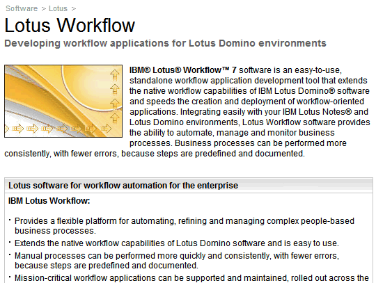
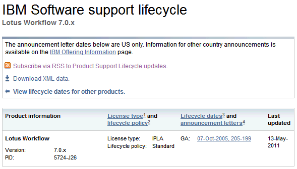

---
authors:
  - serdar

title: "Don't ask me about Lotus Workflow..."

slug: dont-ask-me-about-lotus-workflow...

categories:
  - Misc

date: 2011-06-07T09:51:37+02:00

tags:
  - domino-dev
  - ibm
  - wishlist
---

If there were a Lotus Workflow fan club, I would be the first member. It was a great application with its flexibility, ease of use, customization capability etc. I know lots of customers that are still using... But nowadays, many are stuck with their applications and looking for non-Lotus alternatives to move out. Why?
<!-- more -->
Because IBM does not seem to have a decision on Lotus Workflow.

This is going to be another 'Dear IBM' post I think.

I am tired to give the political answer: "IBM will eventually make a decision about it..."

No information about the life cycle. The last release is almost 6-year-old.

Dear IBM,

Please, either:

- Announce that Lotus Workflow will be terminated at a specific date,

...or...

Never mind. I am just emotional :)
