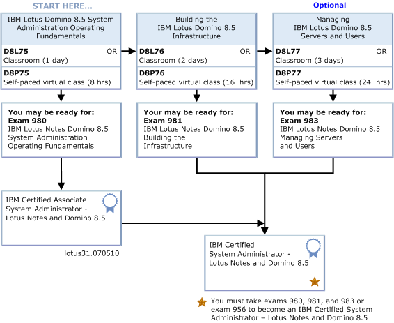

---
authors:
  - serdar

title: "IBM Lotus Certifications Overview"

slug: ibm-lotus-certifications-overview

categories:
  - Articles

date: 2011-06-04T11:51:15+02:00

tags:
  - domino-admin
  - domino-dev
  - ibm
---

Certification is becoming an important issue in recent years...

I can see this issue with 4 different angles: I am an expert taking exams, an employer, an IBM BP and co-leader of LUGTR... I will be considering our market, of course. If there are differences, don't hesitate to comment in.
<!-- more -->
First of all, I want to summarize the certification process in IBM Software Group, specifically the Lotus brand...

Certification has three main components.

- Courses / Training
- Tests / Exams
- Certification

Courses are usually linked to tests. There are at least one course that is recommended to be taken before each test. Courses may be virtual (self-paced or classroom) and non-virtual (on-site or off-site). In Turkish market, (as far as I know) there is only one Authorized Training partner, [Sibnet](http://www.sibnet.com.tr/). However, classroom training is very rare and sometimes cannot even be provided for some courses because of **insufficient demand** in the market.

Classroom education (including virtual ones) have high costs. Self-paced training are provided by Virtual Innovation Centers for free, but those are usually very introductory and mostly technical-sales oriented. Some companies also provide virtual paid training like TLCC and XPages101.net. These are also costly, but during LUG activities or special events like "[Learn XPages in June](2011-05-still-dont-know-xpages-learn-in-june.md)", you may have special discounts. Let me remind that both TLCC and XPages101.net has also special discount for LUGTR members.

IBM certification tests are provided by Prometric company. Each test costs about 70-200 USD depending on the content.

Certification is the title you are entitled through a path contains one or more tests. When you complete the certification path with necessary tests, you earn it.

This is the certification path for Lotus Notes and Domino System Administrators. After you take necessary courses, you should take the test 980. It makes you an "IBM Certified Associate System Administrator". After passing tests 981 and 983, you become an "IBM Certified System Administrator". There is also a star marked with the test 956. This is called the 'upgrade path'. If you have completed this path in Lotus Notes and Domino 8.0 version before, you may take the upgrade exam (956) to update your certification.

You may see other certification paths for Lotus Software [here](http://www-304.ibm.com/jct03001c/services/learning/ites.wss/us/en?pageType=page&c=G397738M77321Z06).

Let's see the frequently asked questions :)

#### Is it necessary to get courses?

 

Formally, no it's not! You can book your test from Prometric web site and take it immediately. But courses are **recommended** ...

I have took several tests in my life. In first exams, I took my courses. Because, honestly, the questions on tests are not much related to real-life situations. When I took the first Administration exam, I had experience for three years in Domino Servers. But I passed the test with the knowledge I learned in the training. If you are taking a test on a specific product like Lotus Workflow, you should definitely take the course.

After some experience, now I don't need much education. I study on the outline of the exam and guess what may be the questions for a couple of day. Even so, last year I failed Quickr Administration exam and passed in my second trial.

#### What was questions on your latest exam?

 

Prometric terms and conditions you have agreed before the exam clearly **prohibit talking about questions in the exam** ! However, there are sites selling old exam questions on the net. There are also legitimate companies selling serious practice tests like CertFX which has refund guarantee in failure.

Usually, each test has a pool of questions. For example, an exam with 50 questions has a pool of 100-150. I think there is a special grading between these questions that is used for selection. For example if you know questions from someone took the exam recently (which is illegal), you probably know a large portion of questions. However, interestingly, if you fail a test (like I did), you will see a very different set of questions on your second and your second test will be more difficult.

#### Exams are too expensive!

 

Yep, exams are expensive relatively. A system adminitration certificate (only tests) costs about 600 USD.

If you are working for a business partner and your employer has '**Value Package** ', thanks to the '**You pass we pay** ' program, your company will be paid back for your successful exams in certain certification paths. You can also get free/discounted tests and vouchers in IBM and LUG events (as in the recent LUGTR 2011 conference)...

#### Is it necessary to get certified?

 

I am administrating and/or supporting large Domino infrastructrures for 12 years. In this period, I have completed very large deployment and upgrade projects. But I am 'associate' system administrator in certification.

On the other hand, you shouldn't consider my situation, because I never posted my CV to an employer for a Domino Administrator position. Many employers cares about certification. In Europe or US, it would be more important than Turkey, if you look at job postings.

There is also recent development that IBM forces BPs to have certification. Some product groups can only be sold by authorized partners. Authorization means Certification! However, the certification requirements are not tough probably because the application is very new. For instance, technical sales certification is currently equal to technical certification. So many BPs achieved certification very easily so far. Even so, it is certain that in the long term certified experts will be a little more valuable than others.

As an employer, certification is not a priority even it is a '+1' advantage for a candidate. However, If I were developing packaged software products, I would definitely force certification on my team. A quick twitter survey shows that many BPs require certification, but some because of IBM's requirements.

From the LUG perspective, it is very important. Especially we should assist newbies for certification in long term. The main reason is that **the decrease in the number of experts on the market is a great threat to the value of Lotus Software** . Certifying senior university students will enable them participating into the pool of experts.

#### How?

 

IMHO, you should get certified. In the time your boss preparing the budget proposals, ask him to include some training and certification. Get education and take your exams quickly, before forgetting. If your company doesn't pay your exams, buy them individually. It is **the investment for your CV** !

Even if you cannot get courses, take exams. For example, you installed Sametime and played with it for a month. Be quick and take the exam before you forget! Because each day it will be harder to pass. A couple of days studying on the documentation make it easy to pass exams if you have some practice.

#### Is IBM Certification working well in general?

 

It's an interesting discussion. We should dig several dimensions here.

First of all, is certification a good indication of expertise? My personal opinion, it's not measuring well. If you scale the expertise upto 100, certification only indicates 50-60 points. The rest is the experience and knowing tricky parts. However, there has to be a 'rest' in the expertise that cannot be measured by exams. There is an equilibrium here.

Certification is not a 'measuring expertise' and moreover, the expertise is not the knowledge. Exams shoud indicate the level of 'knowing the book', not 'capability of doing well'... I made it complicated :)

People should participate into the 'system' with training and certification. If you make your exams too much difficult and 'out of the book', newbies cannot pass exams and participate into the 'system' without certification. After some time, you should have some carrots and/or obligations to include them into the certification pool, which is difficult. So the 'book' is important for exams, ideally.

However, I still think the IBM-style tests don't have a high quality. That's not because they don't depend on the 'book'. But if a question asks for the filename of the DLL file that connects SQL server to the ODBC, there is a serious problem with your exam. It's not the book, not the theory. Even you read that 'book' ten times, you won't learn the filename!

The second problem is the penetration. IBM certification has not been penetrated over years. In Turkey, there is a more interesting problem. One can see which partner has which certificates using Partner Locator tool. If we compare those listings with partners' web site, we can see that partners are not pushing their certificates in their marketing. Because penetration has many forcers. Customers and vendors push certification on the partners. In our case, only the vendor pushes, but it seems customers don't care about it.

We know from the Microsoft case that over-penetration isn't good... Some years ago, even the grocery on the corner was 'selling' the Microsoft certificates! Although it was a perceptual advantage for the market penetration of the product, in the long term, it decreases the value of certification because everyone (including people who have not seen a server ever in their life) have a certificate. Comparing Microsoft certification against Oracle or Java, it's not respected anymore in Turkish market...

Simplicity is an aspect in penetration. Currently, being certified in IBM Lotus is difficult for individuals. It's not easy to afford thousands of dollars to have education and tests. I don't want the certification to be easy but I prefer that the **difficulty would be because of the content, not the price** !

In bottomline, the same issue appears again and again. The cost of certification is very expensive for Turkish market. So the certification should be localized according to different locales, otherwise it will be very difficult to settle down a strategy upon certification.
