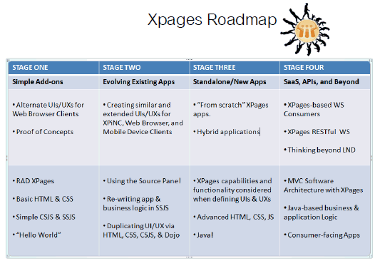
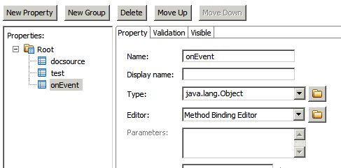
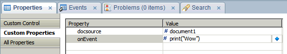
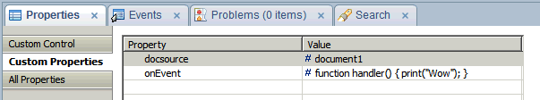

---
authors:
  - serdar

title: "Lesson of the day: I need to learn more about XPages"

slug: lesson-of-the-day-i-need-to-learn-more-about-xpages

categories:
  - Tips & Tricks

date: 2011-06-11T17:05:36+02:00

tags:
  - domino-dev
  - troubleshooting
  - xpages
---

Today, I noticed there are lot more to learn about XPages...
<!-- more -->
Here is the problem.

I am creating a custom control for general use. There is a simple business logic behind it and when certain state is achieved, it needs to fire an event at the mother XPages. This event could be a Lotusscript agent, SSJS code, sending a message, data source transaction etc. It could be anything. So it needs to be a 'parameter'.

I participated XPages Guru's webcast a while ago. There were an incredibly useful roadmap graph by Chris Toohey.

According to this, what I am trying to do is stepping up to stage four instantly. This is not going to happen :)))

Back to the problem.

My instincts say that there should be a way to create events for custom controls. Dead end. I couldn't find it on the JSF definition.

Then found a 'non-elegant solution'. Created a button on the mother XPages, pass its id to the custom control, when it is time, custom control may fire this button. It is non-elegant because of two reasons. You may have a breach if you forget to hide the button (it could be fired by FireBug) and if you are giving this control to another developer, too much 'tricks' should be considered (create button, hide it, pass its reference to the control, etc.).

Finally looked for if it is possible to create a property definition that takes a 'SSJS routine' to be run. Partial success. Here is why...

We define a custom property for the control:

When we use it;

What will happen is not what we want. It tries to return an 'object' from the 'print()' statement. So 'compositeData.onEvent' will return null. Partial success is here:

Now, it returns a 'function' object. If we fire 'compositeData.onEvent()' code at the custom control, it runs.

This solution is also non-elegant but better than the former.

What I need actually, should be more clean. We can create custom event handlers for XPages but I couldn't find how to fire them.

I need to study more about object hierarchies of JSF :)
