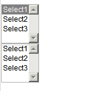
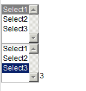
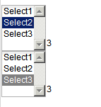
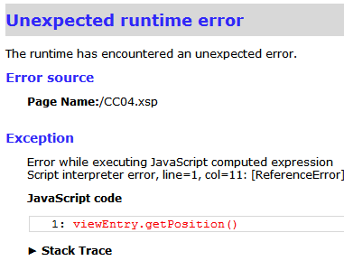

---
authors:
  - serdar

title: "Multiple Custom Controls and Events aware of their owners..."

slug: multiple-custom-controls-and-events-aware-of-their-owners...

categories:
  - Tips & Tricks

date: 2011-06-16T19:41:00+02:00

tags:
  - domino-dev
  - open-source
  - xpages
---

I am developing a simple (really simple) custom control for the [OpenNTF contest](http://contest.openntf.org/)... There are very good controls there and I don't think my humble control will be a revolutionary :)
<!-- more -->
Anyway, I really messed up this thing... Because I didn't plan the architecture right, I have to re-implement everything. The problem started when I tried using multiple copies of the same custom control.

This post will be a quick tip for a very simple problem. If you are developing a custom control which may be used more than once in the same XPage, you may bang your head like me...

Let's see a very simple case.

We have a simple Custom Control:

```xml
<?xml version="1.0" encoding="UTF-8"?>
<xp:view xmlns:xp="http://www.ibm.com/xsp/core">

        <xp:listBox id="listBox1" value="#{viewScope.select}">
                <xp:selectItem itemLabel="Select1" itemValue="1"></xp:selectItem>
                <xp:selectItem itemLabel="Select2" itemValue="2"></xp:selectItem>
                <xp:selectItem itemLabel="Select3" itemValue="3"></xp:selectItem>
                <xp:eventHandler event="onchange" submit="true"
                        refreshMode="partial" refreshId="computedField1">
                </xp:eventHandler>
        </xp:listBox>
        <xp:text escape="true" id="computedField1" value="#{viewScope.select}"></xp:text>

</xp:view>
```

It's simple. We are selecting from a listbox and partial refresh will set the same value in the computed field. Let's use this twice in an XPage...



We select a value in the first control and it doesn't work. Let's select a value in the second one.



It seems OK. Now I am selecting the second option in the first control.



The problem is so obvious. We are using "viewScope.select" variable for both controls. So the solution is also obvious. We should use different variables for custom controls. This is a very common scheme, you define a property for the custom control (like uid) so you can refer different elements with different id's. I implemented the same scheme for this case.

```xml
<?xml version="1.0" encoding="UTF-8"?>
<xp:view xmlns:xp="http://www.ibm.com/xsp/core">

        <xp:label id="label1"><xp:this.value><![CDATA[#{javascript:compositeData.uid+":"}]]></xp:this.value></xp:label>
        <xp:listBox id="listBox1">
                <xp:this.value><![CDATA[${javascript:"#{viewScope.select_"+compositeData.uid+"}"}]]></xp:this.value>
                <xp:selectItem itemLabel="Select1" itemValue="1"></xp:selectItem>
                <xp:selectItem itemLabel="Select2" itemValue="2"></xp:selectItem>
                <xp:selectItem itemLabel="Select3" itemValue="3"></xp:selectItem>
                <xp:eventHandler event="onchange" submit="true"
                        refreshMode="partial" refreshId="computedField1">
                </xp:eventHandler></xp:listBox>
        <xp:text escape="true" id="computedField1">
                <xp:this.value><![CDATA[${javascript:"#{viewScope.select_"+compositeData.uid+"}"}]]></xp:this.value>
        </xp:text>
</xp:view>
```

It works. Now we calculate which scope variable will be used...

However, if you look at the calculation, you may see the calculation starts with "${...", not with "#{...". That means the value mapping is calculated '**during the page loading** ' process... This is important. It is similar using 'calculated' field names. It cannot be changed in runtime.

Why is this so important?

Suppose you placed this custom control into a view control... Somehow, you have to set this "uid" parameter. "viewEntry.getPosition()" will be a good candidate. Or we can use "index" variable of the data source.

You cannot use these parameters in a view. Because, **at the loading phase, view and its entries does not exist** . If you are using repeat control, you may have a chance depending on your data source. But no chance with views.

```xml
<?xml version="1.0" encoding="UTF-8"?>
<xp:view xmlns:xp="http://www.ibm.com/xsp/core"
        xmlns:xc="http://www.ibm.com/xsp/custom">
        <xp:viewPanel rows="30" id="viewPanel1">
                <xp:this.facets>
                        <xp:pager partialRefresh="true" layout="Previous Group Next"
                                xp:key="headerPager" id="pager1">
                        </xp:pager>
                </xp:this.facets>
                <xp:this.data>
                        <xp:dominoView var="view1" viewName="Contents"></xp:dominoView>
                </xp:this.data>
                <xp:viewColumn columnName="Title" id="viewColumn1">
                        <xp:viewColumnHeader value="Title" id="viewColumnHeader1"></xp:viewColumnHeader>
                </xp:viewColumn>
                <xp:viewColumn id="viewColumn2" value="">
                        <xp:this.facets>
                                <xp:viewColumnHeader xp:key="header"
                                        id="viewColumnHeader2">
                                </xp:viewColumnHeader>
                        </xp:this.facets>
                        <xc:CCTest03 uid="#{javascript:viewEntry.getPosition()}"></xc:CCTest03>
                </xp:viewColumn></xp:viewPanel>
</xp:view>
```

The result:


A quick workaround may be applied for limited number of cases.

Suppose we want to pass the selected value to a scope variable. If this is the only need, we have to find the selected value at onChange SSJS event. How are we going to find it?

By old habits, I tried "this.getValue()" in the event but it failed. So I just dumped the 'this' object inside the event and googled this class to find its super classes. I found it :)

We modify our custom control as the following:

```xml
<?xml version="1.0" encoding="UTF-8"?>
<xp:view xmlns:xp="http://www.ibm.com/xsp/core">

        <xp:label id="label1"><xp:this.value><![CDATA[#{javascript:compositeData.uid+":"}]]></xp:this.value></xp:label>
        <xp:listBox id="listBox1">
                <xp:selectItem itemLabel="Select1" itemValue="1"></xp:selectItem>
                <xp:selectItem itemLabel="Select2" itemValue="2"></xp:selectItem>
                <xp:selectItem itemLabel="Select3" itemValue="3"></xp:selectItem>
                <xp:eventHandler event="onchange" submit="true"
                        refreshMode="partial" refreshId="computedField1">
                        <xp:this.action><![CDATA[#{javascript:viewScope.put("select_"+compositeData.uid, this.getParent().getValue())}]]></xp:this.action>
                </xp:eventHandler></xp:listBox>
        <xp:text escape="true" id="computedField1">
                <xp:this.value><![CDATA[#{javascript:viewScope.get("select_"+compositeData.uid)}]]></xp:this.value>
        </xp:text>
</xp:view>
```

You can see the added row there. "this" object is the event handler. Its parent gives us the component object and getValue() returns its value.

This notation can be used for many purposes. You may define generic functions in your library and any event calling those functions may pass its component into the function. I liked it :)
