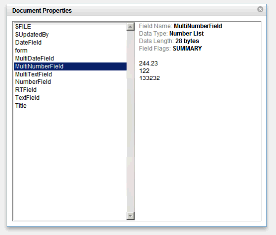

---
authors:
  - serdar

title: "My Custom Control for the OpenNTF Contest: xProperties"

slug: my-custom-control-for-the-openntf-contest-xproperties

categories:
  - Portfolio

date: 2011-06-22T07:58:00+02:00

tags:
  - open-source
  - openntf
  - xpages
---

At last I submitted my custom control to the [OpenNTF Contest](http://contest.openntf.org/) sponsored by We4IT... Now I am waiting for two iPad 3 or 3 iPad 2, whatever comes first :)))

Anyway, this is a short summary for the[xProperties control](http://www.openntf.org/internal/home.nsf/project.xsp?action=openDocument&name=xProperties%20Custom%20Control).
<!-- more -->
My custom control imitates the traditional document properties box we are using in Lotus Notes client. The reason I have chosen this, it seemed really challenging for me.

In fact, it is not possible to imitate our precious Document Properties box completely. Because it uses the C API to get information from the document note. Many properties and attributes are not accessible from the class hierarchy that are provided by Notes/Domino API. SSJS API is even more restricted than Lotusscript, so there are some deficiencies in my control. But it seems roughly like:

One may place this control into the base framework for debugging purposes. It is also useful in views. Just put an extra column to the view to check document properties. It's a bit retro :)

The version is 0.91, not 1.0 :)

There are some possible extensions to the control:

- Document Information (Unique ID, Note ID, modification/creation date, etc.)
- Formula tester,
- Reader/Author modification,
- Comparison

In addition there are some weak points as I explained in the documentation.

I am waiting for your comments and suggestions.
