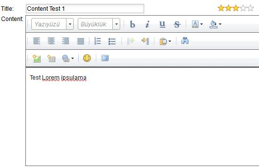
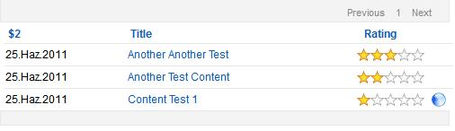

---
authors:
  - serdar

title: "Second Custom Control for the OpenNTF Contest: xInvolve"

slug: second-custom-control-for-the-openntf-contest-xinvolve

categories:
  - Portfolio

date: 2011-06-28T10:47:57+02:00

tags:
  - domino-dev
  - open-source
  - openntf
  - xpages
---

The second custom control for the [OpenNTF Contest](http://contest.openntf.org/) has been released a couple of days before.

[xInvolve](http://www.openntf.org/internal/home.nsf/project.xsp?action=openDocument&name=xInvolve%20Custom%20Control) is a customizable and reusable custom control bringing user interaction to your XPages applications. It can be used on single page and views.
<!-- more -->
Current version 1.00 has been designed only to rate documents (or other elements based on a unique identifier) for non-anonymous users. I am planning to extend this control for commenting and anonymous contribution in the future. However, I can't figure out solutions to some problems in anonymous contribution like security and flooding. Any comments will be appreciated.

Currently I have some problems on the browser-compatibility. Light yellow stars that are supposed to be seen on mouse-over sometimes get confused with the tooltip. I think I'm going to change the rating widget from dojo to another open source one...

I'll blog more about improvements... Stay tuned :)
