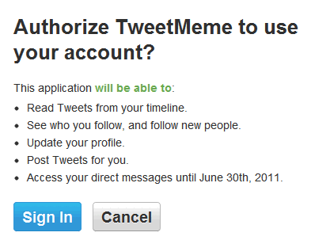

---
authors:
  - serdar

title: "Social Media and our Multiple Personality Disorder..."

slug: social-media-and-our-multiple-personality-disorder...

categories:
  - Misc

date: 2011-06-11T18:18:14+02:00

tags:
  - pov
---

Years ago (before 2000), my friend who was studying on the theoretical problems of information technologies, brought this issue on the table...

He said that with the evolution of emerging social tools we are going to have a real problem of identities.
<!-- more -->
The issue has multiple dimensions. One is our passwords.

It's a technical complication. You are using twitter, friendfeed, facebook, linkedin, gmail, etc. Every service you are using requests a seperate credentials. I am carefully listing all passwords I am using in a secure method. It is around hundred and increasing everyday. There are methods like OAUTH, but I don't trust it. Because many implementations either abuse or over-use it.

A simple micro-site that you are using to involve into some voluntary marketing activity, requests permission to put entries into your Facebook feed. Lately I registered to a social media aggregation tool which collects my streams from several tools like twitter, facebook, linkedin, etc. One day, I noticed that I have given permission to tweet on behalf of me! Why? Your mission is to 'COLLECT'. I just revoked access and deleted my account...

TweetMeme, for instance, requesting permission to tweet articles in a web site:

Google is hungry about it. I am using many services of Google and one day I found out that it was listing all my activity under my profile. I deleted my profile and not using anymore.

Privacy is a huge concern that prevents a possible consolidation of identities.

The second problem is with your connections.

Many people like me try to have seperate worlds in social media. I don't use Facebook for business contacts or LinkedIn for friends. But how many types of connections you are using to connect to a friend, is a mess!

You met with a business contact and sent him a network request from LinkedIn. If this person is a blogger, you add him to your Google Reader and follow him at Twitter. Occasional chats may be needed and Adding Skype may be a good idea. In our Lotus world, you may have common interests and connecting him with LotusLive, Greenhouse, EULUC, etc?

Some time ago, we had a meeting with a client about the benefits of building a customer social network for their brand. We found hundreds of advantages for this project but there were one fact, people would not want a different 'identity' so they gave up and moved to Facebook.

Need of seperation in social groups is one another blocker here.

The third problem is about monitoring. When did you stop looking your Facebook stream? I have a modest number of connections in Facebook and I don't look at it for 3-4 years. Too many connections, too many updates! Now, I have the same issue in Twitter.

My friend wasn't a fortune-teller. It is a known issue and predicted problem in 1990s. Social Mess!
