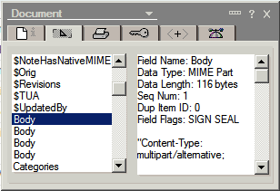

---
authors:
  - serdar

title: "The dilemma of Body field: I know it's wrong, but I'm still using it. "

slug: the-dilemma-of-body-field-i-know-its-wrong-but-im-still-using-it.-

categories:
  - Tips & Tricks

date: 2011-06-10T17:03:22+02:00

tags:
  - domino-dev
  - fun
  - lotusscript
---

This is from Designer Help - NotesDocument class:
<!-- more -->
> **GetFirstItem method** :
>
> If multiple items in a document have the same name, programmatic access is limited to the first item. The remaining items yield invalid data. A work-around is to get the first item, process it, remove it, again get the first item (which was the second item), and so on until you process all the items with the same name. If you do not save the document, the items are not actually removed. However, the recommendation is that you avoid creating multiple items with the same name.

 

This is a small screen shot from the traditional properties dialog:

Funny right?

BTW, it's wrong. You may still have an access to those fields by NotesDocument.Items array. I mean, I think there is. I will try it in a minute :)

UPDATE: I tried, they are right. You cannot access multiple fields with Items array :(
