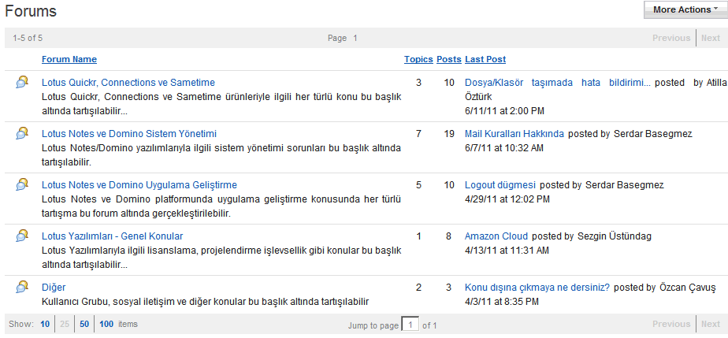

---
authors:
  - serdar

title: "Is this LUG working?"

slug: is-this-lug-working

categories:
  - LUG Turkey

date: 2011-07-30T10:37:05+02:00

tags:
  - community
  - opinion
---

We have founded LUGTR in 2008, established an executive committee in 2010, organized the first community event, LUGTR 2011 conference in March.

Beginning this year, thanks to our sponsors, we launched a powerful server with Quickr 8.5.1 for our web site. And this is the screen shot from the 'Forum' part of Turkish Lotus User Group...
<!-- more -->

The last message has been received in June. There are only three members participating discussion out of the executive team.

There are times people get exhausted, out of ideas and motivation. This is the time...
