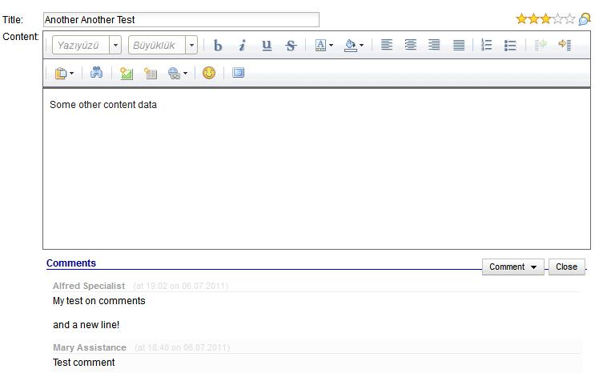
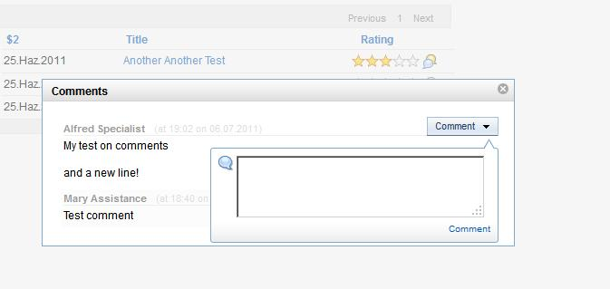

---
authors:
  - serdar

title: "My Custom Control xInvolve: New version with commenting..."

slug: my-custom-control-xinvolve-new-version-with-commenting...

categories:
  - Portfolio

date: 2011-07-06T19:40:07+02:00

tags:
  - domino-dev
  - open-source
  - openntf
  - xpages
---

I posted an entry a couple of weeks ago about [my custom control](2011-06-second-custom-control-for-the-openntf-contest-xinvolve.md "second-custom-control-for-the-openntf-contest-xinvolve.htm") for the [OpenNTF Contest](http://contest.openntf.org/)...

I have upgraded [xInvolve](http://www.openntf.org/internal/home.nsf/project.xsp?action=openDocument&name=xInvolve%20Custom%20Control) with commenting ability.
<!-- more -->
New version 1.10 provides a customizable interface for rating and commenting about documents (or other elements based on a unique identifier) for non-anonymous users. Here are some screen shots...

