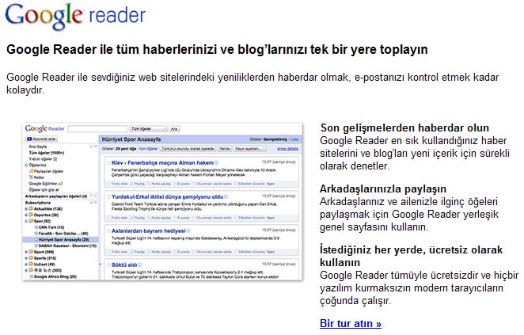
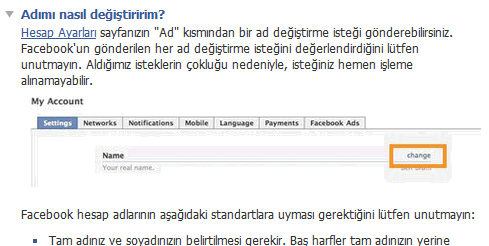

---
authors:
  - serdar

title: "Google, IBM, Microsoft and Localization of everything..."

slug: google-ibm-microsoft-and-localization-of-everything...

categories:
  - Misc

date: 2011-08-08T20:50:00+02:00

tags:
  - ibm
  - lotus-sametime
  - out-of-bubble
  - wishlist
---

I have posted an entry into the Turkish part over a year ago. I will extend its content a bit...

My post was based on this screen shot:
<!-- more -->

The scene above is from Google Reader and in Turkish, as you may notice. It's not 'Google-translated'. But the key part is on the little screen shot on the left. Someone in Turkey created a collection of well-known Turkish RSS resources and prepared a screen shot for this 'localization'!

That makes it '**Localization** ', rather than '**Translation** '.

Lets look at the following:

This is a screen shot from Facebook, which has been reported containing over 16 million Turkish users. It explains how to change your name in Turkish. But the screen shot used in this help topic is from English version. So the user has to know English to find out which button is "Change" in Turkish.

Twitter has a Turkish interface, but no Turkish help. Yahoo makes it extremely difficult to navigate into Turkish language where it provides half-English, half-Turkish pages...

Let's get back to IBM and Microsoft.

Microsoft is fairly successful about this. I can say 'fairly', because first of all it targets end users as well. So translating technotes makes sense. However, I can say that an average IT guy makes fun of stupid translations of both software companies.

Microsoft has an important score here. I don't remember any Microsoft product (touching end users) that launchs the product without Turkish version of interface or help documentation. In Lotus Notes/Domino case, we should wait 90 days for all releases to see Turkish interfaces. That means, **many customers will not be able to upgrade Lotus Notes/Domino 8.5.3 before christmas** .

One would say Microsoft has a longer product cycle than Lotus. It is actually incorrect because Lotus Notes/Domino 8.5.3 is not developed as a new product. UI improvements are not that much between minor releases and major release frequency is not so different from Microsoft. We do not wait for language packs with each service pack in Windows...

End user documentation is another story.

Today, my customer asked me about the availability of **Sametime 8.5.2 user guide for Turkish** . Nope! it doesn't exist and I don't know when to be released, or will it ever be released... Because there wasn't any Turkish user guide for 8.5 or 8.5.1 (or it's hidden under the dungeons of ibm.com)...

**UPDATE:** Thanks to Joyce, I have been able to talk with the localization team for Sametime. User guide has been translated and located under the product. It seems that we couldn't see it due to some technical problems. They are looking for other product documentation if there is a plan for translation. Thanks for the quick return!

These are translation issues... What about localization?

To be honest, beside several issues like holidays (still no Turkish holidays), IBM corrected too many issues in time. I remember R5 days and currently, we are not dealing with annoying issues like calendar formats, decimal points, position of currency sign etc.

Bottomline is: Software localization is a must for every market and there is a huge space for IBM to alter their product development methodology.

What about localization of marketing? Different story...
