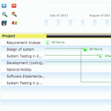

---
authors:
  - serdar

title: "My votes for the OpenNTF Contest..."

slug: my-votes-for-the-openntf-contest...

categories:
  - OpenNTF

date: 2011-08-19T08:56:00+02:00

tags:
  - domino-dev
  - open-source
  - openntf
  - pov
  - xpages
---

OpenNTF Contest about developing XPages Custom Controls will be closed for submissions today.

I would like to announce my winners today :)
<!-- more -->
I'll start from the special prizes before winners. I have selected these three for different reasons...

**Special Prize #1:**

[MySQL Control](http://www.openntf.org/internal/home.nsf/project.xsp?action=openDocument&name=XPages%20SQL%20Datasource%20Custom%20Control) (by Ulrich Krause, aka. [Eknori](http://www.eknori.de/)):

I have selected MySQL control for two reasons. First, it was my idea, Ulrich did it first :) More importantly, Ulrich provided a good approach about how to use Java in XPages. This controls enables us to connect relational databases at a basic level, without extension library and 8.5.3 CD5.

**Special Prize #2:**

[Asynch Files Upload Control](http://www.openntf.org/internal/home.nsf/project.xsp?action=openDocument&name=Xpages%20Async%20Multi%20File%20Uploader%20Custom%20Control) (by the contest champion, [Ferry Kranenberg](http://www.bleedyellow.com/blogs/ferrykranenburg/)):

Sure, Ferry deserves great praise with his contributions to the contest. I selected this control because 'asynch' word is not a good friend of XPages.So I really respect people designing 'asynchronous' things :)

**Special Prize #3:**

[JQuery Library Controls](http://www.openntf.org/internal/home.nsf/project.xsp?action=openDocument&name=jQuery%20Extension%20Library) (by [Declan Lynch](http://www.qtzar.com/)):

It's a great control. But I didn't include this in my winner list because it's an extension library... It would not be fair to compare this with other custom controls. Anyway, JQuery library is a 'must-have' extension for XPages.

Now, winners... \[drums here\]

**3rd Best Control:**

[Search and Tag Cloud Control](http://www.openntf.org/internal/home.nsf/project.xsp?action=openDocument&name=Xpage%20Search%20And%20Tagcloud%20control) (by [Frank van der Linden](http://www.domino-weblog.nl/)):

Frank designed an excellent control for the contest. This control provides a great extension for XPages applications' search functionality. It's especially cool with tag cloud feature. I love it!

**2nd Best Control:**

[Calendar Plan Control](http://www.openntf.org/internal/home.nsf/project.xsp?action=openDocument&name=Calendar%20schedule%20chart%20and%20Gantt%20chart) (by Kateryna Czerniachowska):

This control is another 'must-have' for many applications. Calendar Plan Control provides excellent user experience for calendar-based XPages applications, like project management, task management, etc. It's using dojo widgets coming with 1.6.1, but these widgets are compatible with dojo 1.4.3...

**... and the winner is...**

[View PickList Control](http://www.openntf.org/internal/home.nsf/project.xsp?action=openDocument&name=View%20Picklist%20Custom%20Control) (by [Mark Hughes](http://blog.hughesconnect.com/)):

This control is the best control I've seen in the contest. It's not only the design, but also View PickList control covers many deficiencies in XPages design with a great visual/functional quality.

View PickList provides picklist dialogs, multivalue deselect box and document value controls. They provide equivalent controls that we were using in Notes client as well as some we know from classical web 2.0 tools. It's complete, well-designed, well-documented and definitely deserves the iPad at the first place :)

Sure, the selection committee is going to consider some other criterias for the selection. So I won't yell to anyone if the results are different from my votes :) This is not a best-effort contest at the end of the day. But the period of the contest provided a great contribution to the OpenNTF. That was the point and the rest is fun.

Please explore [all controls](http://xpages.info/XPagesHome.nsf/Contest.xsp) and visit [IBM Business Partner We4IT](http://www.we4it.com/EN/), the sponsor of the contest.

...and a very important last word:

All these contributions, including ones out of the contest have been made with time and effort of developers. They deserve credits and appraisal. **If you are using them in your applications, please give the credit, shout and advertise!**
