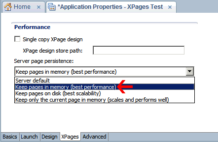
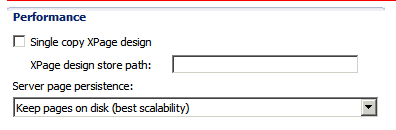
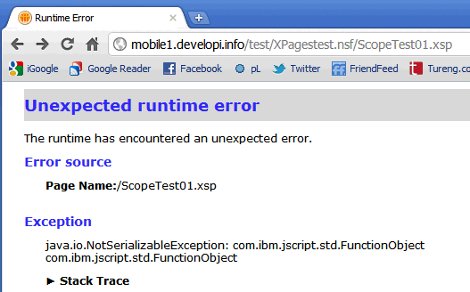

---
authors:
  - serdar

title: "Serialization, viewScope and Exploding XPage after Upgrade..."

slug: serialization-viewscope-and-exploding-xpage-after-upgrade...

categories:
  - Articles

date: 2011-08-29T08:15:00+02:00

tags:
  - domino-dev
  - java
  - troubleshooting
  - xpages
---

Before the post, I would like to thank my fellow champions [David Leedy](http://notesin9.com/) and [Tim Tripcony](http://xmage.gbs.com/) about this issue. I am stealing their thunder right now. They did most of the job and I am blogging about it :)

This is not a new thing. I experienced this problem while working on my custom controls. Some history:
<!-- more -->
I have designed a [Captcha Control](2011-01-a-simple-captcha-test-for-xpages....md "") a while ago. I were using this control in LUGTR site (8.5.1) and it was working fine. One day, I tested this on my development server (8.5.2) and it failed. I somehow corrected the issue with some stupid modifications and put it under the pile to be explored later.

After a time, I were designing my xProperties control for OpenNTF contest. When it's all done, I moved all components to a fresh database and BAM! It wasn't working. I couldn't solve this for a while and then saw a tip on Dave's "[XPages Gut Check](http://notesin9.com/index.php/2011/06/10/xpages-gut-check/)" post. I contacted him and we did a couple of tests. Finally the great master, Tim gave us a long explanation of the problem :)

Before the explanation, I will show you what's going on.

First, create a test database on Domino 8.5.2 server. A new feature came with this version. I'll explain what it means in the next step. For now, we will disable this to simulate 8.5.1 behaviour. Open Application Properties and change the following setting and restart the HTTP task on the server for convenience:



Now create an XPage as the following:

```
<?xml version="1.0" encoding="UTF-8"?>
<xp:view xmlns:xp="http://www.ibm.com/xsp/core">
     <xp:this.beforePageLoad><![CDATA[#{javascript:viewScope.testJS=function testJS(parameter) { print("got this: "+parameter); }}]]></xp:this.beforePageLoad>
     <xp:inputText id="inputText1"></xp:inputText>
     <xp:br></xp:br>
     <xp:button value="Click Me!" id="button1">
             <xp:eventHandler event="onclick" submit="true" refreshMode="complete">
                     <xp:this.action><![CDATA[#{javascript:viewScope.testJS(getComponent("inputText1").getValue());}]]></xp:this.action>
             </xp:eventHandler>
     </xp:button>
</xp:view>
```

<br />

<br />

It's a cool trick. What we did here is to **create a Javascript function, put it into viewScope** . We can use this inside a custom control for instance. So we can communicate between custom controls and their mother pages. But be patient before implementation :)

Now running this code:


It works and prints some string into the console:


Now, get back to the XPages tab under the application properties page. Normally, when you create a new database in Domino Designer 8.5.2, the setting we just changed will be like the following. So you change it as "Keep pages on disk" and restart HTTP task, again for convenience:



Now, run our sample page again:



Oops! WTF!

We didn't change anything except accepting the default performance option in the application properties. It gives "**java.io.NotSerializableException: com.ibm.jscript.std.FunctionObject** " error now.

Let's change our code as the following. This time, we will use sessionScope, instead of viewScope.

```
<?xml version="1.0" encoding="UTF-8"?>
<xp:view xmlns:xp="http://www.ibm.com/xsp/core">
     <xp:this.beforePageLoad><![CDATA[#{javascript:sessionScope.testJS=function testJS(parameter) { print("got this: "+parameter); }}]]></xp:this.beforePageLoad>
     <xp:inputText id="inputText1"></xp:inputText>
     <xp:br></xp:br>
     <xp:button value="Click Me!" id="button1">
             <xp:eventHandler event="onclick" submit="true" refreshMode="complete">
                     <xp:this.action><![CDATA[#{javascript:sessionScope.testJS(getComponent("inputText1").getValue());}]]></xp:this.action>
             </xp:eventHandler>
     </xp:button>
</xp:view>
```

<br />

<br />

It works now! Seems funny huh? In fact, sessionScope and viewScope are coming from the same HashMap implementation in Java. However there is a problem with the setting that XPages team changed.

Let's explain the problem.

First, you have to be aware of the [Serialization](http://en.wikipedia.org/wiki/Serialization) issue.

Serialization is the ability to convert some data structure to a type that can be stored to a file/memory buffer and/or transmitted over a stream. I knew this issue from my final project in the university. I were dealing with an SIP application and I were using socket streams to transmit lots of information between clients. One day, I implemented an additional property to my objects and my class became 'non-serializable'. Just two weeks before, I found myself in the darkest and strangest tunnels of Java before tuning my classes to implement serialization interface.

How are we affected with this complex notion?

Tim has explained this issue in a very deep detail. It is related to the JSF page lifecycles. When XSP server serves a page, it constructs a 'in-memory' tree structure. This tree-structure, we can call it as the page, contains many objects like div elements, viewScope, etc. The page is being used to operate between states and changes.

In 8.5.1, this page was being stored in memory. Think of hundreds of users requesting the same page. Memory will be filled with hundred 'page's in memory for each request. That's why XPages consumes so much memory but it feels very fast after the initial launch.

XPages team creates an additional method to increase scalability. After 8.5.2, XSP server has the ability to store those pages in disk. It decreases the performance because of the increase in disk activity, but it improves the scalability which means you may serve more and more users with the same memory space.

However, XSP server is using serialization to store the page into the disk. So if you have objects that are not serializable in your viewScope, it will fail writing these pages into the disk and throws the error above. I have experienced this issue with my custom controls. My custom controls can work with multiple copies. To optimize this methodology, I were putting all necessary functions and fields into a JSON-style SSJS object and using them for custom control interactions. If I put this global object into requestScope, I would not be able to use it in partial refresh events. On the other hand, applicationScope or sessionScope will be waste of resources. So I were using viewScope to store my global object. It was a realy practical method for my job

**Any object containing javascript functions will fail when put into viewScope; because XPages team has not implemented serialization for SSJS functions.**

Is it a bug or regression? This is an ongoing discussion. IBM created a feature, a method working previously stopped working in a later version which is the formal description of the regression bug. However, IBM claims that storing SSJS functions is not a good practice and not accepting this as a bug (I don't know the recent situation).

This is also valid if you store standard Domino objects like NotesDocument, NotesView, etc. Because They cannot be serialized as well.

However, it is not adviced to play with these objects. [Tim advices using primitive references instead](http://notesin9.com/index.php/2011/06/10/xpages-gut-check/#comment-224955960)... Because these objects are actually based on C and C does not have an automated garbage collector. That also means those objects cannot be serialized in any future because garbage collector occasionally deletes those objects' memory pointers and this worst-practice will become toxic (term is nicely taken from Tim) for the application.

I have tried to explain the issue. Hope this helps.
