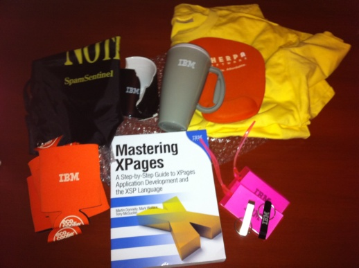

---
authors:
  - serdar

title: "A new wiki article in response to the gift I received..."

slug: a-new-wiki-article-in-response-to-the-gift-i-received...

categories:
  - Articles

date: 2011-09-11T12:15:27+02:00

tags:
  - best-practices
  - community
  - xpages
---

On thursday, I have received a very cool gift package from [Jim Casale](http://www.jimcasale.net/) because of my [Wikimania](http://www.wikimania.us/) participation...
<!-- more -->

Unfortunately, the IBM mug wasn't lucky enough for this long travel but other gifts are cool! Especially I am very glad about my hard copy of "Mastering XPages" book. This will be the first book on my shelf in the new office :)

I thought about it and I decided that returning a simple "Thank you" will not be enough!

Therefore, I created a new wiki article named "[Do's and Do Not's for XPages Scoped Variables](http://www-10.lotus.com/ldd/ddwiki.nsf/dx/Dos_and_Do_Nots_for_XPages_Scoped_Variables)" in return of this gift. It is based on my recent blog about [XPages and serialization issue](2011-08-serialization-viewscope-and-exploding-xpage-after-upgrade....md).

I am hoping to extend this article in the future with your valuable comments. I would like to have more details about performance issues especially.

Thank you Jim for the Wikimania contest, David and Tim for their contributions into the article.

Now I'm thinking what I may do after receiving my IBM Champions package :)
