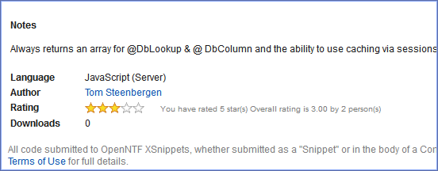
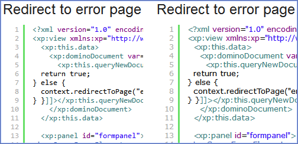
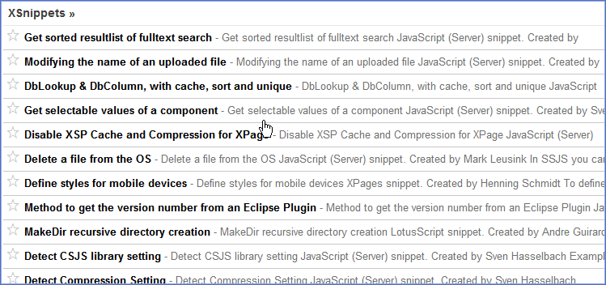

---
authors:
  - serdar

title: "Latest updates deployed on XSnippets..."

slug: latest-updates-deployed-on-xsnippets...

categories:
  - OpenNTF

date: 2011-11-28T10:00:00+02:00

tags:
  - domino-dev
  - open-source
  - openntf
  - xpages
  - xsnippets
---

As you know, [XSnippets project](http://www.openntf.org/blogs/openntf.nsf/d6plinks/NHEF-8NNBK7) has been deployed as [Beta](http://openntf.org/xsnippets) a while ago. Today, we have deployed a new version with some enhancements.
<!-- more -->

First of all, I'd like to remind all that we are actively using [the project page on OpenNTF](http://xsnippets.openntf.org/)... You may submit defects, feature requests and other comments. We also decided to follow all bugs from this page.

The recent version includes a couple of new enhancements. The most important one is the ability to rate snippets.

If you remember, I have submitted [xInvolve custom control](http://www.openntf.org/internal/home.nsf/project.xsp?action=openDocument&name=xInvolve%20Custom%20Control) for the first OpenNTF contest. I have been designing xInvolve for a while. The planned enhancements for the version 2.0 are;

- Dividing rating and commenting functions into different controls,
- Anonymous rating,
- Rating persistence (saving rating results into the document of context to be able to use it in views),
- Server-side comment handling,
- Favorites tracking,
- Extension Library adaption

Last week I developed the first beta of my new Rating control and adapted into XSnippets project.

We also added Best Rated snippets view into the navigation. Just remember that we only consider snippets that are rated by at least three users in this view.

Another enhancements are small changes in syntax highlighting as I discussed my [latest post](2011-11-highlight-your-syntax-in-designer-style....md "highlight-your-syntax-in-designer-style....htm"). Changes are mostly related to make highlighting more compatible with designer style. Even modifying fonts alone creates a big change...

Finally, Thomas Ladehoff's great [Feed Generator control](http://www.openntf.org/internal/home.nsf/project.xsp?action=openDocument&name=Feed%20generator%20XPage%20agent) has been implemented into XSnippets. Currently, you may add XSnippets url to your favorite reader, it will discover automatically. Currently, we support single feed (both RSS and ATOM) for all snippets. Next version, we are considering different feeds according to the language.

I'm monitoring the beta deployment and it seems people are adding a new snippet every day. This is exciting! We are delighted to have such a positive community reaction...

This week we will have a couple of cool additions to the beta version. So stay tuned and follow us :)
