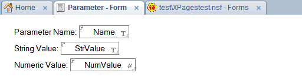
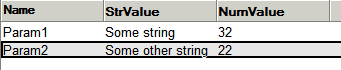
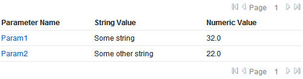
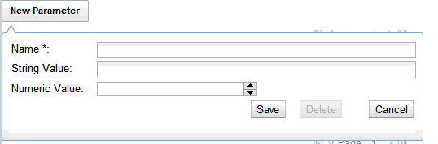

---
authors:
  - serdar

title: "Mini-Patterns for XPages: Parameter Editing with Dialogs (1)"

slug: mini-patterns-for-xpages-parameter-editing-with-dialogs-1

categories:
  - Tips & Tricks

date: 2011-11-06T16:24:00+02:00

tags:
  - domino-dev
  - xpages
  - series
---

I were off due to the incredible workload... I've started this blog entry several weeks ago. I think it's time to publish it before people forget me :)

This is a new series of articles. I'd like to introduce semi-reusable patterns that may help developers to shorten the design time for common issues.

The first article will be about "Parameter Editing".
<!-- more -->r
Many applications use parameters, editable by power users. In classical Notes, we create a form and view; that's all, except I don't like it! Here, we will create single XPages interface as a CRUD pattern for parameters. There are two common methods for parameter editing. We will use an XPage view and a tooltip dialog for editing.

Our parameters contains a unique id (name) and some data in it. So we have a form for the parameter:



We may add more fields like the last modifier, author field, etc. Let's keep it simple. We will also need a view.



Now, let's design our XPages view. I used a data table for this. Because I hate the view panel object and I'm very comfortable with data table. It's more practical.

```
<?xml version="1.0" encoding="UTF-8"?>
<xp:view xmlns:xp="http://www.ibm.com/xsp/core" xmlns:xc="http://www.ibm.com/xsp/custom" xmlns:xe="http://www.ibm.com/xsp/coreex">

     <xp:this.data>
             <xp:dominoView var="view1" viewName="Parameters"></xp:dominoView>
     </xp:this.data>

     <xp:panel style="width:500px;">
             <xp:dataTable id="dataTable1" rows="15" value="#{view1}" var="rowData">
                     <xp:this.facets>
                             <xp:pager partialRefresh="true" id="pager1" layout="FirstImage PreviousImage SeparatorPage Group NextImage LastImage" xp:key="header">        </xp:pager>
                             <xp:pager partialRefresh="true" layout="FirstImage PreviousImage SeparatorPage Group NextImage LastImage" xp:key="footer" id="pager2"></xp:pager>
                     </xp:this.facets>
                     <xp:column id="column1" style="vertical-align:top; width:150px;">
                             <xp:link escape="true" text="#{rowData.Name}" id="NameLink"></xp:link>
                             <xp:this.facets>
                                     <xp:label value="Parameter Name" id="label1" xp:key="header" style="font-weight:bold"></xp:label>
                             </xp:this.facets>
                     </xp:column>
                     <xp:column id="column2">
                             <xp:text escape="false" id="computedField2" value="#{rowData.StrValue}"></xp:text>
                             <xp:this.facets>
                                     <xp:label value="String Value" id="label2" xp:key="header" style="font-weight:bold"></xp:label>
                             </xp:this.facets>
                     </xp:column>
                     <xp:column id="column3">
                             <xp:text escape="false" id="computedField1" value="#{rowData.NumValue}"></xp:text>
                             <xp:this.facets>
                                     <xp:label value="Numeric Value" id="label3" xp:key="header" style="font-weight:bold"></xp:label>
                             </xp:this.facets>
                     </xp:column>
             </xp:dataTable>
     </xp:panel>

</xp:view>
```

<br />

<br />

It seems like a standard view. I placed links for the name field, we will use it. One may add/remove columns to fit the need.



We are planning to use a tooltip dialog for CRUD operations. In order not to create duplicate form dialog, we will create a scope variable to store which document will be edited. Now, we will create a "New Parameter" button on the top. Here we will do some tricks. Dialogs coming with the extension library have a great feature. They can be launched at the server side. I mean, for a normal dialog, you may get it with "getComponent" function and use "show()" method to launch it. Extension library is creating necessary client side javascript methods to launch the dialog.

However, in tooltip dialogs, you should specify where to launch the dialog (near which element). So here is the trick:

```
<xp:button value="New Parameter" id="newButton">
       <xp:eventHandler event="onclick" submit="true" refreshMode="norefresh" onComplete="XSP.openTooltipDialog('#{id:dlg}', '#{id:newButton}')">
               <xp:this.action><![CDATA[#{javascript:viewScope.noteId="NEW";}]]></xp:this.action>
       </xp:eventHandler>
</xp:button>
```

<br />

<br />

It will set the required scope variable and launches the dialog at 'onComplete' part. Now, let's modify our 'NameLink' element at the data table to launch the dialog similarly.

```
<xp:link escape="true" text="#{rowData.Name}" id="NameLink">
       <xp:eventHandler event="onclick" submit="true" refreshMode="norefresh" onComplete="XSP.openTooltipDialog('#{id:dlg}', '#{id:NameLink}')">
               <xp:this.action><![CDATA[#{javascript:viewScope.noteId=rowData.getNoteID();}]]></xp:this.action>
       </xp:eventHandler>
</xp:link>
```

<br />

<br />

It's pretty the same. Now, it's time for the dialog. We may place it anywhere on the page. It will be hidden at first, until we launch it.

```
<xe:tooltipDialog id="dlg" title="Parameter">
       <xp:panel style="width:500.0px">
               <xp:this.data>
                       <xp:dominoDocument var="document1" formName="Parameter"
                               action="#{javascript:return viewScope.noteId=='NEW'?'createDocument':'editDocument';}" documentId="#{javascript:viewScope.noteId=='NEW'?'':viewScope.noteId}"
                               ignoreRequestParams="true">
                       </xp:dominoDocument>
               </xp:this.data>
               <xp:table style="width:100%">
                       <xp:tr>
                               <xp:td valign="top" style="width:100.0px">
                                       <xp:label value="Name *:" id="label5"></xp:label>
                               </xp:td>
                               <xp:td>
                                       <xp:inputText value="#{document1.Name}" required="true" style="width:100%">
                                               <xp:this.validators>
                                                       <xp:validateRequired message="Name is required."></xp:validateRequired>
                                               </xp:this.validators>
                                       </xp:inputText>
                               </xp:td>
                       </xp:tr>
                       <xp:tr>
                               <xp:td valign="top" style="width:auto">
                                       <xp:label value="String Value:" id="label6"></xp:label>
                               </xp:td>
                               <xp:td>
                                       
                               <xp:inputText id="inputText1" style="width:100%" value="#{document1.StrValue}"></xp:inputText></xp:td>
                       </xp:tr>
                       <xp:tr>
                               <xp:td valign="top" style="width:auto">
                                       <xp:label value="Numeric Value:" id="label4"></xp:label>
                               </xp:td>
                               <xp:td>
                                       <xe:djNumberSpinner id="djNumberSpinner1" value="#{document1.NumValue}">
                                               <xp:this.converter>
                                                       <xp:convertNumber></xp:convertNumber>
                                               </xp:this.converter>
                                       </xe:djNumberSpinner>
                               </xp:td>
                       </xp:tr>
               </xp:table>
               <xp:messages id="messages2"></xp:messages>
               <xp:panel style="text-align:right">
                       <xe:djButton id="djButton1" label="Save" disabled="#{javascript:!document1.isEditable()}">
                               <xp:eventHandler event="onclick" submit="true" refreshMode="complete">
                                       <xp:this.action>
                                               <xp:actionGroup>
                                                       <xp:saveDocument></xp:saveDocument>
                                                       <xp:executeScript>
                                                               <xp:this.script><![CDATA[#{javascript:getComponent("dlg").hide("dataTable1")}]]></xp:this.script>
                                                       </xp:executeScript>
                                               </xp:actionGroup>
                                       </xp:this.action>
                               </xp:eventHandler>
                       </xe:djButton>
                       &#160;&#160;&#160;
                       <xe:djButton id="djButton3" label="Delete" disabled="#{javascript:document1.isNewNote()}">
                               <xp:eventHandler event="onclick" submit="true" refreshMode="complete">
                                       <xp:this.action>
                                               <xp:actionGroup>
                                                       <xp:deleteDocument name="" message="Are you sure?"></xp:deleteDocument>
                                                       <xp:executeScript>
                                                               <xp:this.script><![CDATA[#{javascript:getComponent("dlg").hide("dataTable1");}]]></xp:this.script>
                                                       </xp:executeScript>
                                               </xp:actionGroup>
                                       </xp:this.action>
                               </xp:eventHandler>
                       </xe:djButton>
                       &#160;&#160;&#160;&#160;&#160;&#160;&#160;
                       <xe:djButton id="djButton2" label="Cancel">
                               <xp:eventHandler event="onclick" submit="true" immediate="true">
                                       <xp:this.action>
                                               <xp:actionGroup>
                                                       <xp:executeScript>
                                                               <xp:this.script><![CDATA[#{javascript:getComponent("dlg").hide()}]]></xp:this.script>
                                                       </xp:executeScript>
                                               </xp:actionGroup>
                                       </xp:this.action>
                               </xp:eventHandler>
                       </xe:djButton>
               </xp:panel>
               <xp:br></xp:br>
       </xp:panel>
</xe:tooltipDialog>
```

<br />

<br />

Here, there are two important points. The first is that we get the document at the launch phase of the dialog. Javascript calculates it from the viewScope.noteId parameter. You should use viewScope here. Because there are two partial refresh events in the opening of a dialog (first is setting scope, the second is document retrieval). Therefore you cannot use requestScope.

The second point is the script that closes the dialog. As I said before extension library dialogs are very cool components. You can see that we are closing them at the server side. 'hide()' function has a refresh parameter. If you give a parameter, it will refresh the element you pointed after closing the dialog.

One strange thing here; the deletion didn't work for me. I played with database, moved it to another, tried on local and finally it worked but I don't know why. I couldn't reproduce this incident again. So, let me know if you have the same problem.

You may also use a normal dialog here, if your form is larger.

That's it! You will find all screen shots and the XSP code below.

What is the next step? We have mentioned two ways for this pattern. The second pattern is using dojo grids, which will be the second post :)

Hope it helps to you.




```
<?xml version="1.0" encoding="UTF-8"?>
<xp:view xmlns:xp="http://www.ibm.com/xsp/core" xmlns:xc="http://www.ibm.com/xsp/custom" xmlns:xe="http://www.ibm.com/xsp/coreex">

       <xp:this.data>
               <xp:dominoView var="view1" viewName="Parameters"></xp:dominoView>
       </xp:this.data>

       <xp:panel style="width:500px;">
               
               <xp:button value="New Parameter" id="newButton">
                       <xp:eventHandler event="onclick" submit="true" refreshMode="norefresh" onComplete="XSP.openTooltipDialog('#{id:dlg}', '#{id:newButton}')">
                               <xp:this.action><![CDATA[#{javascript:viewScope.noteId="NEW";}]]></xp:this.action>
                       </xp:eventHandler>
               </xp:button>
               <xp:dataTable id="dataTable1" rows="15" value="#{view1}" var="rowData">
                       <xp:this.facets>
                               <xp:pager partialRefresh="true" id="pager1" layout="FirstImage PreviousImage SeparatorPage Group NextImage LastImage" xp:key="header">        </xp:pager>
                               <xp:pager partialRefresh="true" layout="FirstImage PreviousImage SeparatorPage Group NextImage LastImage" xp:key="footer" id="pager2"></xp:pager>
                       </xp:this.facets>
                       <xp:column id="column1" style="vertical-align:top; width:150px;">
                               <xp:link escape="true" text="#{rowData.Name}" id="NameLink">
                                       <xp:eventHandler event="onclick" submit="true" refreshMode="norefresh" onComplete="XSP.openTooltipDialog('#{id:dlg}', '#{id:NameLink}')">
                                               <xp:this.action><![CDATA[#{javascript:viewScope.noteId=rowData.getNoteID();}]]></xp:this.action>
                                       </xp:eventHandler>
                               </xp:link>
                               <xp:this.facets>
                                       <xp:label value="Parameter Name" id="label1" xp:key="header" style="font-weight:bold"></xp:label>
                               </xp:this.facets>
                       </xp:column>
                       <xp:column id="column2">
                               <xp:text escape="false" id="computedField2" value="#{rowData.StrValue}"></xp:text>
                               <xp:this.facets>
                                       <xp:label value="String Value" id="label2" xp:key="header" style="font-weight:bold"></xp:label>
                               </xp:this.facets>
                       </xp:column>
                       <xp:column id="column3">
                               <xp:text escape="false" id="computedField1" value="#{rowData.NumValue}"></xp:text>
                               <xp:this.facets>
                                       <xp:label value="Numeric Value" id="label3" xp:key="header" style="font-weight:bold"></xp:label>
                               </xp:this.facets>
                       </xp:column>
               </xp:dataTable>
       </xp:panel>

       <xe:tooltipDialog id="dlg" title="Parameter">
               <xp:panel style="width:500.0px">
                       <xp:this.data>
                               <xp:dominoDocument var="document1" formName="Parameter"
                                       action="#{javascript:return viewScope.noteId=='NEW'?'createDocument':'editDocument';}" documentId="#{javascript:viewScope.noteId=='NEW'?'':viewScope.noteId}"
                                       ignoreRequestParams="true">
                               </xp:dominoDocument>
                       </xp:this.data>
                       <xp:table style="width:100%">
                               <xp:tr>
                                       <xp:td valign="top" style="width:100.0px">
                                               <xp:label value="Name *:" id="label5"></xp:label>
                                       </xp:td>
                                       <xp:td>
                                               <xp:inputText value="#{document1.Name}" required="true" style="width:100%">
                                                       <xp:this.validators>
                                                               <xp:validateRequired message="Name is required."></xp:validateRequired>
                                                       </xp:this.validators>
                                               </xp:inputText>
                                       </xp:td>
                               </xp:tr>
                               <xp:tr>
                                       <xp:td valign="top" style="width:auto">
                                               <xp:label value="String Value:" id="label6"></xp:label>
                                       </xp:td>
                                       <xp:td>
                                               
                                       <xp:inputText id="inputText1" style="width:100%" value="#{document1.StrValue}"></xp:inputText></xp:td>
                               </xp:tr>
                               <xp:tr>
                                       <xp:td valign="top" style="width:auto">
                                               <xp:label value="Numeric Value:" id="label4"></xp:label>
                                       </xp:td>
                                       <xp:td>
                                               <xe:djNumberSpinner id="djNumberSpinner1" value="#{document1.NumValue}">
                                                       <xp:this.converter>
                                                               <xp:convertNumber></xp:convertNumber>
                                                       </xp:this.converter>
                                               </xe:djNumberSpinner>
                                       </xp:td>
                               </xp:tr>
                       </xp:table>
                       <xp:messages id="messages2"></xp:messages>
                       <xp:panel style="text-align:right">
                               <xe:djButton id="djButton1" label="Save" disabled="#{javascript:!document1.isEditable()}">
                                       <xp:eventHandler event="onclick" submit="true" refreshMode="complete">
                                               <xp:this.action>
                                                       <xp:actionGroup>
                                                               <xp:saveDocument></xp:saveDocument>
                                                               <xp:executeScript>
                                                                       <xp:this.script><![CDATA[#{javascript:getComponent("dlg").hide("dataTable1")}]]></xp:this.script>
                                                               </xp:executeScript>
                                                       </xp:actionGroup>
                                               </xp:this.action>
                                       </xp:eventHandler>
                               </xe:djButton>
                               &#160;&#160;&#160;
                               <xe:djButton id="djButton3" label="Delete" disabled="#{javascript:document1.isNewNote()}">
                                       <xp:eventHandler event="onclick" submit="true" refreshMode="complete">
                                               <xp:this.action>
                                                       <xp:actionGroup>
                                                               <xp:deleteDocument name="" message="Are you sure?"></xp:deleteDocument>
                                                               <xp:executeScript>
                                                                       <xp:this.script><![CDATA[#{javascript:getComponent("dlg").hide("dataTable1");}]]></xp:this.script>
                                                               </xp:executeScript>
                                                       </xp:actionGroup>
                                               </xp:this.action>
                                       </xp:eventHandler>
                               </xe:djButton>
                               &#160;&#160;&#160;&#160;&#160;&#160;&#160;
                               <xe:djButton id="djButton2" label="Cancel">
                                       <xp:eventHandler event="onclick" submit="true" immediate="true">
                                               <xp:this.action>
                                                       <xp:actionGroup>
                                                               <xp:executeScript>
                                                                       <xp:this.script><![CDATA[#{javascript:getComponent("dlg").hide()}]]></xp:this.script>
                                                               </xp:executeScript>
                                                       </xp:actionGroup>
                                               </xp:this.action>
                                       </xp:eventHandler>
                               </xe:djButton>
                       </xp:panel>
                       <xp:br></xp:br>
               </xp:panel>
       </xe:tooltipDialog>
</xp:view>
```

<br />
