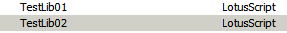
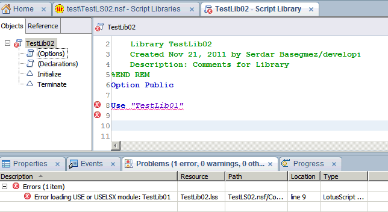
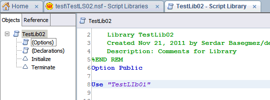

---
authors:
  - serdar

title: "Mystery Solved: \"Error loading USE or USELSX module\""

slug: mystery-solved-error-loading-use-or-uselsx-module

categories:
  - Tips & Tricks

date: 2011-11-21T13:00:16+02:00

tags:
  - bugs
  - domino-dev
  - lotusscript
  - troubleshooting
---

For a week, I was trying to solve a problem with an old database. The problem was a well-known error message: "Error loading USE or USELSX module" in my agents and script libraries.
<!-- more -->
This case, I couldn't update my agents, script libraries, etc. because my designer wasn't compiling due to this error.

So after hours of try and error, I noticed that I didn't test one thing I should have tested at the beginning. My friends guess what I'm talking about :)

**If there is Java, you're living in Turkey, you should check "i" character first!**

I did and found the problem. I can reproduce the problem and have opened PMR report. Now I won't share the exact steps but show the screen shots.

Before, I should tell you that this case is valid for new Lotusscript Editor and Turkish Language in Regional Settings. But there are similar accented character problems in other languages. Therefore use your creativity to find another bug in your language :)

We have two script libraries:

Now we are opening TestLib02 and connect it to TestLib01. But oops!

Very funny, right?

Suppose we have created this application before. We can't modify any code in the library, because it wouldn't compile.

There are two workarounds:

1. Use Uppercase.

2. Disable new Lotusscript editor... This is not happenning in old editor.

What is the implication of this problem?

It also solves the famous "Lotus Workflow is not working on 8.5.x" problem of Turkish customers. Many of my customers mentioned about this problem.

Moreover, this is just a simple case. The lesson of the day is; For any unresolved problems in DDE, if the subject of the problem contains "case insensitivity", the issue is "i" character for Turkish customers.

Expecting your comments about any findings in other languages.
