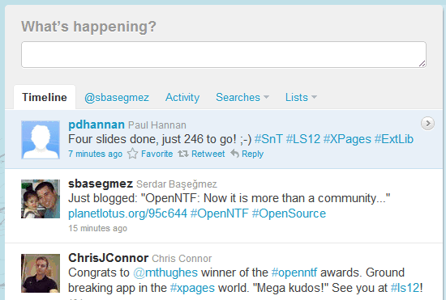
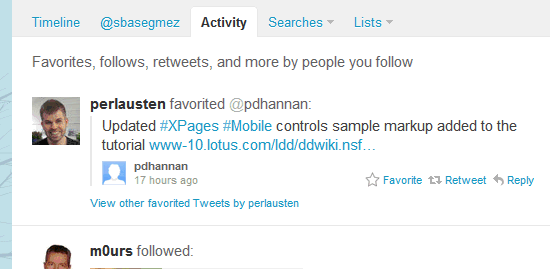
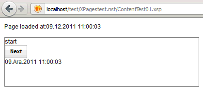
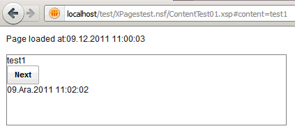
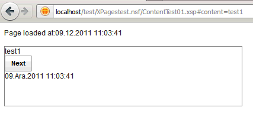
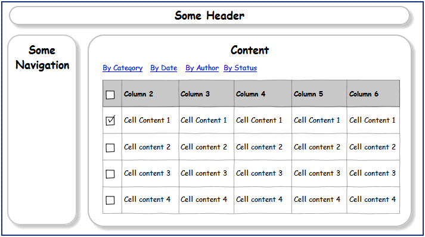
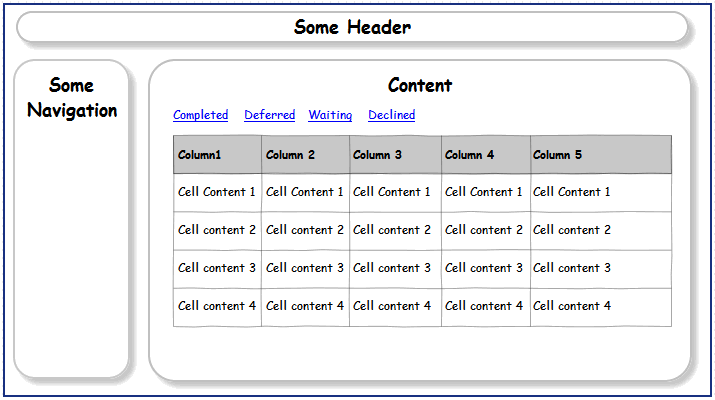

---
authors:
  - serdar

title: "Mini-Patterns for XPages: Using Dynamic Content Control (2)"

slug: mini-patterns-for-xpages-using-dynamic-content-control-2

categories:
  - Tips & Tricks

date: 2011-12-12T12:30:00+02:00

tags:
  - domino-dev
  - xpages
  - series
---

**Dynamic Content** is a great control coming with the extension library. I noticed this too late (thanks to Bruce Elgort and Thomas Adrian)...

Before we start, I'd like to remind one of the biggest discussions about Web 2.0 pattern (I'm excluding people saying it doesn't exist)...
<!-- more -->
As you know, web 2.0 pattern heavily uses AJAX which gives us many different options to render a page. Content may be asynchronous and coming from different sources, view state might be controlled at the client side (browser), we may prevent complete refresh to build a better user experience, etc.

Pages are becoming dynamic in web 2.0. However, some technologies are not ready for this... Bookmarking and search engine optimization are biggest problems. Let's give a simple example...

We are at the timeline view in the Twitter.



When I click to Activity, it doesn't refresh the whole page, instead only streaming content will be changed.



The user refreshes the page at this point to see if s/he has a new activity on the stream. In a standard web 2.0 application, that would be a problem. Because the initial page opened (what URL points) is the 'Timeline' view. So 'refresh' would load it and lead the user back to the 'timeline' page.

However, Twitter solved this with a simple trick. See how it changes the url. The first page is "http://twitter.com/". When you switch to the 'Activity' stream, the URL will be rewritten as '**http://twitter.com/#!/activity** '. So when you refresh the second page, back-end engine will see the intended page reference and end up with the 'Activity' stream. This works the same as the bookmarking.

You may see this approach in many web 2.0 applications. The magic is the hash sign (#) in the URL. You cannot change a page url at the client side without creating a new request to the server, unless you are going navigating 'inside the page' using a hash sign. When you change the hash sign inside the url, the page will not be loaded, instead, browser will search the page to find the anchor element related to the hash.

Of course it doesn't solve search engine optimization; because in many cases, 'Activity' link may not be binded to a real url which prevents search bots to follow those links. But since this pattern will help us to map alternative urls to different states of dynamic pages, we may prepare 'Site Map' configuration to tell bots about 'What we have'...

So back to the XPages.

Dynamic Content Control automates this pattern easily in our XPages applications. As far as I understood (by Google translate), Thomas [blogged](http://www.notessidan.se/blogg.nsf/xstart.xsp?post=26677D0151A4081DC12578360030F305) about this (in Swedish). He has also implemented this feature in [intrapages.com](http://intrapages.com/). Matt also created a video lesson under [XPages101.net](http://xpages101.net/), if you are subscribed.

Let's take a simple example:


Now, when we click Next, it will do a partial refresh on the container panel and switch to another one.


The mother page is still there (look at the time). Only container has been refreshed, but the URL changed to "#content=test1". Now, I will copy this URL and paste to another window to see what happens. (Simulating refreshing or bookmarking the page)


The page has been reloaded. The mother page and the container has been reloaded at the same time. We did this using Dynamic Content control. This is how:

```xml
<?xml version="1.0" encoding="UTF-8"?>
<xp:view xmlns:xp="http://www.ibm.com/xsp/core" xmlns:xe="http://www.ibm.com/xsp/coreex">
     <xe:dynamicContent id="dynamicContent1" useHash="true">
             <xp:panel><!-- Default panel when no hash in URL --></xp:panel>
             <xp:this.facets>
                     <xp:panel xp:key="hash1"><!-- 1st hash content --></xp:panel>
                     <xp:panel xp:key="hash2"><!-- 2nd hash content --></xp:panel>
                     <xp:panel xp:key="hash3"><!-- 3rd hash content --></xp:panel>
                     <xp:panel xp:key="hash4"><!-- 4th hash content --></xp:panel>
             </xp:this.facets>
     </xe:dynamicContent>
</xp:view>
```


The first container inside the dynamic content tag (the control outside facets) will be shown default with empty url extension. The others will be placed inside facets. In the above example, you may call the panel with 'hash2' key by '...#content=hash2' url...

If you look at the Extension Library demo application, you would see there are four methods to open different panes inside the dynamic content control. **1. Client-side link using a #hash:**
This is what Twitter does. It uses dojo to register 'hash' link navigation in the page. When it detects a call, it partially refreshes the content pane created with the dynamic content control and load the necessary facet region. This method is great because it's very easy and compatible with search bots. It also supports "Open In New Window" **2. Client side event - JavaScript call**
You may also call specific facet with XSP.showContent("#{id:dynamicContent1}","hash1") js function. Be careful about the first parameter should be the client side id of the dynamic content control. **3. Server side event - Component API**
When you prefer doing some server-side task before changing the pane, you have the chance to switch it on the server-side with getComponent("dynamicContent1").show("hash1"). **4. Server side event - Simple Action**
OK, if you are a drag and drop developer, there is also a simple action to switch panels.

Remember there are two events to make things more complicated as well. Just look at the sample, it's so clear :)

So what are the possible use cases for this?

One may be like that:



A classical example of navigation. Normally we put those view links on the navigation. But if we want to keep the user inside the content box, using partial refreshes out there would be a very handful. But what about if the user wants to bookmark "By Status" view specifically? That's the part of Dynamic Content control...

I'd like to work on categorized views next to see if dynamic content control can be used with a really dynamic context. Think about the following:



The design with categories will provide links referring to different categories in views. If we know categories at the design time, it's not a problem, we would create a custom control that takes the category as a parameter and put that CC into 4 different panels for each hash. It's brute force, but possible.

Now it's the homework for me and the reader. Can you do it dynamically (I mean, you don't know how many categories we have)?

I think we can :)
